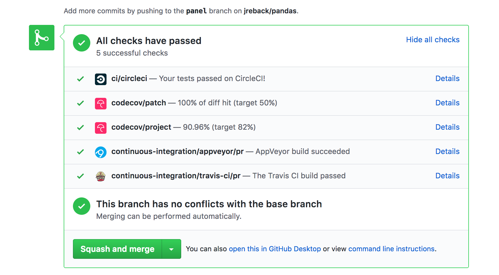

.. _contributing:

**********************
Contributing to pandas
**********************

.. contents:: Table of contents:
   :local:

Where to start?
===============

All contributions, bug reports, bug fixes, documentation improvements,
enhancements, and ideas are welcome.

If you are brand new to pandas or open-source development, we recommend going
through the `GitHub "issues" tab <https://github.com/pandas-dev/pandas/issues>`_
to find issues that interest you. There are a number of issues listed under `Docs
<https://github.com/pandas-dev/pandas/issues?labels=Docs&sort=updated&state=open>`_
and `good first issue
<https://github.com/pandas-dev/pandas/issues?labels=good+first+issue&sort=updated&state=open>`_
where you could start out. Once you've found an interesting issue, you can
return here to get your development environment setup.

Feel free to ask questions on the `mailing list
<https://groups.google.com/forum/?fromgroups#!forum/pydata>`_ or on `Gitter`_.

.. _contributing.bug_reports:

Bug reports and enhancement requests
====================================

Bug reports are an important part of making *pandas* more stable. Having a complete bug report
will allow others to reproduce the bug and provide insight into fixing. See
`this stackoverflow article <https://stackoverflow.com/help/mcve>`_ and
`this blogpost <http://matthewrocklin.com/blog/work/2018/02/28/minimal-bug-reports>`_
for tips on writing a good bug report.

Trying the bug-producing code out on the *master* branch is often a worthwhile exercise
to confirm the bug still exists. It is also worth searching existing bug reports and pull requests
to see if the issue has already been reported and/or fixed.

Bug reports must:

#. Include a short, self-contained Python snippet reproducing the problem.
   You can format the code nicely by using `GitHub Flavored Markdown
   <http://github.github.com/github-flavored-markdown/>`_::

      ```python
      >>> from pandas import DataFrame
      >>> df = DataFrame(...)
      ...
      ```

#. Include the full version string of *pandas* and its dependencies. You can use the built in function::

      >>> import pandas as pd
      >>> pd.show_versions()

#. Explain why the current behavior is wrong/not desired and what you expect instead.

The issue will then show up to the *pandas* community and be open to comments/ideas from others.

.. _contributing.github:

Working with the code
=====================

Now that you have an issue you want to fix, enhancement to add, or documentation to improve,
you need to learn how to work with GitHub and the *pandas* code base.

.. _contributing.version_control:

Version control, Git, and GitHub
--------------------------------

To the new user, working with Git is one of the more daunting aspects of contributing to *pandas*.
It can very quickly become overwhelming, but sticking to the guidelines below will help keep the process
straightforward and mostly trouble free.  As always, if you are having difficulties please
feel free to ask for help.

The code is hosted on `GitHub <https://www.github.com/pandas-dev/pandas>`_. To
contribute you will need to sign up for a `free GitHub account
<https://github.com/signup/free>`_. We use `Git <http://git-scm.com/>`_ for
version control to allow many people to work together on the project.

Some great resources for learning Git:

* the `GitHub help pages <http://help.github.com/>`_.
* the `NumPy's documentation <http://docs.scipy.org/doc/numpy/dev/index.html>`_.
* Matthew Brett's `Pydagogue <http://matthew-brett.github.com/pydagogue/>`_.

Getting started with Git
------------------------

`GitHub has instructions <http://help.github.com/set-up-git-redirect>`__ for installing git,
setting up your SSH key, and configuring git.  All these steps need to be completed before
you can work seamlessly between your local repository and GitHub.

.. _contributing.forking:

Forking
-------

You will need your own fork to work on the code. Go to the `pandas project
page <https://github.com/pandas-dev/pandas>`_ and hit the ``Fork`` button. You will
want to clone your fork to your machine::

    git clone https://github.com/your-user-name/pandas.git pandas-yourname
    cd pandas-yourname
    git remote add upstream https://github.com/pandas-dev/pandas.git

This creates the directory `pandas-yourname` and connects your repository to
the upstream (main project) *pandas* repository.

.. _contributing.dev_env:

Creating a development environment
----------------------------------

To test out code changes, you'll need to build pandas from source, which
requires a C compiler and Python environment. If you're making documentation
changes, you can skip to :ref:`contributing.documentation` but you won't be able
to build the documentation locally before pushing your changes.

.. _contributiong.dev_c:

Installing a C Compiler
~~~~~~~~~~~~~~~~~~~~~~~

Pandas uses C extensions (mostly written using Cython) to speed up certain
operations. To install pandas from source, you need to compile these C
extensions, which means you need a C compiler. This process depends on which
platform you're using. Follow the `CPython contributing guidelines
<https://docs.python.org/devguide/setup.html#build-dependencies>`_ for getting a
compiler installed. You don't need to do any of the ``./configure`` or ``make``
steps; you only need to install the compiler.

For Windows developers, the following links may be helpful.

* https://blogs.msdn.microsoft.com/pythonengineering/2016/04/11/unable-to-find-vcvarsall-bat/
* https://github.com/conda/conda-recipes/wiki/Building-from-Source-on-Windows-32-bit-and-64-bit
* https://cowboyprogrammer.org/building-python-wheels-for-windows/
* https://blog.ionelmc.ro/2014/12/21/compiling-python-extensions-on-windows/
* https://support.enthought.com/hc/en-us/articles/204469260-Building-Python-extensions-with-Canopy

Let us know if you have any difficulties by opening an issue or reaching out on
`Gitter`_.

.. _contributiong.dev_python:

Creating a Python Environment
~~~~~~~~~~~~~~~~~~~~~~~~~~~~~

Now that you have a C compiler, create an isolated pandas development
environment:

* Install either `Anaconda <https://www.anaconda.com/download/>`_ or `miniconda
  <https://conda.io/miniconda.html>`_
* Make sure your conda is up to date (``conda update conda``)
* Make sure that you have :ref:`cloned the repository <contributing.forking>`
* ``cd`` to the *pandas* source directory

We'll now kick off a three-step process:

1. Install the build dependencies
2. Build and install pandas
3. Install the optional dependencies

.. code-block:: none

   # Create and activate the build environment
   conda env create -f ci/environment-dev.yaml
   conda activate pandas-dev

   # or with older versions of Anaconda:
   source activate pandas-dev

   # Build and install pandas
   python setup.py build_ext --inplace -j 4
   python -m pip install -e .

   # Install the rest of the optional dependencies
   conda install -c defaults -c conda-forge --file=ci/requirements-optional-conda.txt

At this point you should be able to import pandas from your locally built version::

   $ python  # start an interpreter
   >>> import pandas
   >>> print(pandas.__version__)
   0.22.0.dev0+29.g4ad6d4d74

This will create the new environment, and not touch any of your existing environments,
nor any existing Python installation.

To view your environments::

      conda info -e

To return to your root environment::

      conda deactivate

See the full conda docs `here <http://conda.pydata.org/docs>`__.

.. _contributing.pip:

Creating a Python Environment (pip)
~~~~~~~~~~~~~~~~~~~~~~~~~~~~~~~~~~~

If you aren't using conda for you development environment, follow these instructions.
You'll need to have at least python3.5 installed on your system.

.. code-block:: none

   # Create a virtual environment
   # Use an ENV_DIR of your choice. We'll use ~/virtualenvs/pandas-dev
   # Any parent directories should already exist
   python3 -m venv ~/virtualenvs/pandas-dev
   # Activate the virtulaenv
   . ~/virtualenvs/pandas-dev/bin/activate

   # Install the build dependencies
   python -m pip install -r ci/requirements_dev.txt
   # Build and install pandas
   python setup.py build_ext --inplace -j 4
   python -m pip install -e .

   # Install additional dependencies
   python -m pip install -r ci/requirements-optional-pip.txt

Creating a branch
-----------------

You want your master branch to reflect only production-ready code, so create a
feature branch for making your changes. For example::

    git branch shiny-new-feature
    git checkout shiny-new-feature

The above can be simplified to::

    git checkout -b shiny-new-feature

This changes your working directory to the shiny-new-feature branch.  Keep any
changes in this branch specific to one bug or feature so it is clear
what the branch brings to *pandas*. You can have many shiny-new-features
and switch in between them using the git checkout command.

When creating this branch, make sure your master branch is up to date with
the latest upstream master version. To update your local master branch, you
can do::

    git checkout master
    git pull upstream master --ff-only

When you want to update the feature branch with changes in master after
you created the branch, check the section on
:ref:`updating a PR <contributing.update-pr>`.

.. _contributing.documentation:

Contributing to the documentation
=================================

Contributing to the documentation benefits everyone who uses *pandas*.
We encourage you to help us improve the documentation, and
you don't have to be an expert on *pandas* to do so! In fact,
there are sections of the docs that are worse off after being written by
experts. If something in the docs doesn't make sense to you, updating the
relevant section after you figure it out is a great way to ensure it will help
the next person.

.. contents:: Documentation:
   :local:


About the *pandas* documentation
--------------------------------

The documentation is written in **reStructuredText**, which is almost like writing
in plain English, and built using `Sphinx <http://sphinx.pocoo.org/>`__. The
Sphinx Documentation has an excellent `introduction to reST
<http://sphinx.pocoo.org/rest.html>`__. Review the Sphinx docs to perform more
complex changes to the documentation as well.

Some other important things to know about the docs:

* The *pandas* documentation consists of two parts: the docstrings in the code
  itself and the docs in this folder ``pandas/doc/``.

  The docstrings provide a clear explanation of the usage of the individual
  functions, while the documentation in this folder consists of tutorial-like
  overviews per topic together with some other information (what's new,
  installation, etc).

* The docstrings follow a pandas convention, based on the **Numpy Docstring
  Standard**. Follow the :ref:`pandas docstring guide <docstring>` for detailed
  instructions on how to write a correct docstring.

  .. toctree::
     :maxdepth: 2

     contributing_docstring.rst

* The tutorials make heavy use of the `ipython directive
  <http://matplotlib.org/sampledoc/ipython_directive.html>`_ sphinx extension.
  This directive lets you put code in the documentation which will be run
  during the doc build. For example::

      .. ipython:: python

          x = 2
          x**3

  will be rendered as::

      In [1]: x = 2

      In [2]: x**3
      Out[2]: 8

  Almost all code examples in the docs are run (and the output saved) during the
  doc build. This approach means that code examples will always be up to date,
  but it does make the doc building a bit more complex.

* Our API documentation in ``doc/source/api.rst`` houses the auto-generated
  documentation from the docstrings. For classes, there are a few subtleties
  around controlling which methods and attributes have pages auto-generated.

  We have two autosummary templates for classes.

  1. ``_templates/autosummary/class.rst``. Use this when you want to
     automatically generate a page for every public method and attribute on the
     class. The ``Attributes`` and ``Methods`` sections will be automatically
     added to the class' rendered documentation by numpydoc. See ``DataFrame``
     for an example.

  2. ``_templates/autosummary/class_without_autosummary``. Use this when you
     want to pick a subset of methods / attributes to auto-generate pages for.
     When using this template, you should include an ``Attributes`` and
     ``Methods`` section in the class docstring. See ``CategoricalIndex`` for an
     example.

  Every method should be included in a ``toctree`` in ``api.rst``, else Sphinx
  will emit a warning.

.. note::

    The ``.rst`` files are used to automatically generate Markdown and HTML versions
    of the docs. For this reason, please do not edit ``CONTRIBUTING.md`` directly,
    but instead make any changes to ``doc/source/contributing.rst``. Then, to
    generate ``CONTRIBUTING.md``, use `pandoc <http://johnmacfarlane.net/pandoc/>`_
    with the following command::

      pandoc doc/source/contributing.rst -t markdown_github > CONTRIBUTING.md

The utility script ``scripts/validate_docstrings.py`` can be used to get a csv
summary of the API documentation. And also validate common errors in the docstring
of a specific class, function or method. The summary also compares the list of
methods documented in ``doc/source/api.rst`` (which is used to generate
the `API Reference <http://pandas.pydata.org/pandas-docs/stable/api.html>`_ page)
and the actual public methods.
This will identify methods documented in ``doc/source/api.rst`` that are not actually
class methods, and existing methods that are not documented in ``doc/source/api.rst``.


Updating a *pandas* docstring
-----------------------------

When improving a single function or method's docstring, it is not necessarily
needed to build the full documentation (see next section).
However, there is a script that checks a docstring (for example for the ``DataFrame.mean`` method)::

    python scripts/validate_docstrings.py pandas.DataFrame.mean

This script will indicate some formatting errors if present, and will also
run and test the examples included in the docstring.
Check the :ref:`pandas docstring guide <docstring>` for a detailed guide
on how to format the docstring.

The examples in the docstring ('doctests') must be valid Python code,
that in a deterministic way returns the presented output, and that can be
copied and run by users. This can be checked with the script above, and is
also tested on Travis. A failing doctest will be a blocker for merging a PR.
Check the :ref:`examples <docstring.examples>` section in the docstring guide
for some tips and tricks to get the doctests passing.

When doing a PR with a docstring update, it is good to post the
output of the validation script in a comment on github.


How to build the *pandas* documentation
---------------------------------------

Requirements
~~~~~~~~~~~~

First, you need to have a development environment to be able to build pandas
(see the docs on :ref:`creating a development environment above <contributing.dev_env>`).

Building the documentation
~~~~~~~~~~~~~~~~~~~~~~~~~~

So how do you build the docs? Navigate to your local
``pandas/doc/`` directory in the console and run::

    python make.py html

Then you can find the HTML output in the folder ``pandas/doc/build/html/``.

The first time you build the docs, it will take quite a while because it has to run
all the code examples and build all the generated docstring pages. In subsequent
evocations, sphinx will try to only build the pages that have been modified.

If you want to do a full clean build, do::

    python make.py clean
    python make.py html

You can tell ``make.py`` to compile only a single section of the docs, greatly
reducing the turn-around time for checking your changes.

::

    # omit autosummary and API section
    python make.py clean
    python make.py --no-api

    # compile the docs with only a single
    # section, that which is in indexing.rst
    python make.py clean
    python make.py --single indexing

    # compile the reference docs for a single function
    python make.py clean
    python make.py --single DataFrame.join

For comparison, a full documentation build may take 15 minutes, but a single
section may take 15 seconds. Subsequent builds, which only process portions
you have changed, will be faster.

You can also specify to use multiple cores to speed up the documentation build::

    python make.py html --num-jobs 4

Open the following file in a web browser to see the full documentation you
just built::

    pandas/docs/build/html/index.html

And you'll have the satisfaction of seeing your new and improved documentation!

.. _contributing.dev_docs:

Building master branch documentation
~~~~~~~~~~~~~~~~~~~~~~~~~~~~~~~~~~~~

When pull requests are merged into the *pandas* ``master`` branch, the main parts of
the documentation are also built by Travis-CI. These docs are then hosted `here
<http://pandas-docs.github.io/pandas-docs-travis>`__, see also
the :ref:`Continuous Integration <contributing.ci>` section.

Spell checking documentation
~~~~~~~~~~~~~~~~~~~~~~~~~~~~

When contributing to documentation to **pandas** it's good to check if your work
contains any spelling errors. Sphinx provides an easy way to spell check documentation
and docstrings.

Running the spell check is easy. Just navigate to your local ``pandas/doc/`` directory and run::

    python make.py spellcheck

The spellcheck will take a few minutes to run (between 1 to 6 minutes). Sphinx will alert you
with warnings and misspelt words - these misspelt words will be added to a file called
``output.txt`` and you can find it on your local directory ``pandas/doc/build/spelling/``.

The Sphinx spelling extension uses an EN-US dictionary to correct words, what means that in
some cases you might need to add a word to this dictionary. You can do so by adding the word to
the bag-of-words file named ``spelling_wordlist.txt`` located in the folder ``pandas/doc/``.

.. _contributing.code:

Contributing to the code base
=============================

.. contents:: Code Base:
   :local:

Code standards
--------------

Writing good code is not just about what you write. It is also about *how* you
write it. During :ref:`Continuous Integration <contributing.ci>` testing, several
tools will be run to check your code for stylistic errors.
Generating any warnings will cause the test to fail.
Thus, good style is a requirement for submitting code to *pandas*.

In addition, because a lot of people use our library, it is important that we
do not make sudden changes to the code that could have the potential to break
a lot of user code as a result, that is, we need it to be as *backwards compatible*
as possible to avoid mass breakages.

Additional standards are outlined on the `code style wiki
page <https://github.com/pandas-dev/pandas/wiki/Code-Style-and-Conventions>`_.

C (cpplint)
~~~~~~~~~~~

*pandas* uses the `Google <https://google.github.io/styleguide/cppguide.html>`_
standard. Google provides an open source style checker called ``cpplint``, but we
use a fork of it that can be found `here <https://github.com/cpplint/cpplint>`__.
Here are *some* of the more common ``cpplint`` issues:

* we restrict line-length to 80 characters to promote readability
* every header file must include a header guard to avoid name collisions if re-included

:ref:`Continuous Integration <contributing.ci>` will run the
`cpplint <https://pypi.org/project/cpplint>`_ tool
and report any stylistic errors in your code. Therefore, it is helpful before
submitting code to run the check yourself::

   cpplint --extensions=c,h --headers=h --filter=-readability/casting,-runtime/int,-build/include_subdir modified-c-file

You can also run this command on an entire directory if necessary::

   cpplint --extensions=c,h --headers=h --filter=-readability/casting,-runtime/int,-build/include_subdir --recursive modified-c-directory

To make your commits compliant with this standard, you can install the
`ClangFormat <http://clang.llvm.org/docs/ClangFormat.html>`_ tool, which can be
downloaded `here <http://llvm.org/builds/>`__. To configure, in your home directory,
run the following command::

    clang-format style=google -dump-config  > .clang-format

Then modify the file to ensure that any indentation width parameters are at least four.
Once configured, you can run the tool as follows::

    clang-format modified-c-file

This will output what your file will look like if the changes are made, and to apply
them, run the following command::

    clang-format -i modified-c-file

To run the tool on an entire directory, you can run the following analogous commands::

    clang-format modified-c-directory/*.c modified-c-directory/*.h
    clang-format -i modified-c-directory/*.c modified-c-directory/*.h

Do note that this tool is best-effort, meaning that it will try to correct as
many errors as possible, but it may not correct *all* of them. Thus, it is
recommended that you run ``cpplint`` to double check and make any other style
fixes manually.

Python (PEP8)
~~~~~~~~~~~~~

*pandas* uses the `PEP8 <http://www.python.org/dev/peps/pep-0008/>`_ standard.
There are several tools to ensure you abide by this standard. Here are *some* of
the more common ``PEP8`` issues:

* we restrict line-length to 79 characters to promote readability
* passing arguments should have spaces after commas, e.g. ``foo(arg1, arg2, kw1='bar')``

:ref:`Continuous Integration <contributing.ci>` will run
the `flake8 <https://pypi.org/project/flake8>`_ tool
and report any stylistic errors in your code. Therefore, it is helpful before
submitting code to run the check yourself on the diff::

   git diff master -u -- "*.py" | flake8 --diff

This command will catch any stylistic errors in your changes specifically, but
be beware it may not catch all of them. For example, if you delete the only
usage of an imported function, it is stylistically incorrect to import an
unused function. However, style-checking the diff will not catch this because
the actual import is not part of the diff. Thus, for completeness, you should
run this command, though it will take longer::

   git diff master --name-only -- "*.py" | grep "pandas/" | xargs -r flake8

Note that on OSX, the ``-r`` flag is not available, so you have to omit it and
run this slightly modified command::

   git diff master --name-only -- "*.py" | grep "pandas/" | xargs flake8

Note that on Windows, these commands are unfortunately not possible because
commands like ``grep`` and ``xargs`` are not available natively. To imitate the
behavior with the commands above, you should run::

    git diff master --name-only -- "*.py"

This will list all of the Python files that have been modified. The only ones
that matter during linting are any whose directory filepath begins with "pandas."
For each filepath, copy and paste it after the ``flake8`` command as shown below:

    flake8 <python-filepath>

Alternatively, you can install the ``grep`` and ``xargs`` commands via the
`MinGW <http://www.mingw.org/>`__ toolchain, and it will allow you to run the
commands above.

Backwards Compatibility
~~~~~~~~~~~~~~~~~~~~~~~

Please try to maintain backward compatibility. *pandas* has lots of users with lots of
existing code, so don't break it if at all possible.  If you think breakage is required,
clearly state why as part of the pull request.  Also, be careful when changing method
signatures and add deprecation warnings where needed. Also, add the deprecated sphinx
directive to the deprecated functions or methods.

If a function with the same arguments as the one being deprecated exist, you can use
the ``pandas.util._decorators.deprecate``:

.. code-block:: python

    from pandas.util._decorators import deprecate

    deprecate('old_func', 'new_func', '0.21.0')

Otherwise, you need to do it manually:

.. code-block:: python

    def old_func():
        """Summary of the function.

        .. deprecated:: 0.21.0
           Use new_func instead.
        """
        warnings.warn('Use new_func instead.', FutureWarning, stacklevel=2)
        new_func()

You'll also need to

1. write a new test that asserts a warning is issued when calling with the deprecated argument
2. Update all of pandas existing tests and code to use the new argument

See :ref:`contributing.warnings` for more.


.. _contributing.ci:

Testing With Continuous Integration
-----------------------------------

The *pandas* test suite will run automatically on the `Travis-CI <https://travis-ci.org/>`__,
and  `Azure-DevOps <https://dev.azure.com>`__ services, once your pull request is submitted.
However, if you wish to run the test suite on a branch prior to submitting the pull request,
then the continuous integration services need to be hooked to your GitHub repository. Instructions are here
for `Travis-CI <https://about.travis-ci.org/docs/user/getting-started/>`__.

A pull-request will be considered for merging when you have an all 'green' build. If any tests are failing,
then you will get a red 'X', where you can click through to see the individual failed tests.
This is an example of a green build.



.. _contributing.tdd:


Test-driven development/code writing
------------------------------------

*pandas* is serious about testing and strongly encourages contributors to embrace
`test-driven development (TDD) <https://en.wikipedia.org/wiki/Test-driven_development>`_.
This development process "relies on the repetition of a very short development cycle:
first the developer writes an (initially failing) automated test case that defines a desired
improvement or new function, then produces the minimum amount of code to pass that test."
So, before actually writing any code, you should write your tests.  Often the test can be
taken from the original GitHub issue.  However, it is always worth considering additional
use cases and writing corresponding tests.

Adding tests is one of the most common requests after code is pushed to *pandas*.  Therefore,
it is worth getting in the habit of writing tests ahead of time so this is never an issue.

Like many packages, *pandas* uses `pytest
<http://docs.pytest.org/en/latest/>`_ and the convenient
extensions in `numpy.testing
<http://docs.scipy.org/doc/numpy/reference/routines.testing.html>`_.

.. note::

   The earliest supported pytest version is 3.6.0.

Writing tests
~~~~~~~~~~~~~

All tests should go into the ``tests`` subdirectory of the specific package.
This folder contains many current examples of tests, and we suggest looking to these for
inspiration.  If your test requires working with files or
network connectivity, there is more information on the `testing page
<https://github.com/pandas-dev/pandas/wiki/Testing>`_ of the wiki.

The ``pandas.util.testing`` module has many special ``assert`` functions that
make it easier to make statements about whether Series or DataFrame objects are
equivalent. The easiest way to verify that your code is correct is to
explicitly construct the result you expect, then compare the actual result to
the expected correct result::

    def test_pivot(self):
        data = {
            'index' : ['A', 'B', 'C', 'C', 'B', 'A'],
            'columns' : ['One', 'One', 'One', 'Two', 'Two', 'Two'],
            'values' : [1., 2., 3., 3., 2., 1.]
        }

        frame = DataFrame(data)
        pivoted = frame.pivot(index='index', columns='columns', values='values')

        expected = DataFrame({
            'One' : {'A' : 1., 'B' : 2., 'C' : 3.},
            'Two' : {'A' : 1., 'B' : 2., 'C' : 3.}
        })

        assert_frame_equal(pivoted, expected)

Transitioning to ``pytest``
~~~~~~~~~~~~~~~~~~~~~~~~~~~

*pandas* existing test structure is *mostly* classed based, meaning that you will typically find tests wrapped in a class.

.. code-block:: python

    class TestReallyCoolFeature(object):
        ....

Going forward, we are moving to a more *functional* style using the `pytest <http://docs.pytest.org/en/latest/>`__ framework, which offers a richer testing
framework that will facilitate testing and developing. Thus, instead of writing test classes, we will write test functions like this:

.. code-block:: python

    def test_really_cool_feature():
        ....

Using ``pytest``
~~~~~~~~~~~~~~~~

Here is an example of a self-contained set of tests that illustrate multiple features that we like to use.

* functional style: tests are like ``test_*`` and *only* take arguments that are either fixtures or parameters
* ``pytest.mark`` can be used to set metadata on test functions, e.g. ``skip`` or ``xfail``.
* using ``parametrize``: allow testing of multiple cases
* to set a mark on a parameter, ``pytest.param(..., marks=...)`` syntax should be used
* ``fixture``, code for object construction, on a per-test basis
* using bare ``assert`` for scalars and truth-testing
* ``tm.assert_series_equal`` (and its counter part ``tm.assert_frame_equal``), for pandas object comparisons.
* the typical pattern of constructing an ``expected`` and comparing versus the ``result``

We would name this file ``test_cool_feature.py`` and put in an appropriate place in the ``pandas/tests/`` structure.

.. code-block:: python

   import pytest
   import numpy as np
   import pandas as pd
   from pandas.util import testing as tm

   @pytest.mark.parametrize('dtype', ['int8', 'int16', 'int32', 'int64'])
   def test_dtypes(dtype):
       assert str(np.dtype(dtype)) == dtype

   @pytest.mark.parametrize('dtype', ['float32',
       pytest.param('int16', marks=pytest.mark.skip),
       pytest.param('int32',
                    marks=pytest.mark.xfail(reason='to show how it works'))])
   def test_mark(dtype):
       assert str(np.dtype(dtype)) == 'float32'

   @pytest.fixture
   def series():
       return pd.Series([1, 2, 3])

   @pytest.fixture(params=['int8', 'int16', 'int32', 'int64'])
   def dtype(request):
       return request.param

   def test_series(series, dtype):
       result = series.astype(dtype)
       assert result.dtype == dtype

       expected = pd.Series([1, 2, 3], dtype=dtype)
       tm.assert_series_equal(result, expected)


A test run of this yields

.. code-block:: shell

   ((pandas) bash-3.2$ pytest  test_cool_feature.py  -v
   =========================== test session starts ===========================
   platform darwin -- Python 3.6.2, pytest-3.6.0, py-1.4.31, pluggy-0.4.0
   collected 11 items

   tester.py::test_dtypes[int8] PASSED
   tester.py::test_dtypes[int16] PASSED
   tester.py::test_dtypes[int32] PASSED
   tester.py::test_dtypes[int64] PASSED
   tester.py::test_mark[float32] PASSED
   tester.py::test_mark[int16] SKIPPED
   tester.py::test_mark[int32] xfail
   tester.py::test_series[int8] PASSED
   tester.py::test_series[int16] PASSED
   tester.py::test_series[int32] PASSED
   tester.py::test_series[int64] PASSED

Tests that we have ``parametrized`` are now accessible via the test name, for example we could run these with ``-k int8`` to sub-select *only* those tests which match ``int8``.


.. code-block:: shell

   ((pandas) bash-3.2$ pytest  test_cool_feature.py  -v -k int8
   =========================== test session starts ===========================
   platform darwin -- Python 3.6.2, pytest-3.6.0, py-1.4.31, pluggy-0.4.0
   collected 11 items

   test_cool_feature.py::test_dtypes[int8] PASSED
   test_cool_feature.py::test_series[int8] PASSED


.. _using-hypothesis:

Using ``hypothesis``
~~~~~~~~~~~~~~~~~~~~

Hypothesis is a library for property-based testing.  Instead of explicitly
parametrizing a test, you can describe *all* valid inputs and let Hypothesis
try to find a failing input.  Even better, no matter how many random examples
it tries, Hypothesis always reports a single minimal counterexample to your
assertions - often an example that you would never have thought to test.

See `Getting Started with Hypothesis <https://hypothesis.works/articles/getting-started-with-hypothesis/>`_
for more of an introduction, then `refer to the Hypothesis documentation
for details <https://hypothesis.readthedocs.io/en/latest/index.html>`_.

.. code-block:: python

    import json
    from hypothesis import given, strategies as st

    any_json_value = st.deferred(lambda: st.one_of(
        st.none(), st.booleans(), st.floats(allow_nan=False), st.text(),
        st.lists(any_json_value), st.dictionaries(st.text(), any_json_value)
    ))

    @given(value=any_json_value)
    def test_json_roundtrip(value):
        result = json.loads(json.dumps(value))
        assert value == result

This test shows off several useful features of Hypothesis, as well as
demonstrating a good use-case: checking properties that should hold over
a large or complicated domain of inputs.

To keep the Pandas test suite running quickly, parametrized tests are
preferred if the inputs or logic are simple, with Hypothesis tests reserved
for cases with complex logic or where there are too many combinations of
options or subtle interactions to test (or think of!) all of them.

.. _contributing.warnings:

Testing Warnings
~~~~~~~~~~~~~~~~

By default, one of pandas CI workers will fail if any unhandled warnings are emitted.

If your change involves checking that a warning is actually emitted, use
``tm.assert_produces_warning(ExpectedWarning)``.


.. code-block:: python

   with tm.assert_prodcues_warning(FutureWarning):
       df.some_operation()

We prefer this to the ``pytest.warns`` context manager because ours checks that the warning's
stacklevel is set correctly. The stacklevel is what ensure the *user's* file name and line number
is printed in the warning, rather than something internal to pandas. It represents the number of
function calls from user code (e.g. ``df.some_operation()``) to the function that actually emits
the warning. Our linter will fail the build if you use ``pytest.warns`` in a test.

If you have a test that would emit a warning, but you aren't actually testing the
warning itself (say because it's going to be removed in the future, or because we're
matching a 3rd-party library's behavior), then use ``pytest.mark.filterwarnings`` to
ignore the error.

.. code-block:: python

   @pytest.mark.filterwarnings("ignore:msg:category")
   def test_thing(self):
       ...

If the test generates a warning of class ``category`` whose message starts
with ``msg``, the warning will be ignored and the test will pass.

If you need finer-grained control, you can use Python's usual
`warnings module <https://docs.python.org/3/library/warnings.html>`__
to control whether a warning is ignored / raised at different places within
a single test.

.. code-block:: python

   with warch.catch_warnings():
       warnings.simplefilter("ignore", FutureWarning)
       # Or use warnings.filterwarnings(...)

Alternatively, consider breaking up the unit test.


Running the test suite
----------------------

The tests can then be run directly inside your Git clone (without having to
install *pandas*) by typing::

    pytest pandas

The tests suite is exhaustive and takes around 20 minutes to run.  Often it is
worth running only a subset of tests first around your changes before running the
entire suite.

The easiest way to do this is with::

    pytest pandas/path/to/test.py -k regex_matching_test_name

Or with one of the following constructs::

    pytest pandas/tests/[test-module].py
    pytest pandas/tests/[test-module].py::[TestClass]
    pytest pandas/tests/[test-module].py::[TestClass]::[test_method]

Using `pytest-xdist <https://pypi.org/project/pytest-xdist>`_, one can
speed up local testing on multicore machines. To use this feature, you will
need to install `pytest-xdist` via::

    pip install pytest-xdist

Two scripts are provided to assist with this.  These scripts distribute
testing across 4 threads.

On Unix variants, one can type::

    test_fast.sh

On Windows, one can type::

    test_fast.bat

This can significantly reduce the time it takes to locally run tests before
submitting a pull request.

For more, see the `pytest <http://docs.pytest.org/en/latest/>`_ documentation.

    .. versionadded:: 0.20.0

Furthermore one can run

.. code-block:: python

   pd.test()

with an imported pandas to run tests similarly.

Running the performance test suite
----------------------------------

Performance matters and it is worth considering whether your code has introduced
performance regressions.  *pandas* is in the process of migrating to
`asv benchmarks <https://github.com/spacetelescope/asv>`__
to enable easy monitoring of the performance of critical *pandas* operations.
These benchmarks are all found in the ``pandas/asv_bench`` directory.  asv
supports both python2 and python3.

To use all features of asv, you will need either ``conda`` or
``virtualenv``. For more details please check the `asv installation
webpage <https://asv.readthedocs.io/en/latest/installing.html>`_.

To install asv::

    pip install git+https://github.com/spacetelescope/asv

If you need to run a benchmark, change your directory to ``asv_bench/`` and run::

    asv continuous -f 1.1 upstream/master HEAD

You can replace ``HEAD`` with the name of the branch you are working on,
and report benchmarks that changed by more than 10%.
The command uses ``conda`` by default for creating the benchmark
environments. If you want to use virtualenv instead, write::

    asv continuous -f 1.1 -E virtualenv upstream/master HEAD

The ``-E virtualenv`` option should be added to all ``asv`` commands
that run benchmarks. The default value is defined in ``asv.conf.json``.

Running the full test suite can take up to one hour and use up to 3GB of RAM.
Usually it is sufficient to paste only a subset of the results into the pull
request to show that the committed changes do not cause unexpected performance
regressions.  You can run specific benchmarks using the ``-b`` flag, which
takes a regular expression.  For example, this will only run tests from a
``pandas/asv_bench/benchmarks/groupby.py`` file::

    asv continuous -f 1.1 upstream/master HEAD -b ^groupby

If you want to only run a specific group of tests from a file, you can do it
using ``.`` as a separator. For example::

    asv continuous -f 1.1 upstream/master HEAD -b groupby.GroupByMethods

will only run the ``GroupByMethods`` benchmark defined in ``groupby.py``.

You can also run the benchmark suite using the version of ``pandas``
already installed in your current Python environment. This can be
useful if you do not have virtualenv or conda, or are using the
``setup.py develop`` approach discussed above; for the in-place build
you need to set ``PYTHONPATH``, e.g.
``PYTHONPATH="$PWD/.." asv [remaining arguments]``.
You can run benchmarks using an existing Python
environment by::

    asv run -e -E existing

or, to use a specific Python interpreter,::

    asv run -e -E existing:python3.5

This will display stderr from the benchmarks, and use your local
``python`` that comes from your ``$PATH``.

Information on how to write a benchmark and how to use asv can be found in the
`asv documentation <https://asv.readthedocs.io/en/latest/writing_benchmarks.html>`_.

Documenting your code
---------------------

Changes should be reflected in the release notes located in ``doc/source/whatsnew/vx.y.z.txt``.
This file contains an ongoing change log for each release.  Add an entry to this file to
document your fix, enhancement or (unavoidable) breaking change.  Make sure to include the
GitHub issue number when adding your entry (using ``:issue:`1234``` where ``1234`` is the
issue/pull request number).

If your code is an enhancement, it is most likely necessary to add usage
examples to the existing documentation.  This can be done following the section
regarding documentation :ref:`above <contributing.documentation>`.
Further, to let users know when this feature was added, the ``versionadded``
directive is used. The sphinx syntax for that is:

.. code-block:: rst

  .. versionadded:: 0.21.0

This will put the text *New in version 0.21.0* wherever you put the sphinx
directive. This should also be put in the docstring when adding a new function
or method (`example <https://github.com/pandas-dev/pandas/blob/v0.20.2/pandas/core/frame.py#L1495>`__)
or a new keyword argument (`example <https://github.com/pandas-dev/pandas/blob/v0.20.2/pandas/core/generic.py#L568>`__).

Contributing your changes to *pandas*
=====================================

Committing your code
--------------------

Keep style fixes to a separate commit to make your pull request more readable.

Once you've made changes, you can see them by typing::

    git status

If you have created a new file, it is not being tracked by git. Add it by typing::

    git add path/to/file-to-be-added.py

Doing 'git status' again should give something like::

    # On branch shiny-new-feature
    #
    #       modified:   /relative/path/to/file-you-added.py
    #

Finally, commit your changes to your local repository with an explanatory message.  *Pandas*
uses a convention for commit message prefixes and layout.  Here are
some common prefixes along with general guidelines for when to use them:

* ENH: Enhancement, new functionality
* BUG: Bug fix
* DOC: Additions/updates to documentation
* TST: Additions/updates to tests
* BLD: Updates to the build process/scripts
* PERF: Performance improvement
* CLN: Code cleanup

The following defines how a commit message should be structured.  Please reference the
relevant GitHub issues in your commit message using GH1234 or #1234.  Either style
is fine, but the former is generally preferred:

* a subject line with `< 80` chars.
* One blank line.
* Optionally, a commit message body.

Now you can commit your changes in your local repository::

    git commit -m

Pushing your changes
--------------------

When you want your changes to appear publicly on your GitHub page, push your
forked feature branch's commits::

    git push origin shiny-new-feature

Here ``origin`` is the default name given to your remote repository on GitHub.
You can see the remote repositories::

    git remote -v

If you added the upstream repository as described above you will see something
like::

    origin  git@github.com:yourname/pandas.git (fetch)
    origin  git@github.com:yourname/pandas.git (push)
    upstream        git://github.com/pandas-dev/pandas.git (fetch)
    upstream        git://github.com/pandas-dev/pandas.git (push)

Now your code is on GitHub, but it is not yet a part of the *pandas* project.  For that to
happen, a pull request needs to be submitted on GitHub.

Review your code
----------------

When you're ready to ask for a code review, file a pull request. Before you do, once
again make sure that you have followed all the guidelines outlined in this document
regarding code style, tests, performance tests, and documentation. You should also
double check your branch changes against the branch it was based on:

#. Navigate to your repository on GitHub -- https://github.com/your-user-name/pandas
#. Click on ``Branches``
#. Click on the ``Compare`` button for your feature branch
#. Select the ``base`` and ``compare`` branches, if necessary. This will be ``master`` and
   ``shiny-new-feature``, respectively.

Finally, make the pull request
------------------------------

If everything looks good, you are ready to make a pull request.  A pull request is how
code from a local repository becomes available to the GitHub community and can be looked
at and eventually merged into the master version.  This pull request and its associated
changes will eventually be committed to the master branch and available in the next
release.  To submit a pull request:

#. Navigate to your repository on GitHub
#. Click on the ``Pull Request`` button
#. You can then click on ``Commits`` and ``Files Changed`` to make sure everything looks
   okay one last time
#. Write a description of your changes in the ``Preview Discussion`` tab
#. Click ``Send Pull Request``.

This request then goes to the repository maintainers, and they will review
the code.

.. _contributing.update-pr:

Updating your pull request
--------------------------

Based on the review you get on your pull request, you will probably need to make
some changes to the code. In that case, you can make them in your branch,
add a new commit to that branch, push it to GitHub, and the pull request will be
automatically updated.  Pushing them to GitHub again is done by::

    git push origin shiny-new-feature

This will automatically update your pull request with the latest code and restart the
:ref:`Continuous Integration <contributing.ci>` tests.

Another reason you might need to update your pull request is to solve conflicts
with changes that have been merged into the master branch since you opened your
pull request.

To do this, you need to "merge upstream master" in your branch::

    git checkout shiny-new-feature
    git fetch upstream
    git merge upstream/master

If there are no conflicts (or they could be fixed automatically), a file with a
default commit message will open, and you can simply save and quit this file.

If there are merge conflicts, you need to solve those conflicts. See for
example at https://help.github.com/articles/resolving-a-merge-conflict-using-the-command-line/
for an explanation on how to do this.
Once the conflicts are merged and the files where the conflicts were solved are
added, you can run ``git commit`` to save those fixes.

If you have uncommitted changes at the moment you want to update the branch with
master, you will need to ``stash`` them prior to updating (see the
`stash docs <https://git-scm.com/book/en/v2/Git-Tools-Stashing-and-Cleaning>`__).
This will effectively store your changes and they can be reapplied after updating.

After the feature branch has been update locally, you can now update your pull
request by pushing to the branch on GitHub::

    git push origin shiny-new-feature

Delete your merged branch (optional)
------------------------------------

Once your feature branch is accepted into upstream, you'll probably want to get rid of
the branch. First, merge upstream master into your branch so git knows it is safe to
delete your branch::

    git fetch upstream
    git checkout master
    git merge upstream/master

Then you can do::

    git branch -d shiny-new-feature

Make sure you use a lower-case ``-d``, or else git won't warn you if your feature
branch has not actually been merged.

The branch will still exist on GitHub, so to delete it there do::

    git push origin --delete shiny-new-feature

.. _Gitter: https://gitter.im/pydata/pandas
