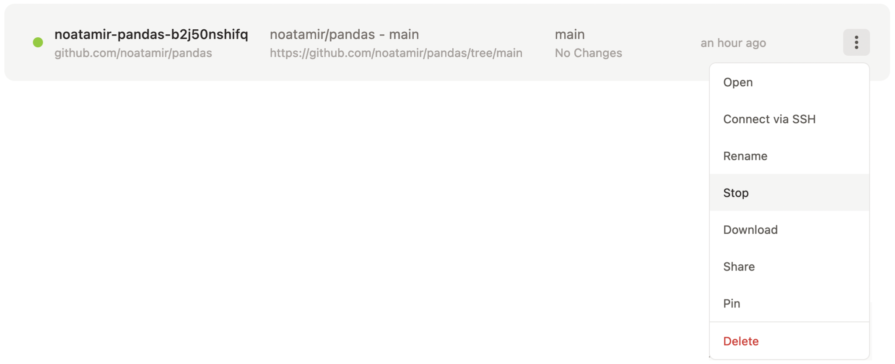
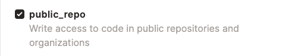

.. _contributing-gitpod:

Using Gitpod for pandas development
===================================

This section of the documentation will guide you through:

*  using Gitpod for your pandas development environment
*  creating a personal fork of the pandas repository on GitHub
*  a quick tour of pandas and VSCode
*  working on the pandas documentation in Gitpod

Gitpod
------

`Gitpod`_  is an open-source platform for automated and ready-to-code
development environments. It enables developers to describe their dev
environment as code and start instant and fresh development environments for
each new task directly from your browser. This reduces the need to install local
development environments and deal with incompatible dependencies.

Gitpod GitHub integration
-------------------------

To be able to use Gitpod, you will need to have the Gitpod app installed on your
GitHub account, so if
you do not have an account yet, you will need to create one first.

To get started just login at `Gitpod`_, and grant the appropriate permissions to GitHub.

We have built a python 3.8 environment and all development dependencies will
install when the environment starts.

Forking the pandas repository
-----------------------------

The best way to work on pandas as a contributor is by making a fork of the
repository first.

#. Browse to the `pandas repository on GitHub`_ and `create your own fork`_.

#. Browse to your fork. Your fork will have a URL like
   https://github.com/noatamir/pandas-dev, except with your GitHub username in place of
   ``noatamir``.

Starting Gitpod
---------------
Once you have authenticated to Gitpod through GitHub, you can install the
`Gitpod Chromium or Firefox browser extension <https://www.gitpod.io/docs/browser-extension>`_
which will add a **Gitpod** button next to the **Code** button in the
repository:

#. If you install the extension - you can click the **Gitpod** button to start
   a new workspace.

#. Alternatively, if you do not want to install the browser extension, you can
   visit https://gitpod.io/#https://github.com/USERNAME/pandas replacing
   ``USERNAME`` with your GitHub username.

#. In both cases, this will open a new tab on your web browser and start
   building your development environment. Please note this can take a few
   minutes.

#. Once the build is complete, you will be directed to your workspace,
   including the VSCode editor and all the dependencies you need to work on
   pandas. The first time you start your workspace, you will notice that there
   might be some actions running. This will ensure that you have a development
   version of pandas installed.

#. When your workspace is ready, you can :ref:`test the build<contributing.running_tests>` by
   entering::

      $ python -m pytest pandas

Quick workspace tour
--------------------
Gitpod uses VSCode as the editor. If you have not used this editor before, you
can check the Getting started `VSCode docs`_ to familiarize yourself with it.

Your workspace will look similar to the image below:

.. image:: ./gitpod-imgs/gitpod-workspace.png
   :alt: Gitpod workspace screenshot

We have marked some important sections in the editor:

#. Your current Python interpreter - by default, this is ``pandas-dev`` and
   should be displayed in the status bar and on your terminal. You do not need
   to activate the conda environment as this will always be activated for you.
#. Your current branch is always displayed in the status bar. You can also use
   this button to change or create branches.
#. GitHub Pull Requests extension - you can use this to work with Pull Requests
   from your workspace.
#. Marketplace extensions - we have added some essential extensions to the pandas
   Gitpod. Still, you can also install other extensions or syntax highlighting
   themes for your user, and these will be preserved for you.
#. Your workspace directory - by default, it is ``/workspace/pandas-dev``. **Do not
   change this** as this is the only directory preserved in Gitpod.

We have also pre-installed a few tools and VSCode extensions to help with the
development experience:

*  `VSCode rst extension <https://marketplace.visualstudio.com/items?itemName=lextudio.restructuredtext>`_
*  `Markdown All in One <https://marketplace.visualstudio.com/items?itemName=yzhang.markdown-all-in-one>`_
*  `VSCode Gitlens extension <https://marketplace.visualstudio.com/items?itemName=eamodio.gitlens>`_
*  `VSCode Git Graph extension <https://marketplace.visualstudio.com/items?itemName=mhutchie.git-graph>`_

Development workflow with Gitpod
--------------------------------
The  :ref:`contributing` section of this documentation contains
information regarding the pandas development workflow. Make sure to check this
before working on your contributions.

When using Gitpod, git is pre configured for you:

#. You do not need to configure your git username, and email as this should be
   done for you as you authenticated through GitHub. Unless you are using GitHub
   feature to keep email address private. You can check the git
   configuration with the command ``git config --list`` in your terminal. Use
   ``git config --global user.email “your-secret-email@users.noreply.github.com”``
   to set your email address to the one you use to make commits with your github
   profile.
#. As you started your workspace from your own pandas fork, you will by default
   have both ``upstream`` and ``origin`` added as remotes. You can verify this by
   typing ``git remote`` on your terminal or by clicking on the **branch name**
   on the status bar (see image below).

   .. image:: ./gitpod-imgs/pandas-gitpod-branches.png
      :alt: Gitpod workspace branches plugin screenshot

Rendering the pandas documentation
----------------------------------
You can find the detailed documentation on how rendering the documentation with
Sphinx works in the :ref:`contributing.howto-build-docs` section. To build the full
docs you need to run the following command in the docs directory::

    $ cd docs
    $ python make.py html

Alternatively you can build a single page with::

    python make.py --single development/contributing_gitpod.rst

You have two main options to render the documentation in Gitpod.

Option 1: using Liveserve
~~~~~~~~~~~~~~~~~~~~~~~~~

#. View the documentation in ``pandas/doc/build/html``.
#. To see the rendered version of a page, you can right-click on the ``.html``
   file and click on **Open with Live Serve**. Alternatively, you can open the
   file in the editor and click on the **Go live** button on the status bar.

    .. image:: ./gitpod-imgs/vscode-statusbar.png
        :alt: Gitpod workspace VSCode start live serve screenshot

#. A simple browser will open to the right-hand side of the editor. We recommend
   closing it and click on the **Open in browser** button in the pop-up.
#. To stop the server click on the **Port: 5500** button on the status bar.

Option 2: using the rst extension
~~~~~~~~~~~~~~~~~~~~~~~~~~~~~~~~~

A quick and easy way to see live changes in a ``.rst`` file as you work on it
uses the rst extension with docutils.

.. note:: This will generate a simple live preview of the document without the
    ``html`` theme, and some backlinks might not be added correctly. But it is an
    easy and lightweight way to get instant feedback on your work, without
    building the html files.

#. Open any of the source documentation files located in ``doc/source`` in the
   editor.
#. Open VSCode Command Palette with :kbd:`Cmd-Shift-P` in Mac or
   :kbd:`Ctrl-Shift-P` in Linux and Windows. Start typing "restructured"
   and choose either "Open preview" or "Open preview to the Side".

    .. image:: ./gitpod-imgs/vscode-rst.png
        :alt: Gitpod workspace VSCode open rst screenshot

#. As you work on the document, you will see a live rendering of it on the editor.

    .. image:: ./gitpod-imgs/rst-rendering.png
        :alt: Gitpod workspace VSCode rst rendering screenshot

If you want to see the final output with the ``html`` theme you will need to
rebuild the docs with ``make html`` and use Live Serve as described in option 1.

FAQ's and troubleshooting
-------------------------

How long is my Gitpod workspace kept for?
~~~~~~~~~~~~~~~~~~~~~~~~~~~~~~~~~~~~~~~~~

Your stopped workspace will be kept for 14 days and deleted afterwards if you do
not use them.

Can I come back to a previous workspace?
~~~~~~~~~~~~~~~~~~~~~~~~~~~~~~~~~~~~~~~~~

Yes, let's say you stepped away for a while and you want to carry on working on
your pandas contributions. You need to visit https://gitpod.io/workspaces and
click on the workspace you want to spin up again. All your changes will be there
as you last left them.

Can I install additional VSCode extensions?
~~~~~~~~~~~~~~~~~~~~~~~~~~~~~~~~~~~~~~~~~~~

Absolutely! Any extensions you installed will be installed in your own workspace
and preserved.

I registered on Gitpod but I still cannot see a ``Gitpod`` button in my repositories.
~~~~~~~~~~~~~~~~~~~~~~~~~~~~~~~~~~~~~~~~~~~~~~~~~~~~~~~~~~~~~~~~~~~~~~~~~~~~~~~~~~~~~

Head to https://gitpod.io/integrations and make sure you are logged in.
Hover over GitHub and click on the three buttons that appear on the right.
Click on edit permissions and make sure you have ``user:email``,
``read:user``, and ``public_repo`` checked. Click on **Update Permissions**
and confirm the changes in the GitHub application page.

.. image:: ./gitpod-imgs/gitpod-edit-permissions-gh.png
   :alt: Gitpod integrations - edit GH permissions screenshot

How long does my workspace stay active if I'm not using it?
~~~~~~~~~~~~~~~~~~~~~~~~~~~~~~~~~~~~~~~~~~~~~~~~~~~~~~~~~~~

If you keep your workspace open in a browser tab but don't interact with it,
it will shut down after 30 minutes. If you close the browser tab, it will
shut down after 3 minutes.

My terminal is blank - there is no cursor and it's completely unresponsive
~~~~~~~~~~~~~~~~~~~~~~~~~~~~~~~~~~~~~~~~~~~~~~~~~~~~~~~~~~~~~~~~~~~~~~~~~~

Unfortunately this is a known-issue on Gitpod's side. You can sort this
issue in two ways:

#. Create a new Gitpod workspace altogether.
#. Head to your `Gitpod dashboard <https://gitpod.io/workspaces>`_ and locate
   the running workspace. Hover on it and click on the **three dots menu**
   and then click on **Stop**. When the workspace is completely stopped you
   can click on its name to restart it again.

I authenticated through GitHub but I still cannot commit to the repository through Gitpod.
~~~~~~~~~~~~~~~~~~~~~~~~~~~~~~~~~~~~~~~~~~~~~~~~~~~~~~~~~~~~~~~~~~~~~~~~~~~~~~~~~~~~~~~~~~

Head to https://gitpod.io/integrations and make sure you are logged in.
Hover over GitHub and click on the three buttons that appear on the right.
Click on edit permissions and make sure you have ``public_repo`` checked.
Click on **Update Permissions** and confirm the changes in the
GitHub application page.

Acknowledgments
---------------

This page is lightly adapted from the `NumPy`_ project .

.. _Gitpod: https://www.gitpod.io/
.. _pandas repository on GitHub: https://github.com/pandas-dev/pandas
.. _create your own fork: https://help.github.com/en/articles/fork-a-repo
.. _VSCode docs: https://code.visualstudio.com/docs/getstarted/tips-and-tricks
.. _NumPy: https://www.numpy.org/
