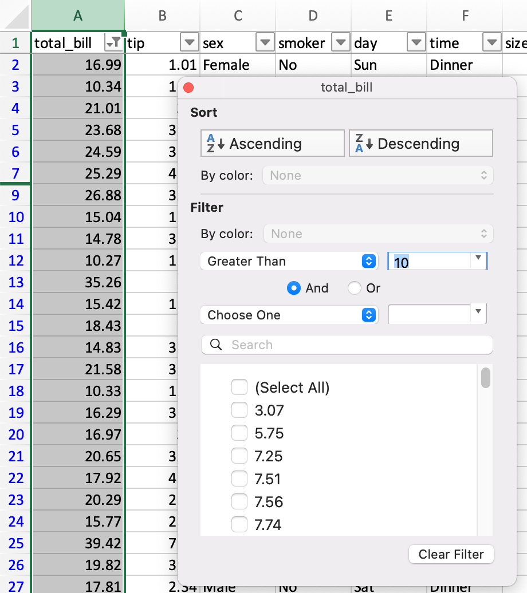
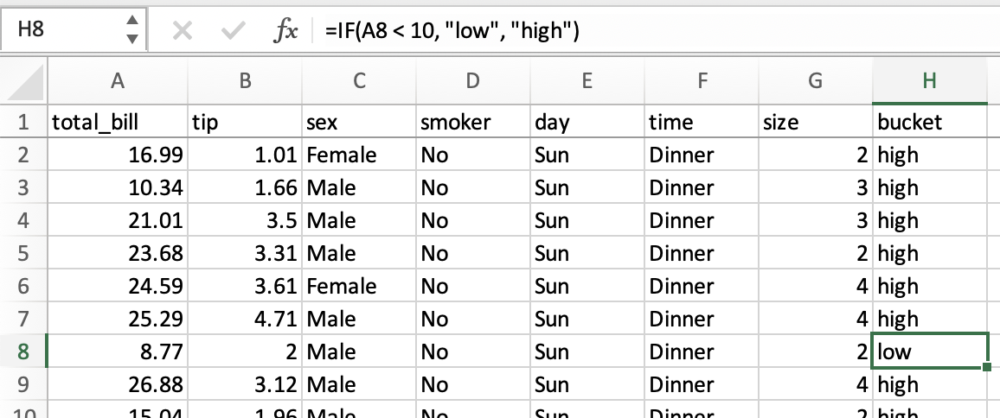
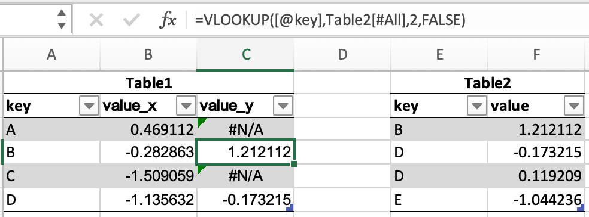

.. _compare_with_spreadsheets:

{{ header }}

Comparison with spreadsheets
****************************

Since many potential pandas users have some familiarity with spreadsheet programs like
`Excel <https://support.microsoft.com/en-us/excel>`_, this page is meant to provide some examples
of how various spreadsheet operations would be performed using pandas. This page will use
terminology and link to documentation for Excel, but much will be the same/similar in
`Google Sheets <https://support.google.com/a/users/answer/9282959>`_,
`LibreOffice Calc <https://help.libreoffice.org/latest/en-US/text/scalc/main0000.html?DbPAR=CALC>`_,
`Apple Numbers <https://www.apple.com/mac/numbers/compatibility/functions.html>`_, and other
Excel-compatible spreadsheet software.

.. include:: includes/introduction.rst

Data structures
---------------

General terminology translation
~~~~~~~~~~~~~~~~~~~~~~~~~~~~~~~

.. csv-table::
    :header: "pandas", "Excel"
    :widths: 20, 20

    ``DataFrame``, worksheet
    ``Series``, column
    ``Index``, row headings
    row, row
    ``NaN``, empty cell

``DataFrame``
~~~~~~~~~~~~~

A ``DataFrame`` in pandas is analogous to an Excel worksheet. While an Excel workbook can contain
multiple worksheets, pandas ``DataFrame``\s exist independently.

``Series``
~~~~~~~~~~

A ``Series`` is the data structure that represents one column of a ``DataFrame``. Working with a
``Series`` is analogous to referencing a column of a spreadsheet.

``Index``
~~~~~~~~~

Every ``DataFrame`` and ``Series`` has an ``Index``, which are labels on the *rows* of the data. In
pandas, if no index is specified, a :class:`~pandas.RangeIndex` is used by default (first row = 0,
second row = 1, and so on), analogous to row headings/numbers in spreadsheets.

In pandas, indexes can be set to one (or multiple) unique values, which is like having a column that
is used as the row identifier in a worksheet. Unlike most spreadsheets, these ``Index`` values can
actually be used to reference the rows. (Note that `this can be done in Excel with structured
references
<https://support.microsoft.com/en-us/office/using-structured-references-with-excel-tables-f5ed2452-2337-4f71-bed3-c8ae6d2b276e>`_.)
For example, in spreadsheets, you would reference the first row as ``A1:Z1``, while in pandas you
could use ``populations.loc['Chicago']``.

Index values are also persistent, so if you re-order the rows in a ``DataFrame``, the label for a
particular row don't change.

See the :ref:`indexing documentation<indexing>` for much more on how to use an ``Index``
effectively.

Copies vs. in place operations
~~~~~~~~~~~~~~~~~~~~~~~~~~~~~~

.. include:: includes/copies.rst

Data input / output
-------------------

Constructing a DataFrame from values
~~~~~~~~~~~~~~~~~~~~~~~~~~~~~~~~~~~~

In a spreadsheet, `values can be typed directly into cells <https://support.microsoft.com/en-us/office/enter-data-manually-in-worksheet-cells-c798181d-d75a-41b1-92ad-6c0800f80038>`_.

.. include:: includes/construct_dataframe.rst

Reading external data
~~~~~~~~~~~~~~~~~~~~~

Both `Excel <https://support.microsoft.com/en-us/office/import-data-from-external-data-sources-power-query-be4330b3-5356-486c-a168-b68e9e616f5a>`__
and :ref:`pandas <10min_tut_02_read_write>` can import data from various sources in various
formats.

CSV
'''

Let's load and display the `tips <https://github.com/pandas-dev/pandas/blob/master/pandas/tests/io/data/csv/tips.csv>`_
dataset from the pandas tests, which is a CSV file. In Excel, you would download and then
`open the CSV <https://support.microsoft.com/en-us/office/import-or-export-text-txt-or-csv-files-5250ac4c-663c-47ce-937b-339e391393ba>`_.
In pandas, you pass the URL or local path of the CSV file to :func:`~pandas.read_csv`:

.. ipython:: python

   url = (
       "https://raw.github.com/pandas-dev"
       "/pandas/master/pandas/tests/io/data/csv/tips.csv"
   )
   tips = pd.read_csv(url)
   tips

Like `Excel's Text Import Wizard <https://support.microsoft.com/en-us/office/text-import-wizard-c5b02af6-fda1-4440-899f-f78bafe41857>`_,
``read_csv`` can take a number of parameters to specify how the data should be parsed. For
example, if the data was instead tab delimited, and did not have column names, the pandas command
would be:

.. code-block:: python

   tips = pd.read_csv("tips.csv", sep="\t", header=None)

   # alternatively, read_table is an alias to read_csv with tab delimiter
   tips = pd.read_table("tips.csv", header=None)

Excel files
'''''''''''

Excel opens `various Excel file formats <https://support.microsoft.com/en-us/office/file-formats-that-are-supported-in-excel-0943ff2c-6014-4e8d-aaea-b83d51d46247>`_
by double-clicking them, or using `the Open menu <https://support.microsoft.com/en-us/office/open-files-from-the-file-menu-97f087d8-3136-4485-8e86-c5b12a8c4176>`_.
In pandas, you use :ref:`special methods for reading and writing from/to Excel files <io.excel>`.

Let's first :ref:`create a new Excel file <io.excel_writer>` based on the ``tips`` dataframe in the above example:

.. code-block:: python

    tips.to_excel("./tips.xlsx")

Should you wish to subsequently access the data in the ``tips.xlsx`` file, you can read it into your module using

.. code-block:: python

    tips_df = pd.read_excel("./tips.xlsx", index_col=0)

You have just read in an Excel file using pandas!

Limiting output
~~~~~~~~~~~~~~~

Spreadsheet programs will only show one screenful of data at a time and then allow you to scroll, so
there isn't really a need to limit output. In pandas, you'll need to put a little more thought into
controlling how your ``DataFrame``\s are displayed.

.. include:: includes/limit.rst

Exporting data
~~~~~~~~~~~~~~

By default, desktop spreadsheet software will save to its respective file format (``.xlsx``, ``.ods``, etc). You can, however, `save to other file formats <https://support.microsoft.com/en-us/office/save-a-workbook-in-another-file-format-6a16c862-4a36-48f9-a300-c2ca0065286e>`_.

:ref:`pandas can create Excel files <io.excel_writer>`, :ref:`CSV <io.store_in_csv>`, or :ref:`a number of other formats <io>`.

Data operations
---------------

Operations on columns
~~~~~~~~~~~~~~~~~~~~~

In spreadsheets, `formulas
<https://support.microsoft.com/en-us/office/overview-of-formulas-in-excel-ecfdc708-9162-49e8-b993-c311f47ca173>`_
are often created in individual cells and then `dragged
<https://support.microsoft.com/en-us/office/copy-a-formula-by-dragging-the-fill-handle-in-excel-for-mac-dd928259-622b-473f-9a33-83aa1a63e218>`_
into other cells to compute them for other columns. In pandas, you're able to do operations on whole
columns directly.

.. include:: includes/column_operations.rst

Note that we aren't having to tell it to do that subtraction cell-by-cell — pandas handles that for
us. See :ref:`how to create new columns derived from existing columns <10min_tut_05_columns>`.

Filtering
~~~~~~~~~

`In Excel, filtering is done through a graphical menu. <https://support.microsoft.com/en-us/office/filter-data-in-a-range-or-table-01832226-31b5-4568-8806-38c37dcc180e>`_

.. include:: includes/filtering.rst

If/then logic
~~~~~~~~~~~~~

Let's say we want to make a ``bucket`` column with values of ``low`` and ``high``, based on whether
the ``total_bill`` is less or more than $10.

In spreadsheets, logical comparison can be done with `conditional formulas
<https://support.microsoft.com/en-us/office/create-conditional-formulas-ca916c57-abd8-4b44-997c-c309b7307831>`_.
We'd use a formula of ``=IF(A2 < 10, "low", "high")``, dragged to all cells in a new ``bucket``
column.

.. include:: includes/if_then.rst

Date functionality
~~~~~~~~~~~~~~~~~~

*This section will refer to "dates", but timestamps are handled similarly.*

We can think of date functionality in two parts: parsing, and output. In spreadsheets, date values
are generally parsed automatically, though there is a `DATEVALUE
<https://support.microsoft.com/en-us/office/datevalue-function-df8b07d4-7761-4a93-bc33-b7471bbff252>`_
function if you need it. In pandas, you need to explicitly convert plain text to datetime objects,
either :ref:`while reading from a CSV <io.read_csv_table.datetime>` or :ref:`once in a DataFrame
<10min_tut_09_timeseries.properties>`.

Once parsed, spreadsheets display the dates in a default format, though `the format can be changed
<https://support.microsoft.com/en-us/office/format-a-date-the-way-you-want-8e10019e-d5d8-47a1-ba95-db95123d273e>`_.
In pandas, you'll generally want to keep dates as ``datetime`` objects while you're doing
calculations with them. Outputting *parts* of dates (such as the year) is done through `date
functions
<https://support.microsoft.com/en-us/office/date-and-time-functions-reference-fd1b5961-c1ae-4677-be58-074152f97b81>`_
in spreadsheets, and :ref:`datetime properties <10min_tut_09_timeseries.properties>` in pandas.

Given ``date1`` and ``date2`` in columns ``A`` and ``B`` of a spreadsheet, you might have these
formulas:

.. list-table::
    :header-rows: 1
    :widths: auto

    * - column
      - formula
    * - ``date1_year``
      - ``=YEAR(A2)``
    * - ``date2_month``
      - ``=MONTH(B2)``
    * - ``date1_next``
      - ``=DATE(YEAR(A2),MONTH(A2)+1,1)``
    * - ``months_between``
      - ``=DATEDIF(A2,B2,"M")``

The equivalent pandas operations are shown below.

.. include:: includes/time_date.rst

See :ref:`timeseries` for more details.

Selection of columns
~~~~~~~~~~~~~~~~~~~~

In spreadsheets, you can select columns you want by:

- `Hiding columns <https://support.microsoft.com/en-us/office/hide-or-show-rows-or-columns-659c2cad-802e-44ee-a614-dde8443579f8>`_
- `Deleting columns <https://support.microsoft.com/en-us/office/insert-or-delete-rows-and-columns-6f40e6e4-85af-45e0-b39d-65dd504a3246>`_
- `Referencing a range <https://support.microsoft.com/en-us/office/create-or-change-a-cell-reference-c7b8b95d-c594-4488-947e-c835903cebaa>`_ from one worksheet into another

Since spreadsheet columns are typically `named in a header row
<https://support.microsoft.com/en-us/office/turn-excel-table-headers-on-or-off-c91d1742-312c-4480-820f-cf4b534c8b3b>`_,
renaming a column is simply a matter of changing the text in that first cell.

.. include:: includes/column_selection.rst

Sorting by values
~~~~~~~~~~~~~~~~~

Sorting in spreadsheets is accomplished via `the sort dialog <https://support.microsoft.com/en-us/office/sort-data-in-a-range-or-table-62d0b95d-2a90-4610-a6ae-2e545c4a4654>`_.

.. image:: ../../_static/spreadsheets/sort.png
   :alt: Screenshot of dialog from Excel showing sorting by the sex then total_bill columns
   :align: center

.. include:: includes/sorting.rst

String processing
-----------------

Finding length of string
~~~~~~~~~~~~~~~~~~~~~~~~

In spreadsheets, the number of characters in text can be found with the `LEN
<https://support.microsoft.com/en-us/office/len-lenb-functions-29236f94-cedc-429d-affd-b5e33d2c67cb>`_
function. This can be used with the `TRIM
<https://support.microsoft.com/en-us/office/trim-function-410388fa-c5df-49c6-b16c-9e5630b479f9>`_
function to remove extra whitespace.

::

   =LEN(TRIM(A2))

.. include:: includes/length.rst

Note this will still include multiple spaces within the string, so isn't 100% equivalent.

Finding position of substring
~~~~~~~~~~~~~~~~~~~~~~~~~~~~~

The `FIND
<https://support.microsoft.com/en-us/office/find-findb-functions-c7912941-af2a-4bdf-a553-d0d89b0a0628>`_
spreadsheet function returns the position of a substring, with the first character being ``1``.

.. image:: ../../_static/spreadsheets/sort.png
   :alt: Screenshot of FIND formula being used in Excel
   :align: center

.. include:: includes/find_substring.rst

Extracting substring by position
~~~~~~~~~~~~~~~~~~~~~~~~~~~~~~~~

Spreadsheets have a `MID
<https://support.microsoft.com/en-us/office/mid-midb-functions-d5f9e25c-d7d6-472e-b568-4ecb12433028>`_
formula for extracting a substring from a given position. To get the first character::

   =MID(A2,1,1)

.. include:: includes/extract_substring.rst

Extracting nth word
~~~~~~~~~~~~~~~~~~~

In Excel, you might use the `Text to Columns Wizard
<https://support.microsoft.com/en-us/office/split-text-into-different-columns-with-the-convert-text-to-columns-wizard-30b14928-5550-41f5-97ca-7a3e9c363ed7>`_
for splitting text and retrieving a specific column. (Note `it's possible to do so through a formula
as well <https://exceljet.net/formula/extract-nth-word-from-text-string>`_.)

.. include:: includes/nth_word.rst

Changing case
~~~~~~~~~~~~~

Spreadsheets provide `UPPER, LOWER, and PROPER functions
<https://support.microsoft.com/en-us/office/change-the-case-of-text-01481046-0fa7-4f3b-a693-496795a7a44d>`_
for converting text to upper, lower, and title case, respectively.

.. include:: includes/case.rst

Merging
-------

.. include:: includes/merge_setup.rst

In Excel, there are `merging of tables can be done through a VLOOKUP
<https://support.microsoft.com/en-us/office/how-can-i-merge-two-or-more-tables-c80a9fce-c1ab-4425-bb96-497dd906d656>`_.

.. include:: includes/merge.rst

``merge`` has a number of advantages over ``VLOOKUP``:

* The lookup value doesn't need to be the first column of the lookup table
* If multiple rows are matched, there will be one row for each match, instead of just the first
* It will include all columns from the lookup table, instead of just a single specified column
* It supports :ref:`more complex join operations <merging.join>`

Other considerations
--------------------

Fill Handle
~~~~~~~~~~~

Create a series of numbers following a set pattern in a certain set of cells. In
a spreadsheet, this would be done by shift+drag after entering the first number or by
entering the first two or three values and then dragging.

This can be achieved by creating a series and assigning it to the desired cells.

.. ipython:: python

    df = pd.DataFrame({"AAA": [1] * 8, "BBB": list(range(0, 8))})
    df

    series = list(range(1, 5))
    series

    df.loc[2:5, "AAA"] = series

    df

Drop Duplicates
~~~~~~~~~~~~~~~

Excel has built-in functionality for `removing duplicate values <https://support.microsoft.com/en-us/office/find-and-remove-duplicates-00e35bea-b46a-4d5d-b28e-66a552dc138d>`_.
This is supported in pandas via :meth:`~DataFrame.drop_duplicates`.

.. ipython:: python

    df = pd.DataFrame(
        {
            "class": ["A", "A", "A", "B", "C", "D"],
            "student_count": [42, 35, 42, 50, 47, 45],
            "all_pass": ["Yes", "Yes", "Yes", "No", "No", "Yes"],
        }
    )

    df.drop_duplicates()

    df.drop_duplicates(["class", "student_count"])

Pivot Tables
~~~~~~~~~~~~

`PivotTables <https://support.microsoft.com/en-us/office/create-a-pivottable-to-analyze-worksheet-data-a9a84538-bfe9-40a9-a8e9-f99134456576>`_
from spreadsheets can be replicated in pandas through :ref:`reshaping`. Using the ``tips`` dataset again,
let's find the average gratuity by size of the party and sex of the server.

In Excel, we use the following configuration for the PivotTable:

.. image:: ../../_static/spreadsheets/pivot.png
   :alt: Screenshot showing a PivotTable in Excel, using sex as the column, size as the rows, then average tip as the values
   :align: center

The equivalent in pandas:

.. ipython:: python

    pd.pivot_table(
        tips, values="tip", index=["size"], columns=["sex"], aggfunc=np.average
    )

Adding a row
~~~~~~~~~~~~

Assuming we are using a :class:`~pandas.RangeIndex` (numbered ``0``, ``1``, etc.), we can use :meth:`DataFrame.append` to add a row to the bottom of a ``DataFrame``.

.. ipython:: python

    df
    new_row = {"class": "E", "student_count": 51, "all_pass": True}
    df.append(new_row, ignore_index=True)

Find and Replace
~~~~~~~~~~~~~~~~

`Excel's Find dialog <https://support.microsoft.com/en-us/office/find-or-replace-text-and-numbers-on-a-worksheet-0e304ca5-ecef-4808-b90f-fdb42f892e90>`_
takes you to cells that match, one by one. In pandas, this operation is generally done for an
entire column or ``DataFrame`` at once through :ref:`conditional expressions <10min_tut_03_subset.rows_and_columns>`.

.. ipython:: python

    tips
    tips == "Sun"
    tips["day"].str.contains("S")

pandas' :meth:`~DataFrame.replace` is comparable to Excel's ``Replace All``.

.. ipython:: python

    tips.replace("Thu", "Thursday")
