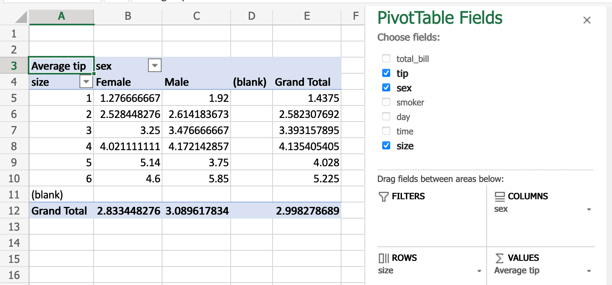

.. _compare_with_spreadsheets:

{{ header }}

Comparison with spreadsheets
****************************

Since many potential pandas users have some familiarity with spreadsheet programs like
`Excel <https://support.microsoft.com/en-us/excel>`_, this page is meant to provide some examples
of how various spreadsheet operations would be performed using pandas. This page will use
terminology and link to documentation for Excel, but much will be the same/similar in
`Google Sheets <https://support.google.com/a/users/answer/9282959>`_,
`LibreOffice Calc <https://help.libreoffice.org/latest/en-US/text/scalc/main0000.html?DbPAR=CALC>`_,
`Apple Numbers <https://www.apple.com/mac/numbers/compatibility/functions.html>`_, and other
Excel-compatible spreadsheet software.

.. include:: comparison_boilerplate.rst

Data structures
---------------

General terminology translation
~~~~~~~~~~~~~~~~~~~~~~~~~~~~~~~

.. csv-table::
    :header: "pandas", "Excel"
    :widths: 20, 20

    ``DataFrame``, worksheet
    ``Series``, column
    ``Index``, row headings
    row, row
    ``NaN``, empty cell

``DataFrame``
~~~~~~~~~~~~~

A ``DataFrame`` in pandas is analogous to an Excel worksheet. While an Excel worksheet can contain
multiple worksheets, pandas ``DataFrame``\s exist independently.

``Series``
~~~~~~~~~~

A ``Series`` is the data structure that represents one column of a ``DataFrame``. Working with a
``Series`` is analogous to referencing a column of a spreadsheet.

``Index``
~~~~~~~~~

Every ``DataFrame`` and ``Series`` has an ``Index``, which are labels on the *rows* of the data. In
pandas, if no index is specified, a :class:`~pandas.RangeIndex` is used by default (first row = 0,
second row = 1, and so on), analogous to row headings/numbers in spreadsheets.

In pandas, indexes can be set to one (or multiple) unique values, which is like having a column that
use use as the row identifier in a worksheet. Unlike spreadsheets, these ``Index`` values can actually be
used to reference the rows. For example, in spreadsheets, you would reference the first row as ``A1:Z1``,
while in pandas you could use ``populations.loc['Chicago']``.

Index values are also persistent, so if you re-order the rows in a ``DataFrame``, the label for a
particular row don't change.

See the :ref:`indexing documentation<indexing>` for much more on how to use an ``Index``
effectively.

Commonly used spreadsheet functionalities
-----------------------------------------

Importing data
~~~~~~~~~~~~~~

Both `Excel <https://support.microsoft.com/en-us/office/import-data-from-external-data-sources-power-query-be4330b3-5356-486c-a168-b68e9e616f5a>`__
and :ref:`pandas <10min_tut_02_read_write>` can import data from various sources in various
formats.

Excel files
'''''''''''

Excel opens `various Excel file formats <https://support.microsoft.com/en-us/office/file-formats-that-are-supported-in-excel-0943ff2c-6014-4e8d-aaea-b83d51d46247>`_
by double-clicking them, or using `the Open menu <https://support.microsoft.com/en-us/office/open-files-from-the-file-menu-97f087d8-3136-4485-8e86-c5b12a8c4176>`_.
In pandas, you use :ref:`special methods for reading and writing from/to Excel files <io.excel>`.

CSV
'''

Let's load and display the `tips <https://github.com/pandas-dev/pandas/blob/master/pandas/tests/io/data/csv/tips.csv>`_
dataset from the pandas tests, which is a CSV file. In Excel, you would download and then
`open the CSV <https://support.microsoft.com/en-us/office/import-or-export-text-txt-or-csv-files-5250ac4c-663c-47ce-937b-339e391393ba>`_.
In pandas, you pass the URL or local path of the CSV file to :func:`~pandas.read_csv`:

.. ipython:: python

   url = (
       "https://raw.github.com/pandas-dev"
       "/pandas/master/pandas/tests/io/data/csv/tips.csv"
   )
   tips = pd.read_csv(url)
   tips

Fill Handle
~~~~~~~~~~~

Create a series of numbers following a set pattern in a certain set of cells. In
a spreadsheet, this would be done by shift+drag after entering the first number or by
entering the first two or three values and then dragging.

This can be achieved by creating a series and assigning it to the desired cells.

.. ipython:: python

    df = pd.DataFrame({"AAA": [1] * 8, "BBB": list(range(0, 8))})
    df

    series = list(range(1, 5))
    series

    df.loc[2:5, "AAA"] = series

    df

Filters
~~~~~~~

Filters can be achieved by using slicing.

The examples filter by 0 on column AAA, and also show how to filter by multiple
values.

.. ipython:: python

   df[df.AAA == 0]

   df[(df.AAA == 0) | (df.AAA == 2)]

Drop Duplicates
~~~~~~~~~~~~~~~

Excel has built-in functionality for `removing duplicate values <https://support.microsoft.com/en-us/office/find-and-remove-duplicates-00e35bea-b46a-4d5d-b28e-66a552dc138d>`_.
This is supported in pandas via :meth:`~DataFrame.drop_duplicates`.

.. ipython:: python

    df = pd.DataFrame(
        {
            "class": ["A", "A", "A", "B", "C", "D"],
            "student_count": [42, 35, 42, 50, 47, 45],
            "all_pass": ["Yes", "Yes", "Yes", "No", "No", "Yes"],
        }
    )

    df.drop_duplicates()

    df.drop_duplicates(["class", "student_count"])

Pivot Tables
~~~~~~~~~~~~

`PivotTables <https://support.microsoft.com/en-us/office/create-a-pivottable-to-analyze-worksheet-data-a9a84538-bfe9-40a9-a8e9-f99134456576>`_
from spreadsheets can be replicated in pandas through :ref:`reshaping`. Using the ``tips`` dataset again,
let's find the average gratuity by size of the party and sex of the server.

In Excel, we use the following configuration for the PivotTable:

The equivalent in pandas:

.. ipython:: python

    pd.pivot_table(
        tips, values="tip", index=["size"], columns=["sex"], aggfunc=np.average
    )

Formulas
~~~~~~~~

In spreadsheets, `formulas <https://support.microsoft.com/en-us/office/overview-of-formulas-in-excel-ecfdc708-9162-49e8-b993-c311f47ca173>`_
are often created in individual cells and then `dragged <https://support.microsoft.com/en-us/office/copy-a-formula-by-dragging-the-fill-handle-in-excel-for-mac-dd928259-622b-473f-9a33-83aa1a63e218>`_
into other cells to compute them for other columns. In pandas, you'll be doing more operations on
full columns.

As an example, let's create a new column "girls_count" and try to compute the number of boys in
each class.

.. ipython:: python

    df["girls_count"] = [21, 12, 21, 31, 23, 17]
    df
    df["boys_count"] = df["student_count"] - df["girls_count"]
    df

Note that we aren't having to tell it to do that subtraction cell-by-cell — pandas handles that for
us. See :ref:`how to create new columns derived from existing columns <10min_tut_05_columns>`.

VLOOKUP
~~~~~~~

.. ipython:: python

    import random

    first_names = [
        "harry",
        "ron",
        "hermione",
        "rubius",
        "albus",
        "severus",
        "luna",
    ]
    keys = [1, 2, 3, 4, 5, 6, 7]
    df1 = pd.DataFrame({"keys": keys, "first_names": first_names})
    df1

    surnames = [
        "hadrid",
        "malfoy",
        "lovegood",
        "dumbledore",
        "grindelwald",
        "granger",
        "weasly",
        "riddle",
        "longbottom",
        "snape",
    ]
    keys = [random.randint(1, 7) for x in range(0, 10)]
    random_names = pd.DataFrame({"surnames": surnames, "keys": keys})

    random_names

    random_names.merge(df1, on="keys", how="left")

Adding a row
~~~~~~~~~~~~

To appended a row, we can just assign values to an index using :meth:`~DataFrame.loc`.

NOTE: If the index already exists, the values in that index will be over written.

.. ipython:: python

    df1.loc[7] = [8, "tonks"]
    df1

Search and Replace
~~~~~~~~~~~~~~~~~~

The ``replace`` method that comes associated with the ``DataFrame`` object can perform
this function. Please see `pandas.DataFrame.replace <https://pandas.pydata.org/pandas-docs/stable/generated/pandas.DataFrame.replace.html>`__ for examples.
