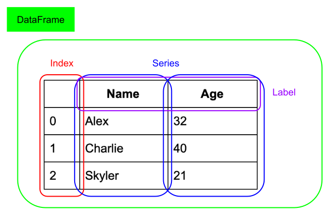
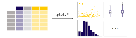
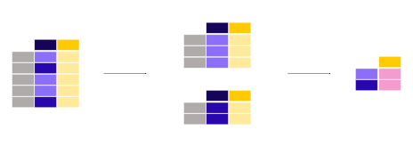
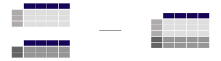

{{ header }}

.. _getting_started:

===============
Getting started
===============

Installation
------------

.. raw:: html

    

        

            

                

                

                    Working with conda?
                

                

                    

pandas is part of the `Anaconda <http://docs.continuum.io/anaconda/>`__ distribution and can be
installed with Anaconda or Miniconda:

.. raw:: html

                    

                

                

.. code-block:: bash

   conda install pandas

.. raw:: html

                

                

            

            

                

                

                    Prefer pip?
                

                

                    

pandas can be installed via pip from `PyPI <https://pypi.org/project/pandas>`__.

.. raw:: html

                    

                

                

.. code-block:: bash

   pip install pandas

.. raw:: html

                

                

            

            

                

                

                    In-depth instructions?
                

                

                    
Installing a specific version?
                      Installing from source?
                      Check the advanced installation page.

.. container:: custom-button

    :ref:`Learn more <install>`

.. raw:: html

                

                

            

        

    

.. _gentle_intro:

Intro to pandas
---------------

.. raw:: html

    

    

        

            

                

                    

                        <button class="btn btn-dark btn-sm"></button>
                        What kind of data does pandas handle?
                    

                    

:ref:`Straight to tutorial...<10min_tut_01_tableoriented>`

.. raw:: html

                    
                

            

            

                

When working with tabular data, such as data stored in spreadsheets or databases, pandas is the right tool for you. pandas will help you
to explore, clean and process your data. In pandas, a data table is called a :class:`DataFrame`.

.. raw:: html

                    

                        

:ref:`To introduction tutorial <10min_tut_01_tableoriented>`

.. raw:: html

                        
                        

:ref:`To user guide <dsintro>`

.. raw:: html

                        
                    

                

            

        

        

            

                

                    

                        <button class="btn btn-dark btn-sm"></button>
                        How do I read and write tabular data?
                    

                    

:ref:`Straight to tutorial...<10min_tut_02_read_write>`

.. raw:: html

                    
                

            

            

                

pandas supports the integration with many file formats or data sources out of the box (csv, excel, sql, json, parquet,…). Importing data from each of these
data sources is provided by function with the prefix ``read_*``. Similarly, the ``to_*`` methods are used to store data.

.. image:: ../_static/schemas/02_io_readwrite.svg
   :align: center

.. raw:: html

                    

                        

:ref:`To introduction tutorial <10min_tut_02_read_write>`

.. raw:: html

                        
                        

:ref:`To user guide <io>`

.. raw:: html

                        
                    

                

            

        

        

            

                

                    

                        <button class="btn btn-dark btn-sm"></button>
                        How do I select a subset of a table?
                    

                    

:ref:`Straight to tutorial...<10min_tut_03_subset>`

.. raw:: html

                    
                

            

            

                

Selecting or filtering specific rows and/or columns? Filtering the data on a condition? Methods for slicing, selecting, and extracting the
data you need are available in pandas.

.. image:: ../_static/schemas/03_subset_columns_rows.svg
   :align: center

.. raw:: html

                    

                        

:ref:`To introduction tutorial <10min_tut_03_subset>`

.. raw:: html

                        
                        

:ref:`To user guide <indexing>`

.. raw:: html

                        
                    

                

            

        

        

            

                

                    

                        <button class="btn btn-dark btn-sm"></button>
                        How to create plots in pandas?
                    

                    

:ref:`Straight to tutorial...<10min_tut_04_plotting>`

.. raw:: html

                    
                

            

            

                

pandas provides plotting your data out of the box, using the power of Matplotlib. You can pick the plot type (scatter, bar, boxplot,...)
corresponding to your data.

.. raw:: html

                    

                        

:ref:`To introduction tutorial <10min_tut_04_plotting>`

.. raw:: html

                        
                        

:ref:`To user guide <visualization>`

.. raw:: html

                        
                    

                

            

        

        

            

                

                    

                        <button class="btn btn-dark btn-sm"></button>
                        How to create new columns derived from existing columns?
                    

                    

:ref:`Straight to tutorial...<10min_tut_05_columns>`

.. raw:: html

                    
                

            

            

                

There is no need to loop over all rows of your data table to do calculations. Data manipulations on a column work elementwise.
Adding a column to a :class:`DataFrame` based on existing data in other columns is straightforward.

.. image:: ../_static/schemas/05_newcolumn_2.svg
   :align: center

.. raw:: html

                    

                        

:ref:`To introduction tutorial <10min_tut_05_columns>`

.. raw:: html

                        
                        

:ref:`To user guide <basics.dataframe.sel_add_del>`

.. raw:: html

                        
                    

                

            

        

        

            

                

                    

                        <button class="btn btn-dark btn-sm"></button>
                        How to calculate summary statistics?
                    

                    

:ref:`Straight to tutorial...<10min_tut_06_stats>`

.. raw:: html

                    
                

            

            

                

Basic statistics (mean, median, min, max, counts...) are easily calculable. These or custom aggregations can be applied on the entire
data set, a sliding window of the data or grouped by categories. The latter is also known as the split-apply-combine approach.

.. raw:: html

                    

                        

:ref:`To introduction tutorial <10min_tut_06_stats>`

.. raw:: html

                        
                        

:ref:`To user guide <groupby>`

.. raw:: html

                        
                    

                

            

        

        

            

                

                    

                        <button class="btn btn-dark btn-sm"></button>
                        How to reshape the layout of tables?
                    

                    

:ref:`Straight to tutorial...<10min_tut_07_reshape>`

.. raw:: html

                    
                

            

            

                

Change the structure of your data table in multiple ways. You can :func:`~pandas.melt` your data table from wide to long/tidy form or :func:`~pandas.pivot`
from long to wide format. With aggregations built-in, a pivot table is created with a sinlge command.

.. image:: ../_static/schemas/07_melt.svg
   :align: center

.. raw:: html

                    

                        

:ref:`To introduction tutorial <10min_tut_07_reshape>`

.. raw:: html

                        
                        

:ref:`To user guide <reshaping>`

.. raw:: html

                        
                    

                

            

        

        

            

                

                    

                        <button class="btn btn-dark btn-sm"></button>
                        How to combine data from multiple tables?
                    

                    

:ref:`Straight to tutorial...<10min_tut_08_combine>`

.. raw:: html

                    
                

            

            

                

Multiple tables can be concatenated both column wise as row wise and database-like join/merge operations are provided to combine multiple tables of data.

.. raw:: html

                    

                        

:ref:`To introduction tutorial <10min_tut_08_combine>`

.. raw:: html

                        
                        

:ref:`To user guide <merging>`

.. raw:: html

                        
                    

                

            

        

        

            

                

                    

                        <button class="btn btn-dark btn-sm"></button>
                        How to handle time series data?
                    

                    

:ref:`Straight to tutorial...<10min_tut_09_timeseries>`

.. raw:: html

                    
                

            

            

                

pandas has great support for time series and has an extensive set of tools for working with dates, times, and time-indexed data.

.. raw:: html

                    

                        

:ref:`To introduction tutorial <10min_tut_09_timeseries>`

.. raw:: html

                        
                        

:ref:`To user guide <timeseries>`

.. raw:: html

                        
                    

                

            

        

        

            

                

                    

                        <button class="btn btn-dark btn-sm"></button>
                        How to manipulate textual data?
                    

                    

:ref:`Straight to tutorial...<10min_tut_10_text>`

.. raw:: html

                    
                

            

            

                

Data sets do not only contain numerical data. pandas provides a wide range of functions to cleaning textual data and extract useful information from it.

.. raw:: html

                    

                        

:ref:`To introduction tutorial <10min_tut_10_text>`

.. raw:: html

                        
                        

:ref:`To user guide <timeseries>`

.. raw:: html

                        
                    

                

            

        

    

    

.. _comingfrom:

Coming from...
--------------

Are you familiar with other software for manipulating tablular data? Learn
the pandas-equivalent operations compared to software you already know:

.. raw:: html

    

        

            

                

                
                

                    
The <a href="https://www.r-project.org/">R programming language</a> provides the <code>dataframe</code> data structure and multiple packages,
                        such as <a href="https://www.tidyverse.org/">tidyverse</a> use and extend <code>data.frame</code>s for convenient data handling
                        functionalities similar to pandas.

.. container:: custom-button

    :ref:`Learn more <compare_with_r>`

.. raw:: html

                

                

            

            

                

                
                

                    
Already familiar to <code>SELECT</code>, <code>GROUP BY</code>, <code>JOIN</code>, etc.?
                    Most of these SQL manipulations do have equivalents in pandas.

.. container:: custom-button

    :ref:`Learn more <compare_with_sql>`

.. raw:: html

                    

                    

                

                

                    

                    
                    

                        
The <code>data set</code> included in the
                            <a href="https://en.wikipedia.org/wiki/Stata">STATA</a> statistical software suite corresponds
                            to the pandas <code>dataframe</code>. Many of the operations known from STATA have an equivalent
                            in pandas.

.. container:: custom-button

    :ref:`Learn more <compare_with_stata>`

.. raw:: html

                    

                    

                

                

                    

                    
                    

                        
The  <a href="https://en.wikipedia.org/wiki/SAS_(software)">SAS</a> statistical software suite
                            also provides the <code>data set</code> corresponding to the pandas <code>dataframe</code>.
                            Also SAS vectorized operations, filtering, string processing operations, and more have similar
                            functions in pandas.

.. container:: custom-button

    :ref:`Learn more <compare_with_sas>`

.. raw:: html

                    

                    

                

        

    

Tutorials
---------

For a quick overview of pandas functionality, see :ref:`10 Minutes to pandas<10min>`.

You can also reference the pandas `cheat sheet <https://pandas.pydata.org/Pandas_Cheat_Sheet.pdf>`_
for a succinct guide for manipulating data with pandas.

The community produces a wide variety of tutorials available online. Some of the
material is enlisted in the community contributed :ref:`communitytutorials`.

.. If you update this toctree, also update the manual toctree in the
   main index.rst.template

.. toctree::
    :maxdepth: 2
    :hidden:

    install
    overview
    intro_tutorials/index
    comparison/index
    tutorials
