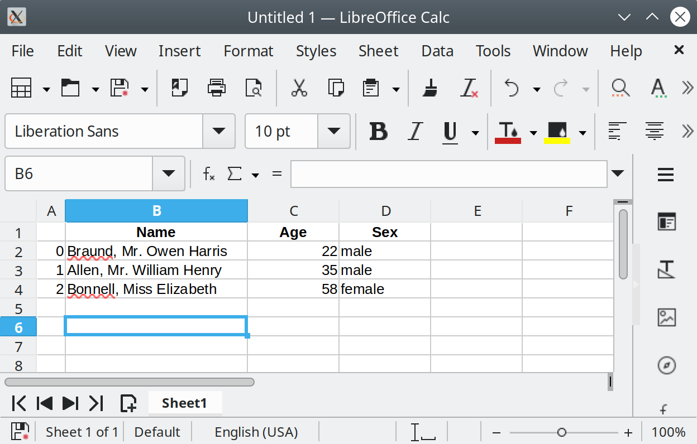

.. _10min_tut_01_tableoriented:

{{ header }}

What kind of data does pandas handle?
=====================================

.. raw:: html

    <ul class="task-bullet">
        <li>

I want to start using pandas

.. ipython:: python

    import pandas as pd

To load the pandas package and start working with it, import the
package. The community agreed alias for pandas is ``pd``, so loading
pandas as ``pd`` is assumed standard practice for all of the pandas
documentation.

.. raw:: html

        </li>
    </ul>

Pandas data table representation
~~~~~~~~~~~~~~~~~~~~~~~~~~~~~~~~

.. image:: ../../_static/schemas/01_table_dataframe.svg
   :align: center

.. raw:: html

    <ul class="task-bullet">
        <li>

I want to store passenger data of the Titanic. For a number of passengers, I know the name (characters), age (integers) and sex (male/female) data.

.. ipython:: python

    df = pd.DataFrame({
        "Name": ["Braund, Mr. Owen Harris",
                 "Allen, Mr. William Henry",
                 "Bonnell, Miss. Elizabeth"],
        "Age": [22, 35, 58],
        "Sex": ["male", "male", "female"]}
    )
    df

To manually store data in a table, create a ``DataFrame``. When using a Python dictionary of lists, the dictionary keys will be used as column headers and
the values in each list as rows of the ``DataFrame``.

.. raw:: html

        </li>
    </ul>

A :class:`DataFrame` is a 2-dimensional data structure that can store data of
different types (including characters, integers, floating point values,
categorical data and more) in columns. It is similar to a spreadsheet, a
SQL table or the ``data.frame`` in R.

-  The table has 3 columns, each of them with a column label. The column
   labels are respectively ``Name``, ``Age`` and ``Sex``.
-  The column ``Name`` consists of textual data with each value a
   string, the column ``Age`` are numbers and the column ``Sex`` is
   textual data.

In spreadsheet software, the table representation of our data would look
very similar:

Each column in a ``DataFrame`` is a ``Series``
~~~~~~~~~~~~~~~~~~~~~~~~~~~~~~~~~~~~~~~~~~~~~~

.. raw:: html

    <ul class="task-bullet">
        <li>

I’m just interested in working with the data in the column ``Age``

.. ipython:: python

    df["Age"]

When selecting a single column of a pandas :class:`DataFrame`, the result is
a pandas :class:`Series`. To select the column, use the column label in
between square brackets ``[]``.

.. raw:: html

        </li>
    </ul>

.. note::
    If you are familiar to Python
    :ref:`dictionaries <python:tut-dictionaries>`, the selection of a
    single column is very similar to selection of dictionary values based on
    the key.

You can create a ``Series`` from scratch as well:

.. ipython:: python

    ages = pd.Series([22, 35, 58], name="Age")
    ages

A pandas ``Series`` has no column labels, as it is just a single column
of a ``DataFrame``. A Series does have row labels.

Do something with a DataFrame or Series
~~~~~~~~~~~~~~~~~~~~~~~~~~~~~~~~~~~~~~~

.. raw:: html

    <ul class="task-bullet">
        <li>

I want to know the maximum Age of the passengers

We can do this on the ``DataFrame`` by selecting the ``Age`` column and
applying ``max()``:

.. ipython:: python

    df["Age"].max()

Or to the ``Series``:

.. ipython:: python

    ages.max()

.. raw:: html

        </li>
    </ul>

As illustrated by the ``max()`` method, you can *do* things with a
``DataFrame`` or ``Series``. pandas provides a lot of functionalities,
each of them a *method* you can apply to a ``DataFrame`` or ``Series``.
As methods are functions, do not forget to use parentheses ``()``.

.. raw:: html

    <ul class="task-bullet">
        <li>

I’m interested in some basic statistics of the numerical data of my data table

.. ipython:: python

    df.describe()

The :func:`~DataFrame.describe` method provides a quick overview of the numerical data in
a ``DataFrame``. As the ``Name`` and ``Sex`` columns are textual data,
these are by default not taken into account by the :func:`~DataFrame.describe` method.

.. raw:: html

        </li>
    </ul>

Many pandas operations return a ``DataFrame`` or a ``Series``. The
:func:`~DataFrame.describe` method is an example of a pandas operation returning a
pandas ``Series``.

.. raw:: html

    

        To user guide

Check more options on ``describe`` in the user guide section about :ref:`aggregations with describe <basics.describe>`

.. raw:: html

    

.. note::
    This is just a starting point. Similar to spreadsheet
    software, pandas represents data as a table with columns and rows. Apart
    from the representation, also the data manipulations and calculations
    you would do in spreadsheet software are supported by pandas. Continue
    reading the next tutorials to get started!

.. raw:: html

    

        <h4>REMEMBER</h4>

-  Import the package, aka ``import pandas as pd``
-  A table of data is stored as a pandas ``DataFrame``
-  Each column in a ``DataFrame`` is a ``Series``
-  You can do things by applying a method to a ``DataFrame`` or ``Series``

.. raw:: html

    

.. raw:: html

    

        To user guide

A more extended explanation to ``DataFrame`` and ``Series`` is provided in the :ref:`introduction to data structures <dsintro>`.

.. raw:: html

    
