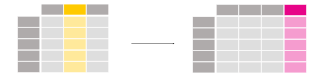
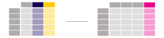

.. _10min_tut_05_columns:

{{ header }}

.. ipython:: python

    import pandas as pd

.. raw:: html

    

        

            

                Data used for this tutorial:
            

        

        <ul class="list-group list-group-flush">
            <li class="list-group-item">

.. include:: includes/air_quality_no2.rst

.. ipython:: python

    air_quality = pd.read_csv("data/air_quality_no2.csv", index_col=0, parse_dates=True)
    air_quality.head()

.. raw:: html

        </li>
    </ul>
    

How to create new columns derived from existing columns?
--------------------------------------------------------

.. raw:: html

    <ul class="task-bullet">
        <li>

I want to express the :math:`NO_2` concentration of the station in London in mg/m\ :math:`^3`

(*If we assume temperature of 25 degrees Celsius and pressure of 1013
hPa, the conversion factor is 1.882*)

.. ipython:: python

    air_quality["london_mg_per_cubic"] = air_quality["station_london"] * 1.882
    air_quality.head()

To create a new column, use the ``[]`` brackets with the new column name
at the left side of the assignment.

.. raw:: html

        </li>
    </ul>

.. note::
    The calculation of the values is done **element_wise**. This
    means all values in the given column are multiplied by the value 1.882
    at once. You do not need to use a loop to iterate each of the rows!

.. raw:: html

    <ul class="task-bullet">
        <li>

I want to check the ratio of the values in Paris versus Antwerp and save the result in a new column

.. ipython:: python

    air_quality["ratio_paris_antwerp"] = (
        air_quality["station_paris"] / air_quality["station_antwerp"]
    )
    air_quality.head()

The calculation is again element-wise, so the ``/`` is applied *for the
values in each row*.

.. raw:: html

        </li>
    </ul>

Also other mathematical operators (``+``, ``-``, ``\*``, ``/``) or
logical operators (``<``, ``>``, ``=``,…) work element wise. The latter was already
used in the :ref:`subset data tutorial <10min_tut_03_subset>` to filter
rows of a table using a conditional expression.

If you need more advanced logic, you can use arbitrary Python code via :meth:`~DataFrame.apply`.

.. raw:: html

    <ul class="task-bullet">
        <li>

I want to rename the data columns to the corresponding station identifiers used by openAQ

.. ipython:: python

    air_quality_renamed = air_quality.rename(
        columns={
            "station_antwerp": "BETR801",
            "station_paris": "FR04014",
            "station_london": "London Westminster",
        }
    )

.. ipython:: python

    air_quality_renamed.head()

The :meth:`~DataFrame.rename` function can be used for both row labels and column
labels. Provide a dictionary with the keys the current names and the
values the new names to update the corresponding names.

.. raw:: html

        </li>
    </ul>

The mapping should not be restricted to fixed names only, but can be a
mapping function as well. For example, converting the column names to
lowercase letters can be done using a function as well:

.. ipython:: python

    air_quality_renamed = air_quality_renamed.rename(columns=str.lower)
    air_quality_renamed.head()

.. raw:: html

    

        To user guide

Details about column or row label renaming is provided in the user guide section on :ref:`renaming labels <basics.rename>`.

.. raw:: html

   

.. raw:: html

    

        <h4>REMEMBER</h4>

-  Create a new column by assigning the output to the DataFrame with a
   new column name in between the ``[]``.
-  Operations are element-wise, no need to loop over rows.
-  Use ``rename`` with a dictionary or function to rename row labels or
   column names.

.. raw:: html

   

.. raw:: html

    

        To user guide

The user guide contains a separate section on :ref:`column addition and deletion <basics.dataframe.sel_add_del>`.

.. raw:: html

   

