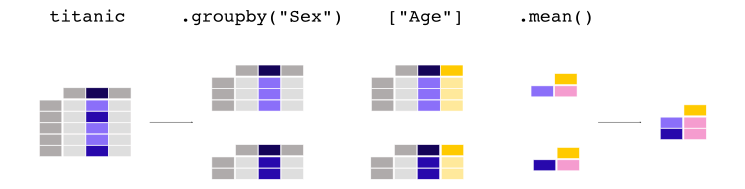
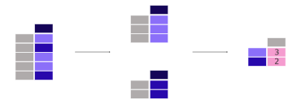

.. _10min_tut_06_stats:

{{ header }}

.. ipython:: python

    import pandas as pd

.. raw:: html

    

        

            

                Data used for this tutorial:
            

        

        <ul class="list-group list-group-flush">
            <li class="list-group-item">

.. include:: includes/titanic.rst

.. ipython:: python

    titanic = pd.read_csv("data/titanic.csv")
    titanic.head()

.. raw:: html

            </li>
        </ul>
    

How to calculate summary statistics?
------------------------------------

Aggregating statistics
~~~~~~~~~~~~~~~~~~~~~~

.. raw:: html

    <ul class="task-bullet">
        <li>

What is the average age of the Titanic passengers?

.. ipython:: python

    titanic["Age"].mean()

.. raw:: html

        </li>
    </ul>

Different statistics are available and can be applied to columns with
numerical data. Operations in general exclude missing data and operate
across rows by default.

.. raw:: html

    <ul class="task-bullet">
        <li>

What is the median age and ticket fare price of the Titanic passengers?

.. ipython:: python

    titanic[["Age", "Fare"]].median()

The statistic applied to multiple columns of a ``DataFrame`` (the selection of two columns
return a ``DataFrame``, see the :ref:`subset data tutorial <10min_tut_03_subset>`) is calculated for each numeric column.

.. raw:: html

        </li>
    </ul>

The aggregating statistic can be calculated for multiple columns at the
same time. Remember the ``describe`` function from :ref:`first tutorial <10min_tut_01_tableoriented>` tutorial?

.. ipython:: python

    titanic[["Age", "Fare"]].describe()

Instead of the predefined statistics, specific combinations of
aggregating statistics for given columns can be defined using the
:func:`DataFrame.agg` method:

.. ipython:: python

    titanic.agg(
        {
            "Age": ["min", "max", "median", "skew"],
            "Fare": ["min", "max", "median", "mean"],
        }
    )

.. raw:: html

    

        To user guide

Details about descriptive statistics are provided in the user guide section on :ref:`descriptive statistics <basics.stats>`.

.. raw:: html

   

Aggregating statistics grouped by category
~~~~~~~~~~~~~~~~~~~~~~~~~~~~~~~~~~~~~~~~~~

.. image:: ../../_static/schemas/06_groupby.svg
   :align: center

.. raw:: html

    <ul class="task-bullet">
        <li>

What is the average age for male versus female Titanic passengers?

.. ipython:: python

    titanic[["Sex", "Age"]].groupby("Sex").mean()

As our interest is the average age for each gender, a subselection on
these two columns is made first: ``titanic[["Sex", "Age"]]``. Next, the
:meth:`~DataFrame.groupby` method is applied on the ``Sex`` column to make a group per
category. The average age *for each gender* is calculated and
returned.

.. raw:: html

        </li>
    </ul>

Calculating a given statistic (e.g. ``mean`` age) *for each category in
a column* (e.g. male/female in the ``Sex`` column) is a common pattern.
The ``groupby`` method is used to support this type of operations. More
general, this fits in the more general ``split-apply-combine`` pattern:

-  **Split** the data into groups
-  **Apply** a function to each group independently
-  **Combine** the results into a data structure

The apply and combine steps are typically done together in pandas.

In the previous example, we explicitly selected the 2 columns first. If
not, the ``mean`` method is applied to each column containing numerical
columns:

.. ipython:: python

    titanic.groupby("Sex").mean()

It does not make much sense to get the average value of the ``Pclass``.
if we are only interested in the average age for each gender, the
selection of columns (rectangular brackets ``[]`` as usual) is supported
on the grouped data as well:

.. ipython:: python

    titanic.groupby("Sex")["Age"].mean()

.. note::
    The ``Pclass`` column contains numerical data but actually
    represents 3 categories (or factors) with respectively the labels ‘1’,
    ‘2’ and ‘3’. Calculating statistics on these does not make much sense.
    Therefore, pandas provides a ``Categorical`` data type to handle this
    type of data. More information is provided in the user guide
    :ref:`categorical` section.

.. raw:: html

    <ul class="task-bullet">
        <li>

What is the mean ticket fare price for each of the sex and cabin class combinations?

.. ipython:: python

    titanic.groupby(["Sex", "Pclass"])["Fare"].mean()

Grouping can be done by multiple columns at the same time. Provide the
column names as a list to the :meth:`~DataFrame.groupby` method.

.. raw:: html

        </li>
    </ul>

.. raw:: html

    

        To user guide

A full description on the split-apply-combine approach is provided in the user guide section on :ref:`groupby operations <groupby>`.

.. raw:: html

   

Count number of records by category
~~~~~~~~~~~~~~~~~~~~~~~~~~~~~~~~~~~

.. raw:: html

    <ul class="task-bullet">
        <li>

What is the number of passengers in each of the cabin classes?

.. ipython:: python

    titanic["Pclass"].value_counts()

The :meth:`~Series.value_counts` method counts the number of records for each
category in a column.

.. raw:: html

        </li>
    </ul>

The function is a shortcut, as it is actually a groupby operation in combination with counting of the number of records
within each group:

.. ipython:: python

    titanic.groupby("Pclass")["Pclass"].count()

.. note::
    Both ``size`` and ``count`` can be used in combination with
    ``groupby``. Whereas ``size`` includes ``NaN`` values and just provides
    the number of rows (size of the table), ``count`` excludes the missing
    values. In the ``value_counts`` method, use the ``dropna`` argument to
    include or exclude the ``NaN`` values.

.. raw:: html

    

        To user guide

The user guide has a dedicated section on ``value_counts`` , see page on :ref:`discretization <basics.discretization>`.

.. raw:: html

   

.. raw:: html

    

        <h4>REMEMBER</h4>

-  Aggregation statistics can be calculated on entire columns or rows
-  ``groupby`` provides the power of the *split-apply-combine* pattern
-  ``value_counts`` is a convenient shortcut to count the number of
   entries in each category of a variable

.. raw:: html

   

.. raw:: html

    

        To user guide

A full description on the split-apply-combine approach is provided in the user guide pages about :ref:`groupby operations <groupby>`.

.. raw:: html

   

