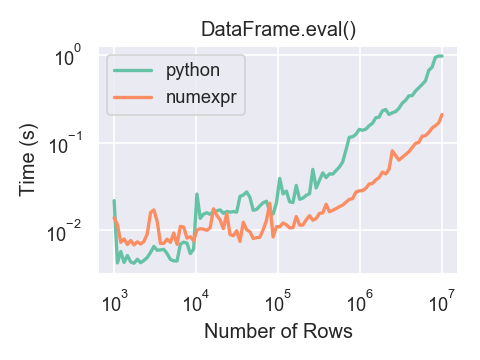

.. _enhancingperf:

{{ header }}

*********************
Enhancing performance
*********************

In this part of the tutorial, we will investigate how to speed up certain
functions operating on pandas ``DataFrames`` using three different techniques:
Cython, Numba and :func:`pandas.eval`. We will see a speed improvement of ~200
when we use Cython and Numba on a test function operating row-wise on the
``DataFrame``. Using :func:`pandas.eval` we will speed up a sum by an order of
~2.

.. _enhancingperf.cython:

Cython (writing C extensions for pandas)
----------------------------------------

For many use cases writing pandas in pure Python and NumPy is sufficient. In some
computationally heavy applications however, it can be possible to achieve sizable
speed-ups by offloading work to `cython <https://cython.org/>`__.

This tutorial assumes you have refactored as much as possible in Python, for example
by trying to remove for-loops and making use of NumPy vectorization. It's always worth
optimising in Python first.

This tutorial walks through a "typical" process of cythonizing a slow computation.
We use an `example from the Cython documentation <http://docs.cython.org/src/quickstart/cythonize.html>`__
but in the context of pandas. Our final cythonized solution is around 100 times
faster than the pure Python solution.

.. _enhancingperf.pure:

Pure Python
~~~~~~~~~~~

We have a ``DataFrame`` to which we want to apply a function row-wise.

.. ipython:: python

   df = pd.DataFrame({'a': np.random.randn(1000),
                      'b': np.random.randn(1000),
                      'N': np.random.randint(100, 1000, (1000)),
                      'x': 'x'})
   df

Here's the function in pure Python:

.. ipython:: python

   def f(x):
       return x * (x - 1)

   def integrate_f(a, b, N):
       s = 0
       dx = (b - a) / N
       for i in range(N):
           s += f(a + i * dx)
       return s * dx

We achieve our result by using ``apply`` (row-wise):

.. code-block:: ipython

   In [7]: %timeit df.apply(lambda x: integrate_f(x['a'], x['b'], x['N']), axis=1)
   10 loops, best of 3: 174 ms per loop

But clearly this isn't fast enough for us. Let's take a look and see where the
time is spent during this operation (limited to the most time consuming
four calls) using the `prun ipython magic function <https://ipython.readthedocs.io/en/stable/interactive/magics.html#magic-prun>`__:

.. ipython:: python

   %prun -l 4 df.apply(lambda x: integrate_f(x['a'], x['b'], x['N']), axis=1)  # noqa E999

By far the majority of time is spend inside either ``integrate_f`` or ``f``,
hence we'll concentrate our efforts cythonizing these two functions.

.. _enhancingperf.plain:

Plain Cython
~~~~~~~~~~~~

First we're going to need to import the Cython magic function to ipython:

.. ipython:: python
   :okwarning:

   %load_ext Cython

Now, let's simply copy our functions over to Cython as is (the suffix
is here to distinguish between function versions):

.. ipython::

   In [2]: %%cython
      ...: def f_plain(x):
      ...:     return x * (x - 1)
      ...: def integrate_f_plain(a, b, N):
      ...:     s = 0
      ...:     dx = (b - a) / N
      ...:     for i in range(N):
      ...:         s += f_plain(a + i * dx)
      ...:     return s * dx
      ...:

.. note::

  If you're having trouble pasting the above into your ipython, you may need
  to be using bleeding edge ipython for paste to play well with cell magics.

.. code-block:: ipython

   In [4]: %timeit df.apply(lambda x: integrate_f_plain(x['a'], x['b'], x['N']), axis=1)
   10 loops, best of 3: 85.5 ms per loop

Already this has shaved a third off, not too bad for a simple copy and paste.

.. _enhancingperf.type:

Adding type
~~~~~~~~~~~

We get another huge improvement simply by providing type information:

.. ipython::

   In [3]: %%cython
      ...: cdef double f_typed(double x) except? -2:
      ...:     return x * (x - 1)
      ...: cpdef double integrate_f_typed(double a, double b, int N):
      ...:     cdef int i
      ...:     cdef double s, dx
      ...:     s = 0
      ...:     dx = (b - a) / N
      ...:     for i in range(N):
      ...:         s += f_typed(a + i * dx)
      ...:     return s * dx
      ...:

.. code-block:: ipython

   In [4]: %timeit df.apply(lambda x: integrate_f_typed(x['a'], x['b'], x['N']), axis=1)
   10 loops, best of 3: 20.3 ms per loop

Now, we're talking! It's now over ten times faster than the original python
implementation, and we haven't *really* modified the code. Let's have another
look at what's eating up time:

.. ipython:: python

   %prun -l 4 df.apply(lambda x: integrate_f_typed(x['a'], x['b'], x['N']), axis=1)

.. _enhancingperf.ndarray:

Using ndarray
~~~~~~~~~~~~~

It's calling series... a lot! It's creating a Series from each row, and get-ting from both
the index and the series (three times for each row). Function calls are expensive
in Python, so maybe we could minimize these by cythonizing the apply part.

.. note::

  We are now passing ndarrays into the Cython function, fortunately Cython plays
  very nicely with NumPy.

.. ipython::

   In [4]: %%cython
      ...: cimport numpy as np
      ...: import numpy as np
      ...: cdef double f_typed(double x) except? -2:
      ...:     return x * (x - 1)
      ...: cpdef double integrate_f_typed(double a, double b, int N):
      ...:     cdef int i
      ...:     cdef double s, dx
      ...:     s = 0
      ...:     dx = (b - a) / N
      ...:     for i in range(N):
      ...:         s += f_typed(a + i * dx)
      ...:     return s * dx
      ...: cpdef np.ndarray[double] apply_integrate_f(np.ndarray col_a, np.ndarray col_b,
      ...:                                            np.ndarray col_N):
      ...:     assert (col_a.dtype == np.float
      ...:             and col_b.dtype == np.float and col_N.dtype == np.int)
      ...:     cdef Py_ssize_t i, n = len(col_N)
      ...:     assert (len(col_a) == len(col_b) == n)
      ...:     cdef np.ndarray[double] res = np.empty(n)
      ...:     for i in range(len(col_a)):
      ...:         res[i] = integrate_f_typed(col_a[i], col_b[i], col_N[i])
      ...:     return res
      ...:

The implementation is simple, it creates an array of zeros and loops over
the rows, applying our ``integrate_f_typed``, and putting this in the zeros array.

.. warning::

   You can **not pass** a ``Series`` directly as a ``ndarray`` typed parameter
   to a Cython function. Instead pass the actual ``ndarray`` using the
   :meth:`Series.to_numpy`. The reason is that the Cython
   definition is specific to an ndarray and not the passed ``Series``.

   So, do not do this:

   .. code-block:: python

        apply_integrate_f(df['a'], df['b'], df['N'])

   But rather, use :meth:`Series.to_numpy` to get the underlying ``ndarray``:

   .. code-block:: python

        apply_integrate_f(df['a'].to_numpy(),
                          df['b'].to_numpy(),
                          df['N'].to_numpy())

.. note::

    Loops like this would be *extremely* slow in Python, but in Cython looping
    over NumPy arrays is *fast*.

.. code-block:: ipython

   In [4]: %timeit apply_integrate_f(df['a'].to_numpy(),
                                     df['b'].to_numpy(),
                                     df['N'].to_numpy())
   1000 loops, best of 3: 1.25 ms per loop

We've gotten another big improvement. Let's check again where the time is spent:

.. ipython:: python

   %%prun -l 4 apply_integrate_f(df['a'].to_numpy(),
                                 df['b'].to_numpy(),
                                 df['N'].to_numpy())

As one might expect, the majority of the time is now spent in ``apply_integrate_f``,
so if we wanted to make anymore efficiencies we must continue to concentrate our
efforts here.

.. _enhancingperf.boundswrap:

More advanced techniques
~~~~~~~~~~~~~~~~~~~~~~~~

There is still hope for improvement. Here's an example of using some more
advanced Cython techniques:

.. ipython::

   In [5]: %%cython
      ...: cimport cython
      ...: cimport numpy as np
      ...: import numpy as np
      ...: cdef double f_typed(double x) except? -2:
      ...:     return x * (x - 1)
      ...: cpdef double integrate_f_typed(double a, double b, int N):
      ...:     cdef int i
      ...:     cdef double s, dx
      ...:     s = 0
      ...:     dx = (b - a) / N
      ...:     for i in range(N):
      ...:         s += f_typed(a + i * dx)
      ...:     return s * dx
      ...: @cython.boundscheck(False)
      ...: @cython.wraparound(False)
      ...: cpdef np.ndarray[double] apply_integrate_f_wrap(np.ndarray[double] col_a,
      ...:                                                 np.ndarray[double] col_b,
      ...:                                                 np.ndarray[int] col_N):
      ...:     cdef int i, n = len(col_N)
      ...:     assert len(col_a) == len(col_b) == n
      ...:     cdef np.ndarray[double] res = np.empty(n)
      ...:     for i in range(n):
      ...:         res[i] = integrate_f_typed(col_a[i], col_b[i], col_N[i])
      ...:     return res
      ...:

.. code-block:: ipython

   In [4]: %timeit apply_integrate_f_wrap(df['a'].to_numpy(),
                                          df['b'].to_numpy(),
                                          df['N'].to_numpy())
   1000 loops, best of 3: 987 us per loop

Even faster, with the caveat that a bug in our Cython code (an off-by-one error,
for example) might cause a segfault because memory access isn't checked.
For more about ``boundscheck`` and ``wraparound``, see the Cython docs on
`compiler directives <https://cython.readthedocs.io/en/latest/src/reference/compilation.html?highlight=wraparound#compiler-directives>`__.

.. _enhancingperf.numba:

Using Numba
-----------

A recent alternative to statically compiling Cython code, is to use a *dynamic jit-compiler*, Numba.

Numba gives you the power to speed up your applications with high performance functions written directly in Python. With a few annotations, array-oriented and math-heavy Python code can be just-in-time compiled to native machine instructions, similar in performance to C, C++ and Fortran, without having to switch languages or Python interpreters.

Numba works by generating optimized machine code using the LLVM compiler infrastructure at import time, runtime, or statically (using the included pycc tool). Numba supports compilation of Python to run on either CPU or GPU hardware, and is designed to integrate with the Python scientific software stack.

.. note::

    You will need to install Numba. This is easy with ``conda``, by using: ``conda install numba``, see :ref:`installing using miniconda<install.miniconda>`.

.. note::

    As of Numba version 0.20, pandas objects cannot be passed directly to Numba-compiled functions. Instead, one must pass the NumPy array underlying the pandas object to the Numba-compiled function as demonstrated below.

Jit
~~~

We demonstrate how to use Numba to just-in-time compile our code. We simply
take the plain Python code from above and annotate with the ``@jit`` decorator.

.. code-block:: python

   import numba

   @numba.jit
   def f_plain(x):
       return x * (x - 1)

   @numba.jit
   def integrate_f_numba(a, b, N):
       s = 0
       dx = (b - a) / N
       for i in range(N):
           s += f_plain(a + i * dx)
       return s * dx

   @numba.jit
   def apply_integrate_f_numba(col_a, col_b, col_N):
       n = len(col_N)
       result = np.empty(n, dtype='float64')
       assert len(col_a) == len(col_b) == n
       for i in range(n):
           result[i] = integrate_f_numba(col_a[i], col_b[i], col_N[i])
       return result

   def compute_numba(df):
       result = apply_integrate_f_numba(df['a'].to_numpy(),
                                        df['b'].to_numpy(),
                                        df['N'].to_numpy())
       return pd.Series(result, index=df.index, name='result')

Note that we directly pass NumPy arrays to the Numba function. ``compute_numba`` is just a wrapper that provides a
nicer interface by passing/returning pandas objects.

.. code-block:: ipython

   In [4]: %timeit compute_numba(df)
   1000 loops, best of 3: 798 us per loop

In this example, using Numba was faster than Cython.

Vectorize
~~~~~~~~~

Numba can also be used to write vectorized functions that do not require the user to explicitly
loop over the observations of a vector; a vectorized function will be applied to each row automatically.
Consider the following toy example of doubling each observation:

.. code-block:: python

   import numba

   def double_every_value_nonumba(x):
       return x * 2

   @numba.vectorize
   def double_every_value_withnumba(x):  # noqa E501
       return x * 2

.. code-block:: ipython

   # Custom function without numba
   In [5]: %timeit df['col1_doubled'] = df['a'].apply(double_every_value_nonumba)  # noqa E501
   1000 loops, best of 3: 797 us per loop

   # Standard implementation (faster than a custom function)
   In [6]: %timeit df['col1_doubled'] = df['a'] * 2
   1000 loops, best of 3: 233 us per loop

   # Custom function with numba
   In [7]: %timeit (df['col1_doubled'] = double_every_value_withnumba(df['a'].to_numpy())
   1000 loops, best of 3: 145 us per loop

Caveats
~~~~~~~

.. note::

    Numba will execute on any function, but can only accelerate certain classes of functions.

Numba is best at accelerating functions that apply numerical functions to NumPy
arrays. When passed a function that only uses operations it knows how to
accelerate, it will execute in ``nopython`` mode.

If Numba is passed a function that includes something it doesn't know how to
work with -- a category that currently includes sets, lists, dictionaries, or
string functions -- it will revert to ``object mode``. In ``object mode``,
Numba will execute but your code will not speed up significantly. If you would
prefer that Numba throw an error if it cannot compile a function in a way that
speeds up your code, pass Numba the argument
``nopython=True`` (e.g.  ``@numba.jit(nopython=True)``). For more on
troubleshooting Numba modes, see the `Numba troubleshooting page
<https://numba.pydata.org/numba-doc/latest/user/troubleshoot.html#the-compiled-code-is-too-slow>`__.

Read more in the `Numba docs <https://numba.pydata.org/>`__.

.. _enhancingperf.eval:

Expression evaluation via :func:`~pandas.eval`
-----------------------------------------------

The top-level function :func:`pandas.eval` implements expression evaluation of
:class:`~pandas.Series` and :class:`~pandas.DataFrame` objects.

.. note::

   To benefit from using :func:`~pandas.eval` you need to
   install ``numexpr``. See the :ref:`recommended dependencies section
   <install.recommended_dependencies>` for more details.

The point of using :func:`~pandas.eval` for expression evaluation rather than
plain Python is two-fold: 1) large :class:`~pandas.DataFrame` objects are
evaluated more efficiently and 2) large arithmetic and boolean expressions are
evaluated all at once by the underlying engine (by default ``numexpr`` is used
for evaluation).

.. note::

   You should not use :func:`~pandas.eval` for simple
   expressions or for expressions involving small DataFrames. In fact,
   :func:`~pandas.eval` is many orders of magnitude slower for
   smaller expressions/objects than plain ol' Python. A good rule of thumb is
   to only use :func:`~pandas.eval` when you have a
   :class:`~pandas.core.frame.DataFrame` with more than 10,000 rows.

:func:`~pandas.eval` supports all arithmetic expressions supported by the
engine in addition to some extensions available only in pandas.

.. note::

   The larger the frame and the larger the expression the more speedup you will
   see from using :func:`~pandas.eval`.

Supported syntax
~~~~~~~~~~~~~~~~

These operations are supported by :func:`pandas.eval`:

* Arithmetic operations except for the left shift (``<<``) and right shift
  (``>>``) operators, e.g., ``df + 2 * pi / s ** 4 % 42 - the_golden_ratio``
* Comparison operations, including chained comparisons, e.g., ``2 < df < df2``
* Boolean operations, e.g., ``df < df2 and df3 < df4 or not df_bool``
* ``list`` and ``tuple`` literals, e.g., ``[1, 2]`` or ``(1, 2)``
* Attribute access, e.g., ``df.a``
* Subscript expressions, e.g., ``df[0]``
* Simple variable evaluation, e.g., ``pd.eval('df')`` (this is not very useful)
* Math functions: `sin`, `cos`, `exp`, `log`, `expm1`, `log1p`,
  `sqrt`, `sinh`, `cosh`, `tanh`, `arcsin`, `arccos`, `arctan`, `arccosh`,
  `arcsinh`, `arctanh`, `abs`, `arctan2` and `log10`.

This Python syntax is **not** allowed:

* Expressions

    * Function calls other than math functions.
    * ``is``/``is not`` operations
    * ``if`` expressions
    * ``lambda`` expressions
    * ``list``/``set``/``dict`` comprehensions
    * Literal ``dict`` and ``set`` expressions
    * ``yield`` expressions
    * Generator expressions
    * Boolean expressions consisting of only scalar values

* Statements

    * Neither `simple <https://docs.python.org/3/reference/simple_stmts.html>`__
      nor `compound <https://docs.python.org/3/reference/compound_stmts.html>`__
      statements are allowed. This includes things like ``for``, ``while``, and
      ``if``.

:func:`~pandas.eval` examples
~~~~~~~~~~~~~~~~~~~~~~~~~~~~~

:func:`pandas.eval` works well with expressions containing large arrays.

First let's create a few decent-sized arrays to play with:

.. ipython:: python

   nrows, ncols = 20000, 100
   df1, df2, df3, df4 = [pd.DataFrame(np.random.randn(nrows, ncols)) for _ in range(4)]

Now let's compare adding them together using plain ol' Python versus
:func:`~pandas.eval`:

.. ipython:: python

   %timeit df1 + df2 + df3 + df4

.. ipython:: python

   %timeit pd.eval('df1 + df2 + df3 + df4')

Now let's do the same thing but with comparisons:

.. ipython:: python

   %timeit (df1 > 0) & (df2 > 0) & (df3 > 0) & (df4 > 0)

.. ipython:: python

   %timeit pd.eval('(df1 > 0) & (df2 > 0) & (df3 > 0) & (df4 > 0)')

:func:`~pandas.eval` also works with unaligned pandas objects:

.. ipython:: python

   s = pd.Series(np.random.randn(50))
   %timeit df1 + df2 + df3 + df4 + s

.. ipython:: python

   %timeit pd.eval('df1 + df2 + df3 + df4 + s')

.. note::

   Operations such as

      .. code-block:: python

         1 and 2  # would parse to 1 & 2, but should evaluate to 2
         3 or 4  # would parse to 3 | 4, but should evaluate to 3
         ~1  # this is okay, but slower when using eval

   should be performed in Python. An exception will be raised if you try to
   perform any boolean/bitwise operations with scalar operands that are not
   of type ``bool`` or ``np.bool_``. Again, you should perform these kinds of
   operations in plain Python.

The ``DataFrame.eval`` method
~~~~~~~~~~~~~~~~~~~~~~~~~~~~~~

In addition to the top level :func:`pandas.eval` function you can also
evaluate an expression in the "context" of a :class:`~pandas.DataFrame`.

.. ipython:: python
   :suppress:

   try:
      del a
   except NameError:
      pass

   try:
      del b
   except NameError:
      pass

.. ipython:: python

   df = pd.DataFrame(np.random.randn(5, 2), columns=['a', 'b'])
   df.eval('a + b')

Any expression that is a valid :func:`pandas.eval` expression is also a valid
:meth:`DataFrame.eval` expression, with the added benefit that you don't have to
prefix the name of the :class:`~pandas.DataFrame` to the column(s) you're
interested in evaluating.

In addition, you can perform assignment of columns within an expression.
This allows for *formulaic evaluation*.  The assignment target can be a
new column name or an existing column name, and it must be a valid Python
identifier.

The ``inplace`` keyword determines whether this assignment will performed
on the original ``DataFrame`` or return a copy with the new column.

.. warning::

   For backwards compatibility, ``inplace`` defaults to ``True`` if not
   specified. This will change in a future version of pandas - if your
   code depends on an inplace assignment you should update to explicitly
   set ``inplace=True``.

.. ipython:: python

   df = pd.DataFrame(dict(a=range(5), b=range(5, 10)))
   df.eval('c = a + b', inplace=True)
   df.eval('d = a + b + c', inplace=True)
   df.eval('a = 1', inplace=True)
   df

When ``inplace`` is set to ``False``, a copy of the ``DataFrame`` with the
new or modified columns is returned and the original frame is unchanged.

.. ipython:: python

   df
   df.eval('e = a - c', inplace=False)
   df

As a convenience, multiple assignments can be performed by using a
multi-line string.

.. ipython:: python

   df.eval("""
   c = a + b
   d = a + b + c
   a = 1""", inplace=False)

The equivalent in standard Python would be

.. ipython:: python

   df = pd.DataFrame(dict(a=range(5), b=range(5, 10)))
   df['c'] = df['a'] + df['b']
   df['d'] = df['a'] + df['b'] + df['c']
   df['a'] = 1
   df

The ``query`` method has a ``inplace`` keyword which determines
whether the query modifies the original frame.

.. ipython:: python

   df = pd.DataFrame(dict(a=range(5), b=range(5, 10)))
   df.query('a > 2')
   df.query('a > 2', inplace=True)
   df

.. warning::

   Unlike with ``eval``, the default value for ``inplace`` for ``query``
   is ``False``.  This is consistent with prior versions of pandas.

Local variables
~~~~~~~~~~~~~~~

You must *explicitly reference* any local variable that you want to use in an
expression by placing the ``@`` character in front of the name. For example,

.. ipython:: python

   df = pd.DataFrame(np.random.randn(5, 2), columns=list('ab'))
   newcol = np.random.randn(len(df))
   df.eval('b + @newcol')
   df.query('b < @newcol')

If you don't prefix the local variable with ``@``, pandas will raise an
exception telling you the variable is undefined.

When using :meth:`DataFrame.eval` and :meth:`DataFrame.query`, this allows you
to have a local variable and a :class:`~pandas.DataFrame` column with the same
name in an expression.

.. ipython:: python

   a = np.random.randn()
   df.query('@a < a')
   df.loc[a < df['a']]  # same as the previous expression

With :func:`pandas.eval` you cannot use the ``@`` prefix *at all*, because it
isn't defined in that context. ``pandas`` will let you know this if you try to
use ``@`` in a top-level call to :func:`pandas.eval`. For example,

.. ipython:: python
   :okexcept:

   a, b = 1, 2
   pd.eval('@a + b')

In this case, you should simply refer to the variables like you would in
standard Python.

.. ipython:: python

   pd.eval('a + b')

:func:`pandas.eval` parsers
~~~~~~~~~~~~~~~~~~~~~~~~~~~~

There are two different parsers and two different engines you can use as
the backend.

The default ``'pandas'`` parser allows a more intuitive syntax for expressing
query-like operations (comparisons, conjunctions and disjunctions). In
particular, the precedence of the ``&`` and ``|`` operators is made equal to
the precedence of the corresponding boolean operations ``and`` and ``or``.

For example, the above conjunction can be written without parentheses.
Alternatively, you can use the ``'python'`` parser to enforce strict Python
semantics.

.. ipython:: python

   expr = '(df1 > 0) & (df2 > 0) & (df3 > 0) & (df4 > 0)'
   x = pd.eval(expr, parser='python')
   expr_no_parens = 'df1 > 0 & df2 > 0 & df3 > 0 & df4 > 0'
   y = pd.eval(expr_no_parens, parser='pandas')
   np.all(x == y)

The same expression can be "anded" together with the word :keyword:`and` as
well:

.. ipython:: python

   expr = '(df1 > 0) & (df2 > 0) & (df3 > 0) & (df4 > 0)'
   x = pd.eval(expr, parser='python')
   expr_with_ands = 'df1 > 0 and df2 > 0 and df3 > 0 and df4 > 0'
   y = pd.eval(expr_with_ands, parser='pandas')
   np.all(x == y)

The ``and`` and ``or`` operators here have the same precedence that they would
in vanilla Python.

:func:`pandas.eval` backends
~~~~~~~~~~~~~~~~~~~~~~~~~~~~~

There's also the option to make :func:`~pandas.eval` operate identical to plain
ol' Python.

.. note::

   Using the ``'python'`` engine is generally *not* useful, except for testing
   other evaluation engines against it. You will achieve **no** performance
   benefits using :func:`~pandas.eval` with ``engine='python'`` and in fact may
   incur a performance hit.

You can see this by using :func:`pandas.eval` with the ``'python'`` engine. It
is a bit slower (not by much) than evaluating the same expression in Python

.. ipython:: python

   %timeit df1 + df2 + df3 + df4

.. ipython:: python

   %timeit pd.eval('df1 + df2 + df3 + df4', engine='python')

:func:`pandas.eval` performance
~~~~~~~~~~~~~~~~~~~~~~~~~~~~~~~~

:func:`~pandas.eval` is intended to speed up certain kinds of operations. In
particular, those operations involving complex expressions with large
:class:`~pandas.DataFrame`/:class:`~pandas.Series` objects should see a
significant performance benefit.  Here is a plot showing the running time of
:func:`pandas.eval` as function of the size of the frame involved in the
computation. The two lines are two different engines.

.. note::

   Operations with smallish objects (around 15k-20k rows) are faster using
   plain Python:

       .. image:: ../_static/eval-perf-small.png

This plot was created using a ``DataFrame`` with 3 columns each containing
floating point values generated using ``numpy.random.randn()``.

Technical minutia regarding expression evaluation
~~~~~~~~~~~~~~~~~~~~~~~~~~~~~~~~~~~~~~~~~~~~~~~~~

Expressions that would result in an object dtype or involve datetime operations
(because of ``NaT``) must be evaluated in Python space. The main reason for
this behavior is to maintain backwards compatibility with versions of NumPy <
1.7. In those versions of NumPy a call to ``ndarray.astype(str)`` will
truncate any strings that are more than 60 characters in length. Second, we
can't pass ``object`` arrays to ``numexpr`` thus string comparisons must be
evaluated in Python space.

The upshot is that this *only* applies to object-dtype expressions. So, if
you have an expression--for example

.. ipython:: python

   df = pd.DataFrame({'strings': np.repeat(list('cba'), 3),
                      'nums': np.repeat(range(3), 3)})
   df
   df.query('strings == "a" and nums == 1')

the numeric part of the comparison (``nums == 1``) will be evaluated by
``numexpr``.

In general, :meth:`DataFrame.query`/:func:`pandas.eval` will
evaluate the subexpressions that *can* be evaluated by ``numexpr`` and those
that must be evaluated in Python space transparently to the user. This is done
by inferring the result type of an expression from its arguments and operators.
