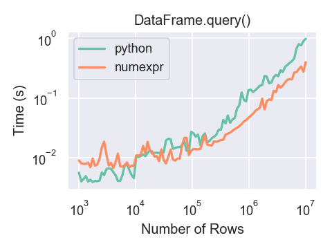

.. _indexing:

{{ header }}

***************************
Indexing and selecting data
***************************

The axis labeling information in pandas objects serves many purposes:

* Identifies data (i.e. provides *metadata*) using known indicators,
  important for analysis, visualization, and interactive console display.
* Enables automatic and explicit data alignment.
* Allows intuitive getting and setting of subsets of the data set.

In this section, we will focus on the final point: namely, how to slice, dice,
and generally get and set subsets of pandas objects. The primary focus will be
on Series and DataFrame as they have received more development attention in
this area.

.. note::

   The Python and NumPy indexing operators ``[]`` and attribute operator ``.``
   provide quick and easy access to pandas data structures across a wide range
   of use cases. This makes interactive work intuitive, as there's little new
   to learn if you already know how to deal with Python dictionaries and NumPy
   arrays. However, since the type of the data to be accessed isn't known in
   advance, directly using standard operators has some optimization limits. For
   production code, we recommended that you take advantage of the optimized
   pandas data access methods exposed in this chapter.

.. warning::

   Whether a copy or a reference is returned for a setting operation, may
   depend on the context. This is sometimes called ``chained assignment`` and
   should be avoided. See :ref:`Returning a View versus Copy
   <indexing.view_versus_copy>`.

See the :ref:`MultiIndex / Advanced Indexing <advanced>` for ``MultiIndex`` and more advanced indexing documentation.

See the :ref:`cookbook<cookbook.selection>` for some advanced strategies.

.. _indexing.choice:

Different choices for indexing
------------------------------

Object selection has had a number of user-requested additions in order to
support more explicit location based indexing. Pandas now supports three types
of multi-axis indexing.

* ``.loc`` is primarily label based, but may also be used with a boolean array. ``.loc`` will raise ``KeyError`` when the items are not found. Allowed inputs are:

    * A single label, e.g. ``5`` or ``'a'`` (Note that ``5`` is interpreted as a
      *label* of the index. This use is **not** an integer position along the
      index.).
    * A list or array of labels ``['a', 'b', 'c']``.
    * A slice object with labels ``'a':'f'`` (Note that contrary to usual python
      slices, **both** the start and the stop are included, when present in the
      index! See :ref:`Slicing with labels <indexing.slicing_with_labels>`
      and :ref:`Endpoints are inclusive <advanced.endpoints_are_inclusive>`.)
    * A boolean array
    * A ``callable`` function with one argument (the calling Series or DataFrame) and
      that returns valid output for indexing (one of the above).

  See more at :ref:`Selection by Label <indexing.label>`.

* ``.iloc`` is primarily integer position based (from ``0`` to
  ``length-1`` of the axis), but may also be used with a boolean
  array.  ``.iloc`` will raise ``IndexError`` if a requested
  indexer is out-of-bounds, except *slice* indexers which allow
  out-of-bounds indexing.  (this conforms with Python/NumPy *slice*
  semantics).  Allowed inputs are:

    * An integer e.g. ``5``.
    * A list or array of integers ``[4, 3, 0]``.
    * A slice object with ints ``1:7``.
    * A boolean array.
    * A ``callable`` function with one argument (the calling Series or DataFrame) and
      that returns valid output for indexing (one of the above).

  See more at :ref:`Selection by Position <indexing.integer>`,
  :ref:`Advanced Indexing <advanced>` and :ref:`Advanced
  Hierarchical <advanced.advanced_hierarchical>`.

* ``.loc``, ``.iloc``, and also ``[]`` indexing can accept a ``callable`` as indexer. See more at :ref:`Selection By Callable <indexing.callable>`.

Getting values from an object with multi-axes selection uses the following
notation (using ``.loc`` as an example, but the following applies to ``.iloc`` as
well). Any of the axes accessors may be the null slice ``:``. Axes left out of
the specification are assumed to be ``:``, e.g. ``p.loc['a']`` is equivalent to
``p.loc['a', :, :]``.

.. csv-table::
    :header: "Object Type", "Indexers"
    :widths: 30, 50
    :delim: ;

    Series; ``s.loc[indexer]``
    DataFrame; ``df.loc[row_indexer,column_indexer]``

.. _indexing.basics:

Basics
------

As mentioned when introducing the data structures in the :ref:`last section
<basics>`, the primary function of indexing with ``[]`` (a.k.a. ``__getitem__``
for those familiar with implementing class behavior in Python) is selecting out
lower-dimensional slices. The following table shows return type values when
indexing pandas objects with ``[]``:

.. csv-table::
    :header: "Object Type", "Selection", "Return Value Type"
    :widths: 30, 30, 60
    :delim: ;

    Series; ``series[label]``; scalar value
    DataFrame; ``frame[colname]``; ``Series`` corresponding to colname

Here we construct a simple time series data set to use for illustrating the
indexing functionality:

.. ipython:: python

   dates = pd.date_range('1/1/2000', periods=8)
   df = pd.DataFrame(np.random.randn(8, 4),
                     index=dates, columns=['A', 'B', 'C', 'D'])
   df

.. note::

   None of the indexing functionality is time series specific unless
   specifically stated.

Thus, as per above, we have the most basic indexing using ``[]``:

.. ipython:: python

   s = df['A']
   s[dates[5]]

You can pass a list of columns to ``[]`` to select columns in that order.
If a column is not contained in the DataFrame, an exception will be
raised. Multiple columns can also be set in this manner:

.. ipython:: python

   df
   df[['B', 'A']] = df[['A', 'B']]
   df

You may find this useful for applying a transform (in-place) to a subset of the
columns.

.. warning::

   pandas aligns all AXES when setting ``Series`` and ``DataFrame`` from ``.loc``, and ``.iloc``.

   This will **not** modify ``df`` because the column alignment is before value assignment.

   .. ipython:: python

      df[['A', 'B']]
      df.loc[:, ['B', 'A']] = df[['A', 'B']]
      df[['A', 'B']]

   The correct way to swap column values is by using raw values:

   .. ipython:: python

      df.loc[:, ['B', 'A']] = df[['A', 'B']].to_numpy()
      df[['A', 'B']]

Attribute access
----------------

.. _indexing.columns.multiple:

.. _indexing.df_cols:

.. _indexing.attribute_access:

You may access an index on a ``Series`` or  column on a ``DataFrame`` directly
as an attribute:

.. ipython:: python

   sa = pd.Series([1, 2, 3], index=list('abc'))
   dfa = df.copy()

.. ipython:: python

   sa.b
   dfa.A

.. ipython:: python

   sa.a = 5
   sa
   dfa.A = list(range(len(dfa.index)))  # ok if A already exists
   dfa
   dfa['A'] = list(range(len(dfa.index)))  # use this form to create a new column
   dfa

.. warning::

   - You can use this access only if the index element is a valid Python identifier, e.g. ``s.1`` is not allowed.
     See `here for an explanation of valid identifiers
     <https://docs.python.org/3/reference/lexical_analysis.html#identifiers>`__.

   - The attribute will not be available if it conflicts with an existing method name, e.g. ``s.min`` is not allowed, but ``s['min']`` is possible.

   - Similarly, the attribute will not be available if it conflicts with any of the following list: ``index``,
     ``major_axis``, ``minor_axis``, ``items``.

   - In any of these cases, standard indexing will still work, e.g. ``s['1']``, ``s['min']``, and ``s['index']`` will
     access the corresponding element or column.

If you are using the IPython environment, you may also use tab-completion to
see these accessible attributes.

You can also assign a ``dict`` to a row of a ``DataFrame``:

.. ipython:: python

   x = pd.DataFrame({'x': [1, 2, 3], 'y': [3, 4, 5]})
   x.iloc[1] = {'x': 9, 'y': 99}
   x

You can use attribute access to modify an existing element of a Series or column of a DataFrame, but be careful;
if you try to use attribute access to create a new column, it creates a new attribute rather than a
new column. In 0.21.0 and later, this will raise a ``UserWarning``:

.. code-block:: ipython

    In [1]: df = pd.DataFrame({'one': [1., 2., 3.]})
    In [2]: df.two = [4, 5, 6]
    UserWarning: Pandas doesn't allow Series to be assigned into nonexistent columns - see https://pandas.pydata.org/pandas-docs/stable/indexing.html#attribute_access
    In [3]: df
    Out[3]:
       one
    0  1.0
    1  2.0
    2  3.0

Slicing ranges
--------------

The most robust and consistent way of slicing ranges along arbitrary axes is
described in the :ref:`Selection by Position <indexing.integer>` section
detailing the ``.iloc`` method. For now, we explain the semantics of slicing using the ``[]`` operator.

With Series, the syntax works exactly as with an ndarray, returning a slice of
the values and the corresponding labels:

.. ipython:: python

   s[:5]
   s[::2]
   s[::-1]

Note that setting works as well:

.. ipython:: python

   s2 = s.copy()
   s2[:5] = 0
   s2

With DataFrame, slicing inside of ``[]`` **slices the rows**. This is provided
largely as a convenience since it is such a common operation.

.. ipython:: python

   df[:3]
   df[::-1]

.. _indexing.label:

Selection by label
------------------

.. warning::

   Whether a copy or a reference is returned for a setting operation, may depend on the context.
   This is sometimes called ``chained assignment`` and should be avoided.
   See :ref:`Returning a View versus Copy <indexing.view_versus_copy>`.

.. warning::

   ``.loc`` is strict when you present slicers that are not compatible (or convertible) with the index type. For example
   using integers in a ``DatetimeIndex``. These will raise a ``TypeError``.

  .. ipython:: python

     dfl = pd.DataFrame(np.random.randn(5, 4),
                        columns=list('ABCD'),
                        index=pd.date_range('20130101', periods=5))
     dfl

  .. code-block:: ipython

     In [4]: dfl.loc[2:3]
     TypeError: cannot do slice indexing on <class 'pandas.tseries.index.DatetimeIndex'> with these indexers [2] of <type 'int'>

  String likes in slicing *can* be convertible to the type of the index and lead to natural slicing.

  .. ipython:: python

     dfl.loc['20130102':'20130104']

.. warning::

   Starting in 0.21.0, pandas will show a ``FutureWarning`` if indexing with a list with missing labels. In the future
   this will raise a ``KeyError``. See :ref:`list-like Using loc with missing keys in a list is Deprecated <indexing.deprecate_loc_reindex_listlike>`.

pandas provides a suite of methods in order to have **purely label based indexing**. This is a strict inclusion based protocol.
Every label asked for must be in the index, or a ``KeyError`` will be raised.
When slicing, both the start bound **AND** the stop bound are *included*, if present in the index.
Integers are valid labels, but they refer to the label **and not the position**.

The ``.loc`` attribute is the primary access method. The following are valid inputs:

* A single label, e.g. ``5`` or ``'a'`` (Note that ``5`` is interpreted as a *label* of the index. This use is **not** an integer position along the index.).
* A list or array of labels ``['a', 'b', 'c']``.
* A slice object with labels ``'a':'f'`` (Note that contrary to usual python
  slices, **both** the start and the stop are included, when present in the
  index! See :ref:`Slicing with labels <indexing.slicing_with_labels>`.
* A boolean array.
* A ``callable``, see :ref:`Selection By Callable <indexing.callable>`.

.. ipython:: python

   s1 = pd.Series(np.random.randn(6), index=list('abcdef'))
   s1
   s1.loc['c':]
   s1.loc['b']

Note that setting works as well:

.. ipython:: python

   s1.loc['c':] = 0
   s1

With a DataFrame:

.. ipython:: python

   df1 = pd.DataFrame(np.random.randn(6, 4),
                      index=list('abcdef'),
                      columns=list('ABCD'))
   df1
   df1.loc[['a', 'b', 'd'], :]

Accessing via label slices:

.. ipython:: python

   df1.loc['d':, 'A':'C']

For getting a cross section using a label (equivalent to ``df.xs('a')``):

.. ipython:: python

   df1.loc['a']

For getting values with a boolean array:

.. ipython:: python

   df1.loc['a'] > 0
   df1.loc[:, df1.loc['a'] > 0]

For getting a value explicitly:

.. ipython:: python

   # this is also equivalent to ``df1.at['a','A']``
   df1.loc['a', 'A']

.. _indexing.slicing_with_labels:

Slicing with labels
~~~~~~~~~~~~~~~~~~~

When using ``.loc`` with slices, if both the start and the stop labels are
present in the index, then elements *located* between the two (including them)
are returned:

.. ipython:: python

   s = pd.Series(list('abcde'), index=[0, 3, 2, 5, 4])
   s.loc[3:5]

If at least one of the two is absent, but the index is sorted, and can be
compared against start and stop labels, then slicing will still work as
expected, by selecting labels which *rank* between the two:

.. ipython:: python

   s.sort_index()
   s.sort_index().loc[1:6]

However, if at least one of the two is absent *and* the index is not sorted, an
error will be raised (since doing otherwise would be computationally expensive,
as well as potentially ambiguous for mixed type indexes). For instance, in the
above example, ``s.loc[1:6]`` would raise ``KeyError``.

For the rationale behind this behavior, see
:ref:`Endpoints are inclusive <advanced.endpoints_are_inclusive>`.

.. _indexing.integer:

Selection by position
---------------------

.. warning::

   Whether a copy or a reference is returned for a setting operation, may depend on the context.
   This is sometimes called ``chained assignment`` and should be avoided.
   See :ref:`Returning a View versus Copy <indexing.view_versus_copy>`.

Pandas provides a suite of methods in order to get **purely integer based indexing**. The semantics follow closely Python and NumPy slicing. These are ``0-based`` indexing. When slicing, the start bound is *included*, while the upper bound is *excluded*. Trying to use a non-integer, even a **valid** label will raise an ``IndexError``.

The ``.iloc`` attribute is the primary access method. The following are valid inputs:

* An integer e.g. ``5``.
* A list or array of integers ``[4, 3, 0]``.
* A slice object with ints ``1:7``.
* A boolean array.
* A ``callable``, see :ref:`Selection By Callable <indexing.callable>`.

.. ipython:: python

   s1 = pd.Series(np.random.randn(5), index=list(range(0, 10, 2)))
   s1
   s1.iloc[:3]
   s1.iloc[3]

Note that setting works as well:

.. ipython:: python

   s1.iloc[:3] = 0
   s1

With a DataFrame:

.. ipython:: python

   df1 = pd.DataFrame(np.random.randn(6, 4),
                      index=list(range(0, 12, 2)),
                      columns=list(range(0, 8, 2)))
   df1

Select via integer slicing:

.. ipython:: python

   df1.iloc[:3]
   df1.iloc[1:5, 2:4]

Select via integer list:

.. ipython:: python

   df1.iloc[[1, 3, 5], [1, 3]]

.. ipython:: python

   df1.iloc[1:3, :]

.. ipython:: python

   df1.iloc[:, 1:3]

.. ipython:: python

   # this is also equivalent to ``df1.iat[1,1]``
   df1.iloc[1, 1]

For getting a cross section using an integer position (equiv to ``df.xs(1)``):

.. ipython:: python

   df1.iloc[1]

Out of range slice indexes are handled gracefully just as in Python/Numpy.

.. ipython:: python

    # these are allowed in python/numpy.
    x = list('abcdef')
    x
    x[4:10]
    x[8:10]
    s = pd.Series(x)
    s
    s.iloc[4:10]
    s.iloc[8:10]

Note that using slices that go out of bounds can result in
an empty axis (e.g. an empty DataFrame being returned).

.. ipython:: python

   dfl = pd.DataFrame(np.random.randn(5, 2), columns=list('AB'))
   dfl
   dfl.iloc[:, 2:3]
   dfl.iloc[:, 1:3]
   dfl.iloc[4:6]

A single indexer that is out of bounds will raise an ``IndexError``.
A list of indexers where any element is out of bounds will raise an
``IndexError``.

.. code-block:: python

   >>> dfl.iloc[[4, 5, 6]]
   IndexError: positional indexers are out-of-bounds

   >>> dfl.iloc[:, 4]
   IndexError: single positional indexer is out-of-bounds

.. _indexing.callable:

Selection by callable
---------------------

``.loc``, ``.iloc``, and also ``[]`` indexing can accept a ``callable`` as indexer.
The ``callable`` must be a function with one argument (the calling Series or DataFrame) that returns valid output for indexing.

.. ipython:: python

   df1 = pd.DataFrame(np.random.randn(6, 4),
                      index=list('abcdef'),
                      columns=list('ABCD'))
   df1

   df1.loc[lambda df: df['A'] > 0, :]
   df1.loc[:, lambda df: ['A', 'B']]

   df1.iloc[:, lambda df: [0, 1]]

   df1[lambda df: df.columns[0]]

You can use callable indexing in ``Series``.

.. ipython:: python

   df1['A'].loc[lambda s: s > 0]

Using these methods / indexers, you can chain data selection operations
without using a temporary variable.

.. ipython:: python

   bb = pd.read_csv('data/baseball.csv', index_col='id')
   (bb.groupby(['year', 'team']).sum()
      .loc[lambda df: df['r'] > 100])

.. _indexing.deprecate_ix:

IX indexer is deprecated
------------------------

.. warning::

   Starting in 0.20.0, the ``.ix`` indexer is deprecated, in favor of the more strict ``.iloc``
   and ``.loc`` indexers.

``.ix`` offers a lot of magic on the inference of what the user wants to do. To wit, ``.ix`` can decide
to index *positionally* OR via *labels* depending on the data type of the index. This has caused quite a
bit of user confusion over the years.

The recommended methods of indexing are:

* ``.loc`` if you want to *label* index.
* ``.iloc`` if you want to *positionally* index.

.. ipython:: python

  dfd = pd.DataFrame({'A': [1, 2, 3],
                      'B': [4, 5, 6]},
                     index=list('abc'))

  dfd

Previous behavior, where you wish to get the 0th and the 2nd elements from the index in the 'A' column.

.. code-block:: ipython

  In [3]: dfd.ix[[0, 2], 'A']
  Out[3]:
  a    1
  c    3
  Name: A, dtype: int64

Using ``.loc``. Here we will select the appropriate indexes from the index, then use *label* indexing.

.. ipython:: python

  dfd.loc[dfd.index[[0, 2]], 'A']

This can also be expressed using ``.iloc``, by explicitly getting locations on the indexers, and using
*positional* indexing to select things.

.. ipython:: python

  dfd.iloc[[0, 2], dfd.columns.get_loc('A')]

For getting *multiple* indexers, using ``.get_indexer``:

.. ipython:: python

  dfd.iloc[[0, 2], dfd.columns.get_indexer(['A', 'B'])]

.. _deprecate_loc_reindex_listlike:
.. _indexing.deprecate_loc_reindex_listlike:

Indexing with list with missing labels is deprecated
----------------------------------------------------

.. warning::

   Starting in 0.21.0, using ``.loc`` or ``[]`` with a list with one or more missing labels, is deprecated, in favor of ``.reindex``.

In prior versions, using ``.loc[list-of-labels]`` would work as long as *at least 1* of the keys was found (otherwise it
would raise a ``KeyError``). This behavior is deprecated and will show a warning message pointing to this section. The
recommended alternative is to use ``.reindex()``.

For example.

.. ipython:: python

   s = pd.Series([1, 2, 3])
   s

Selection with all keys found is unchanged.

.. ipython:: python

   s.loc[[1, 2]]

Previous behavior

.. code-block:: ipython

   In [4]: s.loc[[1, 2, 3]]
   Out[4]:
   1    2.0
   2    3.0
   3    NaN
   dtype: float64

Current behavior

.. code-block:: ipython

   In [4]: s.loc[[1, 2, 3]]
   Passing list-likes to .loc with any non-matching elements will raise
   KeyError in the future, you can use .reindex() as an alternative.

   See the documentation here:
   https://pandas.pydata.org/pandas-docs/stable/indexing.html#deprecate-loc-reindex-listlike

   Out[4]:
   1    2.0
   2    3.0
   3    NaN
   dtype: float64

Reindexing
~~~~~~~~~~

The idiomatic way to achieve selecting potentially not-found elements is via ``.reindex()``. See also the section on :ref:`reindexing <basics.reindexing>`.

.. ipython:: python

  s.reindex([1, 2, 3])

Alternatively, if you want to select only *valid* keys, the following is idiomatic and efficient; it is guaranteed to preserve the dtype of the selection.

.. ipython:: python

   labels = [1, 2, 3]
   s.loc[s.index.intersection(labels)]

Having a duplicated index will raise for a ``.reindex()``:

.. ipython:: python

   s = pd.Series(np.arange(4), index=['a', 'a', 'b', 'c'])
   labels = ['c', 'd']

.. code-block:: ipython

   In [17]: s.reindex(labels)
   ValueError: cannot reindex from a duplicate axis

Generally, you can intersect the desired labels with the current
axis, and then reindex.

.. ipython:: python

   s.loc[s.index.intersection(labels)].reindex(labels)

However, this would *still* raise if your resulting index is duplicated.

.. code-block:: ipython

   In [41]: labels = ['a', 'd']

   In [42]: s.loc[s.index.intersection(labels)].reindex(labels)
   ValueError: cannot reindex from a duplicate axis

.. _indexing.basics.partial_setting:

Selecting random samples
------------------------

A random selection of rows or columns from a Series or DataFrame with the :meth:`~DataFrame.sample` method. The method will sample rows by default, and accepts a specific number of rows/columns to return, or a fraction of rows.

.. ipython:: python

    s = pd.Series([0, 1, 2, 3, 4, 5])

    # When no arguments are passed, returns 1 row.
    s.sample()

    # One may specify either a number of rows:
    s.sample(n=3)

    # Or a fraction of the rows:
    s.sample(frac=0.5)

By default, ``sample`` will return each row at most once, but one can also sample with replacement
using the ``replace`` option:

.. ipython:: python

    s = pd.Series([0, 1, 2, 3, 4, 5])

    # Without replacement (default):
    s.sample(n=6, replace=False)

    # With replacement:
    s.sample(n=6, replace=True)

By default, each row has an equal probability of being selected, but if you want rows
to have different probabilities, you can pass the ``sample`` function sampling weights as
``weights``. These weights can be a list, a NumPy array, or a Series, but they must be of the same length as the object you are sampling. Missing values will be treated as a weight of zero, and inf values are not allowed. If weights do not sum to 1, they will be re-normalized by dividing all weights by the sum of the weights. For example:

.. ipython:: python

    s = pd.Series([0, 1, 2, 3, 4, 5])
    example_weights = [0, 0, 0.2, 0.2, 0.2, 0.4]
    s.sample(n=3, weights=example_weights)

    # Weights will be re-normalized automatically
    example_weights2 = [0.5, 0, 0, 0, 0, 0]
    s.sample(n=1, weights=example_weights2)

When applied to a DataFrame, you can use a column of the DataFrame as sampling weights
(provided you are sampling rows and not columns) by simply passing the name of the column
as a string.

.. ipython:: python

    df2 = pd.DataFrame({'col1': [9, 8, 7, 6],
                        'weight_column': [0.5, 0.4, 0.1, 0]})
    df2.sample(n=3, weights='weight_column')

``sample`` also allows users to sample columns instead of rows using the ``axis`` argument.

.. ipython:: python

    df3 = pd.DataFrame({'col1': [1, 2, 3], 'col2': [2, 3, 4]})
    df3.sample(n=1, axis=1)

Finally, one can also set a seed for ``sample``'s random number generator using the ``random_state`` argument, which will accept either an integer (as a seed) or a NumPy RandomState object.

.. ipython:: python

    df4 = pd.DataFrame({'col1': [1, 2, 3], 'col2': [2, 3, 4]})

    # With a given seed, the sample will always draw the same rows.
    df4.sample(n=2, random_state=2)
    df4.sample(n=2, random_state=2)

Setting with enlargement
------------------------

The ``.loc/[]`` operations can perform enlargement when setting a non-existent key for that axis.

In the ``Series`` case this is effectively an appending operation.

.. ipython:: python

   se = pd.Series([1, 2, 3])
   se
   se[5] = 5.
   se

A ``DataFrame`` can be enlarged on either axis via ``.loc``.

.. ipython:: python

   dfi = pd.DataFrame(np.arange(6).reshape(3, 2),
                      columns=['A', 'B'])
   dfi
   dfi.loc[:, 'C'] = dfi.loc[:, 'A']
   dfi

This is like an ``append`` operation on the ``DataFrame``.

.. ipython:: python

   dfi.loc[3] = 5
   dfi

.. _indexing.basics.get_value:

Fast scalar value getting and setting
-------------------------------------

Since indexing with ``[]`` must handle a lot of cases (single-label access,
slicing, boolean indexing, etc.), it has a bit of overhead in order to figure
out what you're asking for. If you only want to access a scalar value, the
fastest way is to use the ``at`` and ``iat`` methods, which are implemented on
all of the data structures.

Similarly to ``loc``, ``at`` provides **label** based scalar lookups, while, ``iat`` provides **integer** based lookups analogously to ``iloc``

.. ipython:: python

   s.iat[5]
   df.at[dates[5], 'A']
   df.iat[3, 0]

You can also set using these same indexers.

.. ipython:: python

   df.at[dates[5], 'E'] = 7
   df.iat[3, 0] = 7

``at`` may enlarge the object in-place as above if the indexer is missing.

.. ipython:: python

   df.at[dates[-1] + pd.Timedelta('1 day'), 0] = 7
   df

Boolean indexing
----------------

.. _indexing.boolean:

Another common operation is the use of boolean vectors to filter the data.
The operators are: ``|`` for ``or``, ``&`` for ``and``, and ``~`` for ``not``.
These **must** be grouped by using parentheses, since by default Python will
evaluate an expression such as ``df['A'] > 2 & df['B'] < 3`` as
``df['A'] > (2 & df['B']) < 3``, while the desired evaluation order is
``(df['A > 2) & (df['B'] < 3)``.

Using a boolean vector to index a Series works exactly as in a NumPy ndarray:

.. ipython:: python

   s = pd.Series(range(-3, 4))
   s
   s[s > 0]
   s[(s < -1) | (s > 0.5)]
   s[~(s < 0)]

You may select rows from a DataFrame using a boolean vector the same length as
the DataFrame's index (for example, something derived from one of the columns
of the DataFrame):

.. ipython:: python

   df[df['A'] > 0]

List comprehensions and the ``map`` method of Series can also be used to produce
more complex criteria:

.. ipython:: python

   df2 = pd.DataFrame({'a': ['one', 'one', 'two', 'three', 'two', 'one', 'six'],
                       'b': ['x', 'y', 'y', 'x', 'y', 'x', 'x'],
                       'c': np.random.randn(7)})

   # only want 'two' or 'three'
   criterion = df2['a'].map(lambda x: x.startswith('t'))

   df2[criterion]

   # equivalent but slower
   df2[[x.startswith('t') for x in df2['a']]]

   # Multiple criteria
   df2[criterion & (df2['b'] == 'x')]

With the choice methods :ref:`Selection by Label <indexing.label>`, :ref:`Selection by Position <indexing.integer>`,
and :ref:`Advanced Indexing <advanced>` you may select along more than one axis using boolean vectors combined with other indexing expressions.

.. ipython:: python

   df2.loc[criterion & (df2['b'] == 'x'), 'b':'c']

.. _indexing.basics.indexing_isin:

Indexing with isin
------------------

Consider the :meth:`~Series.isin` method of ``Series``, which returns a boolean
vector that is true wherever the ``Series`` elements exist in the passed list.
This allows you to select rows where one or more columns have values you want:

.. ipython:: python

   s = pd.Series(np.arange(5), index=np.arange(5)[::-1], dtype='int64')
   s
   s.isin([2, 4, 6])
   s[s.isin([2, 4, 6])]

The same method is available for ``Index`` objects and is useful for the cases
when you don't know which of the sought labels are in fact present:

.. ipython:: python

   s[s.index.isin([2, 4, 6])]

   # compare it to the following
   s.reindex([2, 4, 6])

In addition to that, ``MultiIndex`` allows selecting a separate level to use
in the membership check:

.. ipython:: python

   s_mi = pd.Series(np.arange(6),
                    index=pd.MultiIndex.from_product([[0, 1], ['a', 'b', 'c']]))
   s_mi
   s_mi.iloc[s_mi.index.isin([(1, 'a'), (2, 'b'), (0, 'c')])]
   s_mi.iloc[s_mi.index.isin(['a', 'c', 'e'], level=1)]

DataFrame also has an :meth:`~DataFrame.isin` method.  When calling ``isin``, pass a set of
values as either an array or dict.  If values is an array, ``isin`` returns
a DataFrame of booleans that is the same shape as the original DataFrame, with True
wherever the element is in the sequence of values.

.. ipython:: python

   df = pd.DataFrame({'vals': [1, 2, 3, 4], 'ids': ['a', 'b', 'f', 'n'],
                      'ids2': ['a', 'n', 'c', 'n']})

   values = ['a', 'b', 1, 3]

   df.isin(values)

Oftentimes you'll want to match certain values with certain columns.
Just make values a ``dict`` where the key is the column, and the value is
a list of items you want to check for.

.. ipython:: python

   values = {'ids': ['a', 'b'], 'vals': [1, 3]}

   df.isin(values)

Combine DataFrame's ``isin`` with the ``any()`` and ``all()`` methods to
quickly select subsets of your data that meet a given criteria.
To select a row where each column meets its own criterion:

.. ipython:: python

  values = {'ids': ['a', 'b'], 'ids2': ['a', 'c'], 'vals': [1, 3]}

  row_mask = df.isin(values).all(1)

  df[row_mask]

.. _indexing.where_mask:

The :meth:`~pandas.DataFrame.where` Method and Masking
------------------------------------------------------

Selecting values from a Series with a boolean vector generally returns a
subset of the data. To guarantee that selection output has the same shape as
the original data, you can use the ``where`` method in ``Series`` and ``DataFrame``.

To return only the selected rows:

.. ipython:: python

   s[s > 0]

To return a Series of the same shape as the original:

.. ipython:: python

   s.where(s > 0)

Selecting values from a DataFrame with a boolean criterion now also preserves
input data shape. ``where`` is used under the hood as the implementation.
The code below is equivalent to ``df.where(df < 0)``.

.. ipython:: python
   :suppress:

   dates = pd.date_range('1/1/2000', periods=8)
   df = pd.DataFrame(np.random.randn(8, 4),
                     index=dates, columns=['A', 'B', 'C', 'D'])

.. ipython:: python

   df[df < 0]

In addition, ``where`` takes an optional ``other`` argument for replacement of
values where the condition is False, in the returned copy.

.. ipython:: python

   df.where(df < 0, -df)

You may wish to set values based on some boolean criteria.
This can be done intuitively like so:

.. ipython:: python

   s2 = s.copy()
   s2[s2 < 0] = 0
   s2

   df2 = df.copy()
   df2[df2 < 0] = 0
   df2

By default, ``where`` returns a modified copy of the data. There is an
optional parameter ``inplace`` so that the original data can be modified
without creating a copy:

.. ipython:: python

   df_orig = df.copy()
   df_orig.where(df > 0, -df, inplace=True)
   df_orig

.. note::

   The signature for :func:`DataFrame.where` differs from :func:`numpy.where`.
   Roughly ``df1.where(m, df2)`` is equivalent to ``np.where(m, df1, df2)``.

   .. ipython:: python

      df.where(df < 0, -df) == np.where(df < 0, df, -df)

**Alignment**

Furthermore, ``where`` aligns the input boolean condition (ndarray or DataFrame),
such that partial selection with setting is possible. This is analogous to
partial setting via ``.loc`` (but on the contents rather than the axis labels).

.. ipython:: python

   df2 = df.copy()
   df2[df2[1:4] > 0] = 3
   df2

Where can also accept ``axis`` and ``level`` parameters to align the input when
performing the ``where``.

.. ipython:: python

   df2 = df.copy()
   df2.where(df2 > 0, df2['A'], axis='index')

This is equivalent to (but faster than) the following.

.. ipython:: python

   df2 = df.copy()
   df.apply(lambda x, y: x.where(x > 0, y), y=df['A'])

``where`` can accept a callable as condition and ``other`` arguments. The function must
be with one argument (the calling Series or DataFrame) and that returns valid output
as condition and ``other`` argument.

.. ipython:: python

   df3 = pd.DataFrame({'A': [1, 2, 3],
                       'B': [4, 5, 6],
                       'C': [7, 8, 9]})
   df3.where(lambda x: x > 4, lambda x: x + 10)

Mask
~~~~

:meth:`~pandas.DataFrame.mask` is the inverse boolean operation of ``where``.

.. ipython:: python

   s.mask(s >= 0)
   df.mask(df >= 0)

.. _indexing.query:

The :meth:`~pandas.DataFrame.query` Method
------------------------------------------

:class:`~pandas.DataFrame` objects have a :meth:`~pandas.DataFrame.query`
method that allows selection using an expression.

You can get the value of the frame where column ``b`` has values
between the values of columns ``a`` and ``c``. For example:

.. ipython:: python

   n = 10
   df = pd.DataFrame(np.random.rand(n, 3), columns=list('abc'))
   df

   # pure python
   df[(df['a'] < df['b']) & (df['b'] < df['c'])]

   # query
   df.query('(a < b) & (b < c)')

Do the same thing but fall back on a named index if there is no column
with the name ``a``.

.. ipython:: python

   df = pd.DataFrame(np.random.randint(n / 2, size=(n, 2)), columns=list('bc'))
   df.index.name = 'a'
   df
   df.query('a < b and b < c')

If instead you don't want to or cannot name your index, you can use the name
``index`` in your query expression:

.. ipython:: python

   df = pd.DataFrame(np.random.randint(n, size=(n, 2)), columns=list('bc'))
   df
   df.query('index < b < c')

.. note::

   If the name of your index overlaps with a column name, the column name is
   given precedence. For example,

   .. ipython:: python

      df = pd.DataFrame({'a': np.random.randint(5, size=5)})
      df.index.name = 'a'
      df.query('a > 2')  # uses the column 'a', not the index

   You can still use the index in a query expression by using the special
   identifier 'index':

   .. ipython:: python

      df.query('index > 2')

   If for some reason you have a column named ``index``, then you can refer to
   the index as ``ilevel_0`` as well, but at this point you should consider
   renaming your columns to something less ambiguous.

:class:`~pandas.MultiIndex` :meth:`~pandas.DataFrame.query` Syntax
~~~~~~~~~~~~~~~~~~~~~~~~~~~~~~~~~~~~~~~~~~~~~~~~~~~~~~~~~~~~~~~~~~

You can also use the levels of a ``DataFrame`` with a
:class:`~pandas.MultiIndex` as if they were columns in the frame:

.. ipython:: python

   n = 10
   colors = np.random.choice(['red', 'green'], size=n)
   foods = np.random.choice(['eggs', 'ham'], size=n)
   colors
   foods

   index = pd.MultiIndex.from_arrays([colors, foods], names=['color', 'food'])
   df = pd.DataFrame(np.random.randn(n, 2), index=index)
   df
   df.query('color == "red"')

If the levels of the ``MultiIndex`` are unnamed, you can refer to them using
special names:

.. ipython:: python

   df.index.names = [None, None]
   df
   df.query('ilevel_0 == "red"')

The convention is ``ilevel_0``, which means "index level 0" for the 0th level
of the ``index``.

:meth:`~pandas.DataFrame.query` Use Cases
~~~~~~~~~~~~~~~~~~~~~~~~~~~~~~~~~~~~~~~~~

A use case for :meth:`~pandas.DataFrame.query` is when you have a collection of
:class:`~pandas.DataFrame` objects that have a subset of column names (or index
levels/names) in common. You can pass the same query to both frames *without*
having to specify which frame you're interested in querying

.. ipython:: python

   df = pd.DataFrame(np.random.rand(n, 3), columns=list('abc'))
   df
   df2 = pd.DataFrame(np.random.rand(n + 2, 3), columns=df.columns)
   df2
   expr = '0.0 <= a <= c <= 0.5'
   map(lambda frame: frame.query(expr), [df, df2])

:meth:`~pandas.DataFrame.query` Python versus pandas Syntax Comparison
~~~~~~~~~~~~~~~~~~~~~~~~~~~~~~~~~~~~~~~~~~~~~~~~~~~~~~~~~~~~~~~~~~~~~~

Full numpy-like syntax:

.. ipython:: python

   df = pd.DataFrame(np.random.randint(n, size=(n, 3)), columns=list('abc'))
   df
   df.query('(a < b) & (b < c)')
   df[(df['a'] < df['b']) & (df['b'] < df['c'])]

Slightly nicer by removing the parentheses (by binding making comparison
operators bind tighter than ``&`` and ``|``).

.. ipython:: python

   df.query('a < b & b < c')

Use English instead of symbols:

.. ipython:: python

   df.query('a < b and b < c')

Pretty close to how you might write it on paper:

.. ipython:: python

   df.query('a < b < c')

The ``in`` and ``not in`` operators
~~~~~~~~~~~~~~~~~~~~~~~~~~~~~~~~~~~

:meth:`~pandas.DataFrame.query` also supports special use of Python's ``in`` and
``not in`` comparison operators, providing a succinct syntax for calling the
``isin`` method of a ``Series`` or ``DataFrame``.

.. ipython:: python

   # get all rows where columns "a" and "b" have overlapping values
   df = pd.DataFrame({'a': list('aabbccddeeff'), 'b': list('aaaabbbbcccc'),
                      'c': np.random.randint(5, size=12),
                      'd': np.random.randint(9, size=12)})
   df
   df.query('a in b')

   # How you'd do it in pure Python
   df[df['a'].isin(df['b'])]

   df.query('a not in b')

   # pure Python
   df[~df['a'].isin(df['b'])]

You can combine this with other expressions for very succinct queries:

.. ipython:: python

   # rows where cols a and b have overlapping values
   # and col c's values are less than col d's
   df.query('a in b and c < d')

   # pure Python
   df[df['b'].isin(df['a']) & (df['c'] < df['d'])]

.. note::

   Note that ``in`` and ``not in`` are evaluated in Python, since ``numexpr``
   has no equivalent of this operation. However, **only the** ``in``/``not in``
   **expression itself** is evaluated in vanilla Python. For example, in the
   expression

   .. code-block:: python

      df.query('a in b + c + d')

   ``(b + c + d)`` is evaluated by ``numexpr`` and *then* the ``in``
   operation is evaluated in plain Python. In general, any operations that can
   be evaluated using ``numexpr`` will be.

Special use of the ``==`` operator with ``list`` objects
~~~~~~~~~~~~~~~~~~~~~~~~~~~~~~~~~~~~~~~~~~~~~~~~~~~~~~~~

Comparing a ``list`` of values to a column using ``==``/``!=`` works similarly
to ``in``/``not in``.

.. ipython:: python

   df.query('b == ["a", "b", "c"]')

   # pure Python
   df[df['b'].isin(["a", "b", "c"])]

   df.query('c == [1, 2]')

   df.query('c != [1, 2]')

   # using in/not in
   df.query('[1, 2] in c')

   df.query('[1, 2] not in c')

   # pure Python
   df[df['c'].isin([1, 2])]

Boolean operators
~~~~~~~~~~~~~~~~~

You can negate boolean expressions with the word ``not`` or the ``~`` operator.

.. ipython:: python

   df = pd.DataFrame(np.random.rand(n, 3), columns=list('abc'))
   df['bools'] = np.random.rand(len(df)) > 0.5
   df.query('~bools')
   df.query('not bools')
   df.query('not bools') == df[~df['bools']]

Of course, expressions can be arbitrarily complex too:

.. ipython:: python

   # short query syntax
   shorter = df.query('a < b < c and (not bools) or bools > 2')

   # equivalent in pure Python
   longer = df[(df['a'] < df['b'])
               & (df['b'] < df['c'])
               & (~df['bools'])
               | (df['bools'] > 2)]

   shorter
   longer

   shorter == longer

Performance of :meth:`~pandas.DataFrame.query`
~~~~~~~~~~~~~~~~~~~~~~~~~~~~~~~~~~~~~~~~~~~~~~

``DataFrame.query()`` using ``numexpr`` is slightly faster than Python for
large frames.

.. note::

   You will only see the performance benefits of using the ``numexpr`` engine
   with ``DataFrame.query()`` if your frame has more than approximately 200,000
   rows.

      .. image:: ../_static/query-perf-small.png

This plot was created using a ``DataFrame`` with 3 columns each containing
floating point values generated using ``numpy.random.randn()``.

.. ipython:: python
   :suppress:

   df = pd.DataFrame(np.random.randn(8, 4),
                     index=dates, columns=['A', 'B', 'C', 'D'])
   df2 = df.copy()

Duplicate data
--------------

.. _indexing.duplicate:

If you want to identify and remove duplicate rows in a DataFrame,  there are
two methods that will help: ``duplicated`` and ``drop_duplicates``. Each
takes as an argument the columns to use to identify duplicated rows.

* ``duplicated`` returns a boolean vector whose length is the number of rows, and which indicates whether a row is duplicated.
* ``drop_duplicates`` removes duplicate rows.

By default, the first observed row of a duplicate set is considered unique, but
each method has a ``keep`` parameter to specify targets to be kept.

* ``keep='first'`` (default): mark / drop duplicates except for the first occurrence.
* ``keep='last'``: mark / drop duplicates except for the last occurrence.
* ``keep=False``: mark  / drop all duplicates.

.. ipython:: python

   df2 = pd.DataFrame({'a': ['one', 'one', 'two', 'two', 'two', 'three', 'four'],
                       'b': ['x', 'y', 'x', 'y', 'x', 'x', 'x'],
                       'c': np.random.randn(7)})
   df2
   df2.duplicated('a')
   df2.duplicated('a', keep='last')
   df2.duplicated('a', keep=False)
   df2.drop_duplicates('a')
   df2.drop_duplicates('a', keep='last')
   df2.drop_duplicates('a', keep=False)

Also, you can pass a list of columns to identify duplications.

.. ipython:: python

   df2.duplicated(['a', 'b'])
   df2.drop_duplicates(['a', 'b'])

To drop duplicates by index value, use ``Index.duplicated`` then perform slicing.
The same set of options are available for the ``keep`` parameter.

.. ipython:: python

   df3 = pd.DataFrame({'a': np.arange(6),
                       'b': np.random.randn(6)},
                      index=['a', 'a', 'b', 'c', 'b', 'a'])
   df3
   df3.index.duplicated()
   df3[~df3.index.duplicated()]
   df3[~df3.index.duplicated(keep='last')]
   df3[~df3.index.duplicated(keep=False)]

.. _indexing.dictionarylike:

Dictionary-like :meth:`~pandas.DataFrame.get` method
----------------------------------------------------

Each of Series or DataFrame have a ``get`` method which can return a
default value.

.. ipython:: python

   s = pd.Series([1, 2, 3], index=['a', 'b', 'c'])
   s.get('a')  # equivalent to s['a']
   s.get('x', default=-1)

The :meth:`~pandas.DataFrame.lookup` method
-------------------------------------------

Sometimes you want to extract a set of values given a sequence of row labels
and column labels, and the ``lookup`` method allows for this and returns a
NumPy array.  For instance:

.. ipython:: python

  dflookup = pd.DataFrame(np.random.rand(20, 4), columns = ['A', 'B', 'C', 'D'])
  dflookup.lookup(list(range(0, 10, 2)), ['B', 'C', 'A', 'B', 'D'])

.. _indexing.class:

Index objects
-------------

The pandas :class:`~pandas.Index` class and its subclasses can be viewed as
implementing an *ordered multiset*. Duplicates are allowed. However, if you try
to convert an :class:`~pandas.Index` object with duplicate entries into a
``set``, an exception will be raised.

:class:`~pandas.Index` also provides the infrastructure necessary for
lookups, data alignment, and reindexing. The easiest way to create an
:class:`~pandas.Index` directly is to pass a ``list`` or other sequence to
:class:`~pandas.Index`:

.. ipython:: python

   index = pd.Index(['e', 'd', 'a', 'b'])
   index
   'd' in index

You can also pass a ``name`` to be stored in the index:

.. ipython:: python

   index = pd.Index(['e', 'd', 'a', 'b'], name='something')
   index.name

The name, if set, will be shown in the console display:

.. ipython:: python

   index = pd.Index(list(range(5)), name='rows')
   columns = pd.Index(['A', 'B', 'C'], name='cols')
   df = pd.DataFrame(np.random.randn(5, 3), index=index, columns=columns)
   df
   df['A']

.. _indexing.set_metadata:

Setting metadata
~~~~~~~~~~~~~~~~

Indexes are "mostly immutable", but it is possible to set and change their
metadata, like the index ``name`` (or, for ``MultiIndex``, ``levels`` and
``codes``).

You can use the ``rename``, ``set_names``, ``set_levels``, and ``set_codes``
to set these attributes directly. They default to returning a copy; however,
you can specify ``inplace=True`` to have the data change in place.

See :ref:`Advanced Indexing <advanced>` for usage of MultiIndexes.

.. ipython:: python

  ind = pd.Index([1, 2, 3])
  ind.rename("apple")
  ind
  ind.set_names(["apple"], inplace=True)
  ind.name = "bob"
  ind

``set_names``, ``set_levels``, and ``set_codes`` also take an optional
``level`` argument

.. ipython:: python

  index = pd.MultiIndex.from_product([range(3), ['one', 'two']], names=['first', 'second'])
  index
  index.levels[1]
  index.set_levels(["a", "b"], level=1)

.. _indexing.set_ops:

Set operations on Index objects
~~~~~~~~~~~~~~~~~~~~~~~~~~~~~~~

The two main operations are ``union (|)`` and ``intersection (&)``.
These can be directly called as instance methods or used via overloaded
operators. Difference is provided via the ``.difference()`` method.

.. ipython:: python

   a = pd.Index(['c', 'b', 'a'])
   b = pd.Index(['c', 'e', 'd'])
   a | b
   a & b
   a.difference(b)

Also available is the ``symmetric_difference (^)`` operation, which returns elements
that appear in either ``idx1`` or ``idx2``, but not in both. This is
equivalent to the Index created by ``idx1.difference(idx2).union(idx2.difference(idx1))``,
with duplicates dropped.

.. ipython:: python

   idx1 = pd.Index([1, 2, 3, 4])
   idx2 = pd.Index([2, 3, 4, 5])
   idx1.symmetric_difference(idx2)
   idx1 ^ idx2

.. note::

   The resulting index from a set operation will be sorted in ascending order.

When performing :meth:`Index.union` between indexes with different dtypes, the indexes
must be cast to a common dtype. Typically, though not always, this is object dtype. The
exception is when performing a union between integer and float data. In this case, the
integer values are converted to float

.. ipython:: python

   idx1 = pd.Index([0, 1, 2])
   idx2 = pd.Index([0.5, 1.5])
   idx1 | idx2

.. _indexing.missing:

Missing values
~~~~~~~~~~~~~~

.. important::

   Even though ``Index`` can hold missing values (``NaN``), it should be avoided
   if you do not want any unexpected results. For example, some operations
   exclude missing values implicitly.

``Index.fillna`` fills missing values with specified scalar value.

.. ipython:: python

   idx1 = pd.Index([1, np.nan, 3, 4])
   idx1
   idx1.fillna(2)

   idx2 = pd.DatetimeIndex([pd.Timestamp('2011-01-01'),
                            pd.NaT,
                            pd.Timestamp('2011-01-03')])
   idx2
   idx2.fillna(pd.Timestamp('2011-01-02'))

Set / reset index
-----------------

Occasionally you will load or create a data set into a DataFrame and want to
add an index after you've already done so. There are a couple of different
ways.

.. _indexing.set_index:

Set an index
~~~~~~~~~~~~

DataFrame has a :meth:`~DataFrame.set_index` method which takes a column name
(for a regular ``Index``) or a list of column names (for a ``MultiIndex``).
To create a new, re-indexed DataFrame:

.. ipython:: python
   :suppress:

   data = pd.DataFrame({'a': ['bar', 'bar', 'foo', 'foo'],
                        'b': ['one', 'two', 'one', 'two'],
                        'c': ['z', 'y', 'x', 'w'],
                        'd': [1., 2., 3, 4]})

.. ipython:: python

   data
   indexed1 = data.set_index('c')
   indexed1
   indexed2 = data.set_index(['a', 'b'])
   indexed2

The ``append`` keyword option allow you to keep the existing index and append
the given columns to a MultiIndex:

.. ipython:: python

   frame = data.set_index('c', drop=False)
   frame = frame.set_index(['a', 'b'], append=True)
   frame

Other options in ``set_index`` allow you not drop the index columns or to add
the index in-place (without creating a new object):

.. ipython:: python

   data.set_index('c', drop=False)
   data.set_index(['a', 'b'], inplace=True)
   data

Reset the index
~~~~~~~~~~~~~~~

As a convenience, there is a new function on DataFrame called
:meth:`~DataFrame.reset_index` which transfers the index values into the
DataFrame's columns and sets a simple integer index.
This is the inverse operation of :meth:`~DataFrame.set_index`.

.. ipython:: python

   data
   data.reset_index()

The output is more similar to a SQL table or a record array. The names for the
columns derived from the index are the ones stored in the ``names`` attribute.

You can use the ``level`` keyword to remove only a portion of the index:

.. ipython:: python

   frame
   frame.reset_index(level=1)

``reset_index`` takes an optional parameter ``drop`` which if true simply
discards the index, instead of putting index values in the DataFrame's columns.

Adding an ad hoc index
~~~~~~~~~~~~~~~~~~~~~~

If you create an index yourself, you can just assign it to the ``index`` field:

.. code-block:: python

   data.index = index

.. _indexing.view_versus_copy:

Returning a view versus a copy
------------------------------

When setting values in a pandas object, care must be taken to avoid what is called
``chained indexing``. Here is an example.

.. ipython:: python

   dfmi = pd.DataFrame([list('abcd'),
                        list('efgh'),
                        list('ijkl'),
                        list('mnop')],
                       columns=pd.MultiIndex.from_product([['one', 'two'],
                                                           ['first', 'second']]))
   dfmi

Compare these two access methods:

.. ipython:: python

   dfmi['one']['second']

.. ipython:: python

   dfmi.loc[:, ('one', 'second')]

These both yield the same results, so which should you use? It is instructive to understand the order
of operations on these and why method 2 (``.loc``) is much preferred over method 1 (chained ``[]``).

``dfmi['one']`` selects the first level of the columns and returns a DataFrame that is singly-indexed.
Then another Python operation ``dfmi_with_one['second']`` selects the series indexed by ``'second'``.
This is indicated by the variable ``dfmi_with_one`` because pandas sees these operations as separate events.
e.g. separate calls to ``__getitem__``, so it has to treat them as linear operations, they happen one after another.

Contrast this to ``df.loc[:,('one','second')]`` which passes a nested tuple of ``(slice(None),('one','second'))`` to a single call to
``__getitem__``. This allows pandas to deal with this as a single entity. Furthermore this order of operations *can* be significantly
faster, and allows one to index *both* axes if so desired.

Why does assignment fail when using chained indexing?
~~~~~~~~~~~~~~~~~~~~~~~~~~~~~~~~~~~~~~~~~~~~~~~~~~~~~

The problem in the previous section is just a performance issue. What's up with
the ``SettingWithCopy`` warning? We don't **usually** throw warnings around when
you do something that might cost a few extra milliseconds!

But it turns out that assigning to the product of chained indexing has
inherently unpredictable results. To see this, think about how the Python
interpreter executes this code:

.. ipython:: python
    :suppress:

    value = None

.. code-block:: python

   dfmi.loc[:, ('one', 'second')] = value
   # becomes
   dfmi.loc.__setitem__((slice(None), ('one', 'second')), value)

But this code is handled differently:

.. code-block:: python

   dfmi['one']['second'] = value
   # becomes
   dfmi.__getitem__('one').__setitem__('second', value)

See that ``__getitem__`` in there? Outside of simple cases, it's very hard to
predict whether it will return a view or a copy (it depends on the memory layout
of the array, about which pandas makes no guarantees), and therefore whether
the ``__setitem__`` will modify ``dfmi`` or a temporary object that gets thrown
out immediately afterward. **That's** what ``SettingWithCopy`` is warning you
about!

.. note:: You may be wondering whether we should be concerned about the ``loc``
   property in the first example. But ``dfmi.loc`` is guaranteed to be ``dfmi``
   itself with modified indexing behavior, so ``dfmi.loc.__getitem__`` /
   ``dfmi.loc.__setitem__`` operate on ``dfmi`` directly. Of course,
   ``dfmi.loc.__getitem__(idx)`` may be a view or a copy of ``dfmi``.

Sometimes a ``SettingWithCopy`` warning will arise at times when there's no
obvious chained indexing going on. **These** are the bugs that
``SettingWithCopy`` is designed to catch! Pandas is probably trying to warn you
that you've done this:

.. code-block:: python

   def do_something(df):
       foo = df[['bar', 'baz']]  # Is foo a view? A copy? Nobody knows!
       # ... many lines here ...
       # We don't know whether this will modify df or not!
       foo['quux'] = value
       return foo

Yikes!

.. _indexing.evaluation_order:

Evaluation order matters
~~~~~~~~~~~~~~~~~~~~~~~~

When you use chained indexing, the order and type of the indexing operation
partially determine whether the result is a slice into the original object, or
a copy of the slice.

Pandas has the ``SettingWithCopyWarning`` because assigning to a copy of a
slice is frequently not intentional, but a mistake caused by chained indexing
returning a copy where a slice was expected.

If you would like pandas to be more or less trusting about assignment to a
chained indexing expression, you can set the :ref:`option <options>`
``mode.chained_assignment`` to one of these values:

* ``'warn'``, the default, means a ``SettingWithCopyWarning`` is printed.
* ``'raise'`` means pandas will raise a ``SettingWithCopyException``
  you have to deal with.
* ``None`` will suppress the warnings entirely.

.. ipython:: python
   :okwarning:

   dfb = pd.DataFrame({'a': ['one', 'one', 'two',
                             'three', 'two', 'one', 'six'],
                       'c': np.arange(7)})

   # This will show the SettingWithCopyWarning
   # but the frame values will be set
   dfb['c'][dfb['a'].str.startswith('o')] = 42

This however is operating on a copy and will not work.

::

   >>> pd.set_option('mode.chained_assignment','warn')
   >>> dfb[dfb['a'].str.startswith('o')]['c'] = 42
   Traceback (most recent call last)
        ...
   SettingWithCopyWarning:
        A value is trying to be set on a copy of a slice from a DataFrame.
        Try using .loc[row_index,col_indexer] = value instead

A chained assignment can also crop up in setting in a mixed dtype frame.

.. note::

   These setting rules apply to all of ``.loc/.iloc``.

This is the correct access method:

.. ipython:: python

   dfc = pd.DataFrame({'A': ['aaa', 'bbb', 'ccc'], 'B': [1, 2, 3]})
   dfc.loc[0, 'A'] = 11
   dfc

This *can* work at times, but it is not guaranteed to, and therefore should be avoided:

.. ipython:: python
   :okwarning:

   dfc = dfc.copy()
   dfc['A'][0] = 111
   dfc

This will **not** work at all, and so should be avoided:

::

   >>> pd.set_option('mode.chained_assignment','raise')
   >>> dfc.loc[0]['A'] = 1111
   Traceback (most recent call last)
        ...
   SettingWithCopyException:
        A value is trying to be set on a copy of a slice from a DataFrame.
        Try using .loc[row_index,col_indexer] = value instead

.. warning::

   The chained assignment warnings / exceptions are aiming to inform the user of a possibly invalid
   assignment. There may be false positives; situations where a chained assignment is inadvertently
   reported.
