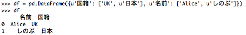
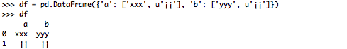

.. _options:

{{ header }}

********************
Options and settings
********************

Overview
--------
pandas has an options system that lets you customize some aspects of its behaviour,
display-related options being those the user is most likely to adjust.

Options have a full "dotted-style", case-insensitive name (e.g. ``display.max_rows``).
You can get/set options directly as attributes of the top-level ``options`` attribute:

.. ipython:: python

   import pandas as pd

   pd.options.display.max_rows
   pd.options.display.max_rows = 999
   pd.options.display.max_rows

The API is composed of 5 relevant functions, available directly from the ``pandas``
namespace:

* :func:`~pandas.get_option` / :func:`~pandas.set_option` - get/set the value of a single option.
* :func:`~pandas.reset_option` - reset one or more options to their default value.
* :func:`~pandas.describe_option` - print the descriptions of one or more options.
* :func:`~pandas.option_context` - execute a codeblock with a set of options
  that revert to prior settings after execution.

**Note:** Developers can check out `pandas/core/config_init.py <https://github.com/pandas-dev/pandas/blob/master/pandas/core/config_init.py>`_ for more information.

All of the functions above accept a regexp pattern (``re.search`` style) as an argument,
and so passing in a substring will work - as long as it is unambiguous:

.. ipython:: python

   pd.get_option("display.max_rows")
   pd.set_option("display.max_rows", 101)
   pd.get_option("display.max_rows")
   pd.set_option("max_r", 102)
   pd.get_option("display.max_rows")

The following will **not work** because it matches multiple option names, e.g.
``display.max_colwidth``, ``display.max_rows``, ``display.max_columns``:

.. ipython:: python
   :okexcept:

   try:
       pd.get_option("column")
   except KeyError as e:
       print(e)

**Note:** Using this form of shorthand may cause your code to break if new options with similar names are added in future versions.

You can get a list of available options and their descriptions with ``describe_option``. When called
with no argument ``describe_option`` will print out the descriptions for all available options.

.. ipython:: python
   :suppress:
   :okwarning:

   pd.reset_option("all")

Getting and setting options
---------------------------

As described above, :func:`~pandas.get_option` and :func:`~pandas.set_option`
are available from the pandas namespace.  To change an option, call
``set_option('option regex', new_value)``.

.. ipython:: python

   pd.get_option("mode.sim_interactive")
   pd.set_option("mode.sim_interactive", True)
   pd.get_option("mode.sim_interactive")

**Note:** The option 'mode.sim_interactive' is mostly used for debugging purposes.

All options also have a default value, and you can use ``reset_option`` to do just that:

.. ipython:: python
   :suppress:

   pd.reset_option("display.max_rows")

.. ipython:: python

   pd.get_option("display.max_rows")
   pd.set_option("display.max_rows", 999)
   pd.get_option("display.max_rows")
   pd.reset_option("display.max_rows")
   pd.get_option("display.max_rows")

It's also possible to reset multiple options at once (using a regex):

.. ipython:: python
   :okwarning:

   pd.reset_option("^display")

``option_context`` context manager has been exposed through
the top-level API, allowing you to execute code with given option values. Option values
are restored automatically when you exit the ``with`` block:

.. ipython:: python

   with pd.option_context("display.max_rows", 10, "display.max_columns", 5):
       print(pd.get_option("display.max_rows"))
       print(pd.get_option("display.max_columns"))
   print(pd.get_option("display.max_rows"))
   print(pd.get_option("display.max_columns"))

Setting startup options in Python/IPython environment
-----------------------------------------------------

Using startup scripts for the Python/IPython environment to import pandas and set options makes working with pandas more efficient.  To do this, create a .py or .ipy script in the startup directory of the desired profile.  An example where the startup folder is in a default IPython profile can be found at:

.. code-block:: none

  $IPYTHONDIR/profile_default/startup

More information can be found in the `IPython documentation
<https://ipython.org/ipython-doc/stable/interactive/tutorial.html#startup-files>`__.  An example startup script for pandas is displayed below:

.. code-block:: python

  import pandas as pd

  pd.set_option("display.max_rows", 999)
  pd.set_option("precision", 5)

.. _options.frequently_used:

Frequently used options
-----------------------
The following is a walk-through of the more frequently used display options.

``display.max_rows`` and ``display.max_columns`` sets the maximum number
of rows and columns displayed when a frame is pretty-printed.  Truncated
lines are replaced by an ellipsis.

.. ipython:: python

   df = pd.DataFrame(np.random.randn(7, 2))
   pd.set_option("max_rows", 7)
   df
   pd.set_option("max_rows", 5)
   df
   pd.reset_option("max_rows")

Once the ``display.max_rows`` is exceeded, the ``display.min_rows`` options
determines how many rows are shown in the truncated repr.

.. ipython:: python

   pd.set_option("max_rows", 8)
   pd.set_option("min_rows", 4)
   # below max_rows -> all rows shown
   df = pd.DataFrame(np.random.randn(7, 2))
   df
   # above max_rows -> only min_rows (4) rows shown
   df = pd.DataFrame(np.random.randn(9, 2))
   df
   pd.reset_option("max_rows")
   pd.reset_option("min_rows")

``display.expand_frame_repr`` allows for the representation of
dataframes to stretch across pages, wrapped over the full column vs row-wise.

.. ipython:: python

   df = pd.DataFrame(np.random.randn(5, 10))
   pd.set_option("expand_frame_repr", True)
   df
   pd.set_option("expand_frame_repr", False)
   df
   pd.reset_option("expand_frame_repr")

``display.large_repr`` lets you select whether to display dataframes that exceed
``max_columns`` or ``max_rows`` as a truncated frame, or as a summary.

.. ipython:: python

   df = pd.DataFrame(np.random.randn(10, 10))
   pd.set_option("max_rows", 5)
   pd.set_option("large_repr", "truncate")
   df
   pd.set_option("large_repr", "info")
   df
   pd.reset_option("large_repr")
   pd.reset_option("max_rows")

``display.max_colwidth`` sets the maximum width of columns.  Cells
of this length or longer will be truncated with an ellipsis.

.. ipython:: python

   df = pd.DataFrame(
       np.array(
           [
               ["foo", "bar", "bim", "uncomfortably long string"],
               ["horse", "cow", "banana", "apple"],
           ]
       )
   )
   pd.set_option("max_colwidth", 40)
   df
   pd.set_option("max_colwidth", 6)
   df
   pd.reset_option("max_colwidth")

``display.max_info_columns`` sets a threshold for when by-column info
will be given.

.. ipython:: python

   df = pd.DataFrame(np.random.randn(10, 10))
   pd.set_option("max_info_columns", 11)
   df.info()
   pd.set_option("max_info_columns", 5)
   df.info()
   pd.reset_option("max_info_columns")

``display.max_info_rows``: ``df.info()`` will usually show null-counts for each column.
For large frames this can be quite slow. ``max_info_rows`` and ``max_info_cols``
limit this null check only to frames with smaller dimensions then specified. Note that you
can specify the option ``df.info(null_counts=True)`` to override on showing a particular frame.

.. ipython:: python

   df = pd.DataFrame(np.random.choice([0, 1, np.nan], size=(10, 10)))
   df
   pd.set_option("max_info_rows", 11)
   df.info()
   pd.set_option("max_info_rows", 5)
   df.info()
   pd.reset_option("max_info_rows")

``display.precision`` sets the output display precision in terms of decimal places.
This is only a suggestion.

.. ipython:: python

   df = pd.DataFrame(np.random.randn(5, 5))
   pd.set_option("precision", 7)
   df
   pd.set_option("precision", 4)
   df

``display.chop_threshold`` sets at what level pandas rounds to zero when
it displays a Series of DataFrame. This setting does not change the
precision at which the number is stored.

.. ipython:: python

   df = pd.DataFrame(np.random.randn(6, 6))
   pd.set_option("chop_threshold", 0)
   df
   pd.set_option("chop_threshold", 0.5)
   df
   pd.reset_option("chop_threshold")

``display.colheader_justify`` controls the justification of the headers.
The options are 'right', and 'left'.

.. ipython:: python

   df = pd.DataFrame(
       np.array([np.random.randn(6), np.random.randint(1, 9, 6) * 0.1, np.zeros(6)]).T,
       columns=["A", "B", "C"],
       dtype="float",
   )
   pd.set_option("colheader_justify", "right")
   df
   pd.set_option("colheader_justify", "left")
   df
   pd.reset_option("colheader_justify")

.. _options.available:

Available options
-----------------

======================================= ============ ==================================
Option                                  Default      Function
======================================= ============ ==================================
display.chop_threshold                  None         If set to a float value, all float
                                                     values smaller then the given
                                                     threshold will be displayed as
                                                     exactly 0 by repr and friends.
display.colheader_justify               right        Controls the justification of
                                                     column headers. used by DataFrameFormatter.
display.column_space                    12           No description available.
display.date_dayfirst                   False        When True, prints and parses dates
                                                     with the day first, eg 20/01/2005
display.date_yearfirst                  False        When True, prints and parses dates
                                                     with the year first, eg 2005/01/20
display.encoding                        UTF-8        Defaults to the detected encoding
                                                     of the console. Specifies the encoding
                                                     to be used for strings returned by
                                                     to_string, these are generally strings
                                                     meant to be displayed on the console.
display.expand_frame_repr               True         Whether to print out the full DataFrame
                                                     repr for wide DataFrames across
                                                     multiple lines, ``max_columns`` is
                                                     still respected, but the output will
                                                     wrap-around across multiple "pages"
                                                     if its width exceeds ``display.width``.
display.float_format                    None         The callable should accept a floating
                                                     point number and return a string with
                                                     the desired format of the number.
                                                     This is used in some places like
                                                     SeriesFormatter.
                                                     See core.format.EngFormatter for an example.
display.large_repr                      truncate     For DataFrames exceeding max_rows/max_cols,
                                                     the repr (and HTML repr) can show
                                                     a truncated table (the default),
                                                     or switch to the view from df.info()
                                                     (the behaviour in earlier versions of pandas).
                                                     allowable settings, ['truncate', 'info']
display.latex.repr                      False        Whether to produce a latex DataFrame
                                                     representation for Jupyter frontends
                                                     that support it.
display.latex.escape                    True         Escapes special characters in DataFrames, when
                                                     using the to_latex method.
display.latex.longtable                 False        Specifies if the to_latex method of a DataFrame
                                                     uses the longtable format.
display.latex.multicolumn               True         Combines columns when using a MultiIndex
display.latex.multicolumn_format        'l'          Alignment of multicolumn labels
display.latex.multirow                  False        Combines rows when using a MultiIndex.
                                                     Centered instead of top-aligned,
                                                     separated by clines.
display.max_columns                     0 or 20      max_rows and max_columns are used
                                                     in __repr__() methods to decide if
                                                     to_string() or info() is used to
                                                     render an object to a string.  In
                                                     case Python/IPython is running in
                                                     a terminal this is set to 0 by default and
                                                     pandas will correctly auto-detect
                                                     the width of the terminal and switch to
                                                     a smaller format in case all columns
                                                     would not fit vertically. The IPython
                                                     notebook, IPython qtconsole, or IDLE
                                                     do not run in a terminal and hence
                                                     it is not possible to do correct
                                                     auto-detection, in which case the default
                                                     is set to 20. 'None' value means unlimited.
display.max_colwidth                    50           The maximum width in characters of
                                                     a column in the repr of a pandas
                                                     data structure. When the column overflows,
                                                     a "..." placeholder is embedded in
                                                     the output. 'None' value means unlimited.
display.max_info_columns                100          max_info_columns is used in DataFrame.info
                                                     method to decide if per column information
                                                     will be printed.
display.max_info_rows                   1690785      df.info() will usually show null-counts
                                                     for each column. For large frames
                                                     this can be quite slow. max_info_rows
                                                     and max_info_cols limit this null
                                                     check only to frames with smaller
                                                     dimensions then specified.
display.max_rows                        60           This sets the maximum number of rows
                                                     pandas should output when printing
                                                     out various output. For example,
                                                     this value determines whether the
                                                     repr() for a dataframe prints out
                                                     fully or just a truncated or summary repr.
                                                     'None' value means unlimited.
display.min_rows                        10           The numbers of rows to show in a truncated
                                                     repr (when ``max_rows`` is exceeded). Ignored
                                                     when ``max_rows`` is set to None or 0. When set
                                                     to None, follows the value of ``max_rows``.
display.max_seq_items                   100          when pretty-printing a long sequence,
                                                     no more then ``max_seq_items`` will
                                                     be printed. If items are omitted,
                                                     they will be denoted by the addition
                                                     of "..." to the resulting string.
                                                     If set to None, the number of items
                                                     to be printed is unlimited.
display.memory_usage                    True         This specifies if the memory usage of
                                                     a DataFrame should be displayed when the
                                                     df.info() method is invoked.
display.multi_sparse                    True         "Sparsify" MultiIndex display (don't
                                                     display repeated elements in outer
                                                     levels within groups)
display.notebook_repr_html              True         When True, IPython notebook will
                                                     use html representation for
                                                     pandas objects (if it is available).
display.pprint_nest_depth               3            Controls the number of nested levels
                                                     to process when pretty-printing
display.precision                       6            Floating point output precision in
                                                     terms of number of places after the
                                                     decimal, for regular formatting as well
                                                     as scientific notation. Similar to
                                                     numpy's ``precision`` print option
display.show_dimensions                 truncate     Whether to print out dimensions
                                                     at the end of DataFrame repr.
                                                     If 'truncate' is specified, only
                                                     print out the dimensions if the
                                                     frame is truncated (e.g. not display
                                                     all rows and/or columns)
display.width                           80           Width of the display in characters.
                                                     In case Python/IPython is running in
                                                     a terminal this can be set to None
                                                     and pandas will correctly auto-detect
                                                     the width. Note that the IPython notebook,
                                                     IPython qtconsole, or IDLE do not run in a
                                                     terminal and hence it is not possible
                                                     to correctly detect the width.
display.html.table_schema               False        Whether to publish a Table Schema
                                                     representation for frontends that
                                                     support it.
display.html.border                     1            A ``border=value`` attribute is
                                                     inserted in the ``<table>`` tag
                                                     for the DataFrame HTML repr.
display.html.use_mathjax                True         When True, Jupyter notebook will process
                                                     table contents using MathJax, rendering
                                                     mathematical expressions enclosed by the
                                                     dollar symbol.
io.excel.xls.writer                     xlwt         The default Excel writer engine for
                                                     'xls' files.

                                                     .. deprecated:: 1.2.0

                                                        As `xlwt <https://pypi.org/project/xlwt/>`__
                                                        package is no longer maintained, the ``xlwt``
                                                        engine will be removed in a future version of
                                                        pandas. Since this is the only engine in pandas
                                                        that supports writing to ``.xls`` files,
                                                        this option will also be removed.

io.excel.xlsm.writer                    openpyxl     The default Excel writer engine for
                                                     'xlsm' files. Available options:
                                                     'openpyxl' (the default).
io.excel.xlsx.writer                    openpyxl     The default Excel writer engine for
                                                     'xlsx' files.
io.hdf.default_format                   None         default format writing format, if
                                                     None, then put will default to
                                                     'fixed' and append will default to
                                                     'table'
io.hdf.dropna_table                     True         drop ALL nan rows when appending
                                                     to a table
io.parquet.engine                       None         The engine to use as a default for
                                                     parquet reading and writing. If None
                                                     then try 'pyarrow' and 'fastparquet'
io.sql.engine                           None         The engine to use as a default for
                                                     sql reading and writing, with SQLAlchemy
                                                     as a higher level interface. If None
                                                     then try 'sqlalchemy'
mode.chained_assignment                 warn         Controls ``SettingWithCopyWarning``:
                                                     'raise', 'warn', or None. Raise an
                                                     exception, warn, or no action if
                                                     trying to use :ref:`chained assignment <indexing.evaluation_order>`.
mode.sim_interactive                    False        Whether to simulate interactive mode
                                                     for purposes of testing.
mode.use_inf_as_na                      False        True means treat None, NaN, -INF,
                                                     INF as NA (old way), False means
                                                     None and NaN are null, but INF, -INF
                                                     are not NA (new way).
compute.use_bottleneck                  True         Use the bottleneck library to accelerate
                                                     computation if it is installed.
compute.use_numexpr                     True         Use the numexpr library to accelerate
                                                     computation if it is installed.
plotting.backend                        matplotlib   Change the plotting backend to a different
                                                     backend than the current matplotlib one.
                                                     Backends can be implemented as third-party
                                                     libraries implementing the pandas plotting
                                                     API. They can use other plotting libraries
                                                     like Bokeh, Altair, etc.
plotting.matplotlib.register_converters True         Register custom converters with
                                                     matplotlib. Set to False to de-register.
styler.sparse.index                     True         "Sparsify" MultiIndex display for rows
                                                     in Styler output (don't display repeated
                                                     elements in outer levels within groups).
styler.sparse.columns                   True         "Sparsify" MultiIndex display for columns
                                                     in Styler output.
styler.render.max_elements              262144       Maximum number of datapoints that Styler will render
                                                     trimming either rows, columns or both to fit.
======================================= ============ ==================================

.. _basics.console_output:

Number formatting
------------------

pandas also allows you to set how numbers are displayed in the console.
This option is not set through the ``set_options`` API.

Use the ``set_eng_float_format`` function
to alter the floating-point formatting of pandas objects to produce a particular
format.

For instance:

.. ipython:: python

   import numpy as np

   pd.set_eng_float_format(accuracy=3, use_eng_prefix=True)
   s = pd.Series(np.random.randn(5), index=["a", "b", "c", "d", "e"])
   s / 1.0e3
   s / 1.0e6

.. ipython:: python
   :suppress:
   :okwarning:

   pd.reset_option("^display")

To round floats on a case-by-case basis, you can also use :meth:`~pandas.Series.round` and :meth:`~pandas.DataFrame.round`.

.. _options.east_asian_width:

Unicode formatting
------------------

.. warning::

   Enabling this option will affect the performance for printing of DataFrame and Series (about 2 times slower).
   Use only when it is actually required.

Some East Asian countries use Unicode characters whose width corresponds to two Latin characters.
If a DataFrame or Series contains these characters, the default output mode may not align them properly.

.. note:: Screen captures are attached for each output to show the actual results.

.. ipython:: python

   df = pd.DataFrame({"国籍": ["UK", "日本"], "名前": ["Alice", "しのぶ"]})
   df

Enabling ``display.unicode.east_asian_width`` allows pandas to check each character's "East Asian Width" property.
These characters can be aligned properly by setting this option to ``True``. However, this will result in longer render
times than the standard ``len`` function.

.. ipython:: python

   pd.set_option("display.unicode.east_asian_width", True)
   df

.. image:: ../_static/option_unicode02.png

In addition, Unicode characters whose width is "Ambiguous" can either be 1 or 2 characters wide depending on the
terminal setting or encoding. The option ``display.unicode.ambiguous_as_wide`` can be used to handle the ambiguity.

By default, an "Ambiguous" character's width, such as "¡" (inverted exclamation) in the example below, is taken to be 1.

.. ipython:: python

   df = pd.DataFrame({"a": ["xxx", "¡¡"], "b": ["yyy", "¡¡"]})
   df

Enabling ``display.unicode.ambiguous_as_wide`` makes pandas interpret these characters' widths to be 2.
(Note that this option will only be effective when ``display.unicode.east_asian_width`` is enabled.)

However, setting this option incorrectly for your terminal will cause these characters to be aligned incorrectly:

.. ipython:: python

   pd.set_option("display.unicode.ambiguous_as_wide", True)
   df

.. image:: ../_static/option_unicode04.png

.. ipython:: python
   :suppress:

   pd.set_option("display.unicode.east_asian_width", False)
   pd.set_option("display.unicode.ambiguous_as_wide", False)

.. _options.table_schema:

Table schema display
--------------------

``DataFrame`` and ``Series`` will publish a Table Schema representation
by default. False by default, this can be enabled globally with the
``display.html.table_schema`` option:

.. ipython:: python

  pd.set_option("display.html.table_schema", True)

Only ``'display.max_rows'`` are serialized and published.

.. ipython:: python
    :suppress:

    pd.reset_option("display.html.table_schema")
