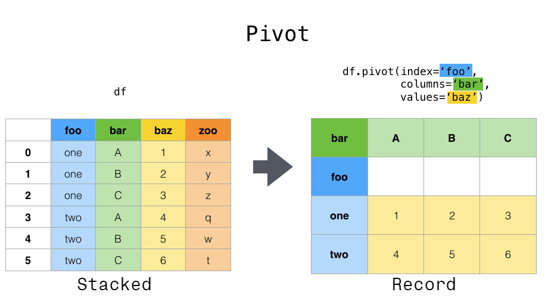
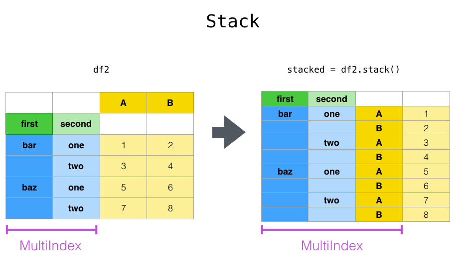
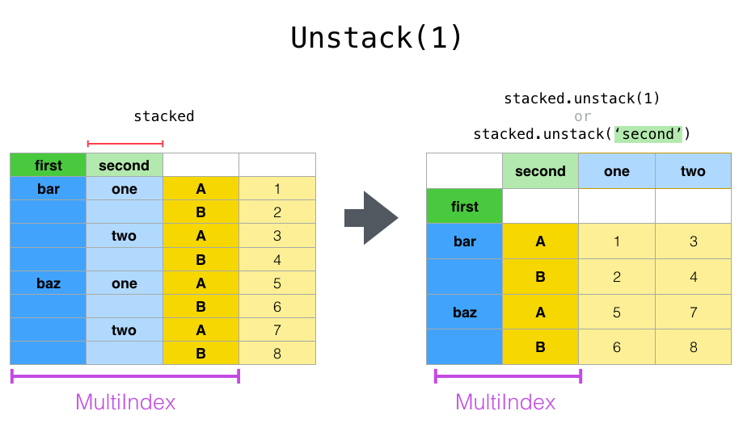
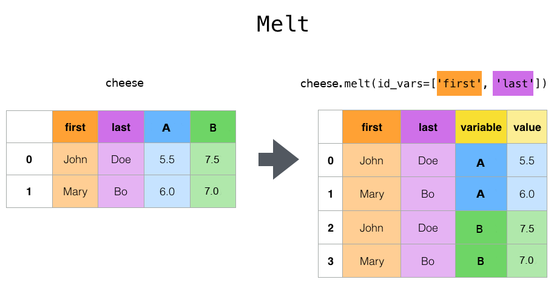

.. _reshaping:

{{ header }}

**************************
Reshaping and pivot tables
**************************

.. _reshaping.reshaping:

Reshaping by pivoting DataFrame objects
---------------------------------------

.. ipython:: python
   :suppress:

   import pandas._testing as tm
   tm.N = 3

   def unpivot(frame):
       N, K = frame.shape
       data = {'value': frame.to_numpy().ravel('F'),
               'variable': np.asarray(frame.columns).repeat(N),
               'date': np.tile(np.asarray(frame.index), K)}
       columns = ['date', 'variable', 'value']
       return pd.DataFrame(data, columns=columns)

   df = unpivot(tm.makeTimeDataFrame())

Data is often stored in so-called "stacked" or "record" format:

.. ipython:: python

   df

For the curious here is how the above ``DataFrame`` was created:

.. code-block:: python

   import pandas._testing as tm

   tm.N = 3

   def unpivot(frame):
       N, K = frame.shape
       data = {'value': frame.to_numpy().ravel('F'),
               'variable': np.asarray(frame.columns).repeat(N),
               'date': np.tile(np.asarray(frame.index), K)}
       return pd.DataFrame(data, columns=['date', 'variable', 'value'])

   df = unpivot(tm.makeTimeDataFrame())

To select out everything for variable ``A`` we could do:

.. ipython:: python

   df[df['variable'] == 'A']

But suppose we wish to do time series operations with the variables. A better
representation would be where the ``columns`` are the unique variables and an
``index`` of dates identifies individual observations. To reshape the data into
this form, we use the :meth:`DataFrame.pivot` method (also implemented as a
top level function :func:`~pandas.pivot`):

.. ipython:: python

   df.pivot(index='date', columns='variable', values='value')

If the ``values`` argument is omitted, and the input ``DataFrame`` has more than
one column of values which are not used as column or index inputs to ``pivot``,
then the resulting "pivoted" ``DataFrame`` will have :ref:`hierarchical columns
<advanced.hierarchical>` whose topmost level indicates the respective value
column:

.. ipython:: python

   df['value2'] = df['value'] * 2
   pivoted = df.pivot(index='date', columns='variable')
   pivoted

You can then select subsets from the pivoted ``DataFrame``:

.. ipython:: python

   pivoted['value2']

Note that this returns a view on the underlying data in the case where the data
are homogeneously-typed.

.. note::
   :func:`~pandas.pivot` will error with a ``ValueError: Index contains duplicate
   entries, cannot reshape`` if the index/column pair is not unique. In this
   case, consider using :func:`~pandas.pivot_table` which is a generalization
   of pivot that can handle duplicate values for one index/column pair.

.. _reshaping.stacking:

Reshaping by stacking and unstacking
------------------------------------

Closely related to the :meth:`~DataFrame.pivot` method are the related
:meth:`~DataFrame.stack` and :meth:`~DataFrame.unstack` methods available on
``Series`` and ``DataFrame``. These methods are designed to work together with
``MultiIndex`` objects (see the section on :ref:`hierarchical indexing
<advanced.hierarchical>`). Here are essentially what these methods do:

* ``stack``: "pivot" a level of the (possibly hierarchical) column labels,
  returning a ``DataFrame`` with an index with a new inner-most level of row
  labels.
* ``unstack``: (inverse operation of ``stack``) "pivot" a level of the
  (possibly hierarchical) row index to the column axis, producing a reshaped
  ``DataFrame`` with a new inner-most level of column labels.

.. image:: ../_static/reshaping_unstack.png

The clearest way to explain is by example. Let's take a prior example data set
from the hierarchical indexing section:

.. ipython:: python

   tuples = list(zip(*[['bar', 'bar', 'baz', 'baz',
                        'foo', 'foo', 'qux', 'qux'],
                       ['one', 'two', 'one', 'two',
                        'one', 'two', 'one', 'two']]))
   index = pd.MultiIndex.from_tuples(tuples, names=['first', 'second'])
   df = pd.DataFrame(np.random.randn(8, 2), index=index, columns=['A', 'B'])
   df2 = df[:4]
   df2

The ``stack`` function "compresses" a level in the ``DataFrame``'s columns to
produce either:

* A ``Series``, in the case of a simple column Index.
* A ``DataFrame``, in the case of a ``MultiIndex`` in the columns.

If the columns have a ``MultiIndex``, you can choose which level to stack. The
stacked level becomes the new lowest level in a ``MultiIndex`` on the columns:

.. ipython:: python

   stacked = df2.stack()
   stacked

With a "stacked" ``DataFrame`` or ``Series`` (having a ``MultiIndex`` as the
``index``), the inverse operation of ``stack`` is ``unstack``, which by default
unstacks the **last level**:

.. ipython:: python

   stacked.unstack()
   stacked.unstack(1)
   stacked.unstack(0)

.. _reshaping.unstack_by_name:

If the indexes have names, you can use the level names instead of specifying
the level numbers:

.. ipython:: python

   stacked.unstack('second')

.. image:: ../_static/reshaping_unstack_0.png

Notice that the ``stack`` and ``unstack`` methods implicitly sort the index
levels involved. Hence a call to ``stack`` and then ``unstack``, or vice versa,
will result in a **sorted** copy of the original ``DataFrame`` or ``Series``:

.. ipython:: python

   index = pd.MultiIndex.from_product([[2, 1], ['a', 'b']])
   df = pd.DataFrame(np.random.randn(4), index=index, columns=['A'])
   df
   all(df.unstack().stack() == df.sort_index())

The above code will raise a ``TypeError`` if the call to ``sort_index`` is
removed.

.. _reshaping.stack_multiple:

Multiple levels
~~~~~~~~~~~~~~~

You may also stack or unstack more than one level at a time by passing a list
of levels, in which case the end result is as if each level in the list were
processed individually.

.. ipython:: python

    columns = pd.MultiIndex.from_tuples([
        ('A', 'cat', 'long'), ('B', 'cat', 'long'),
        ('A', 'dog', 'short'), ('B', 'dog', 'short')],
        names=['exp', 'animal', 'hair_length']
    )
    df = pd.DataFrame(np.random.randn(4, 4), columns=columns)
    df

    df.stack(level=['animal', 'hair_length'])

The list of levels can contain either level names or level numbers (but
not a mixture of the two).

.. ipython:: python

    # df.stack(level=['animal', 'hair_length'])
    # from above is equivalent to:
    df.stack(level=[1, 2])

Missing data
~~~~~~~~~~~~

These functions are intelligent about handling missing data and do not expect
each subgroup within the hierarchical index to have the same set of labels.
They also can handle the index being unsorted (but you can make it sorted by
calling ``sort_index``, of course). Here is a more complex example:

.. ipython:: python

   columns = pd.MultiIndex.from_tuples([('A', 'cat'), ('B', 'dog'),
                                        ('B', 'cat'), ('A', 'dog')],
                                       names=['exp', 'animal'])
   index = pd.MultiIndex.from_product([('bar', 'baz', 'foo', 'qux'),
                                       ('one', 'two')],
                                      names=['first', 'second'])
   df = pd.DataFrame(np.random.randn(8, 4), index=index, columns=columns)
   df2 = df.iloc[[0, 1, 2, 4, 5, 7]]
   df2

As mentioned above, ``stack`` can be called with a ``level`` argument to select
which level in the columns to stack:

.. ipython:: python

   df2.stack('exp')
   df2.stack('animal')

Unstacking can result in missing values if subgroups do not have the same
set of labels.  By default, missing values will be replaced with the default
fill value for that data type, ``NaN`` for float, ``NaT`` for datetimelike,
etc.  For integer types, by default data will converted to float and missing
values will be set to ``NaN``.

.. ipython:: python

   df3 = df.iloc[[0, 1, 4, 7], [1, 2]]
   df3
   df3.unstack()

Alternatively, unstack takes an optional ``fill_value`` argument, for specifying
the value of missing data.

.. ipython:: python

   df3.unstack(fill_value=-1e9)

With a MultiIndex
~~~~~~~~~~~~~~~~~

Unstacking when the columns are a ``MultiIndex`` is also careful about doing
the right thing:

.. ipython:: python

   df[:3].unstack(0)
   df2.unstack(1)

.. _reshaping.melt:

Reshaping by Melt
-----------------

The top-level :func:`~pandas.melt` function and the corresponding :meth:`DataFrame.melt`
are useful to massage a ``DataFrame`` into a format where one or more columns
are *identifier variables*, while all other columns, considered *measured
variables*, are "unpivoted" to the row axis, leaving just two non-identifier
columns, "variable" and "value". The names of those columns can be customized
by supplying the ``var_name`` and ``value_name`` parameters.

For instance,

.. ipython:: python

   cheese = pd.DataFrame({'first': ['John', 'Mary'],
                          'last': ['Doe', 'Bo'],
                          'height': [5.5, 6.0],
                          'weight': [130, 150]})
   cheese
   cheese.melt(id_vars=['first', 'last'])
   cheese.melt(id_vars=['first', 'last'], var_name='quantity')

Another way to transform is to use the :func:`~pandas.wide_to_long` panel data
convenience function. It is less flexible than :func:`~pandas.melt`, but more
user-friendly.

.. ipython:: python

  dft = pd.DataFrame({"A1970": {0: "a", 1: "b", 2: "c"},
                      "A1980": {0: "d", 1: "e", 2: "f"},
                      "B1970": {0: 2.5, 1: 1.2, 2: .7},
                      "B1980": {0: 3.2, 1: 1.3, 2: .1},
                      "X": dict(zip(range(3), np.random.randn(3)))
                     })
  dft["id"] = dft.index
  dft
  pd.wide_to_long(dft, ["A", "B"], i="id", j="year")

.. _reshaping.combine_with_groupby:

Combining with stats and GroupBy
--------------------------------

It should be no shock that combining ``pivot`` / ``stack`` / ``unstack`` with
GroupBy and the basic Series and DataFrame statistical functions can produce
some very expressive and fast data manipulations.

.. ipython:: python

   df
   df.stack().mean(1).unstack()

   # same result, another way
   df.groupby(level=1, axis=1).mean()

   df.stack().groupby(level=1).mean()

   df.mean().unstack(0)

Pivot tables
------------

.. _reshaping.pivot:

While :meth:`~DataFrame.pivot` provides general purpose pivoting with various
data types (strings, numerics, etc.), pandas also provides :func:`~pandas.pivot_table`
for pivoting with aggregation of numeric data.

The function :func:`~pandas.pivot_table` can be used to create spreadsheet-style
pivot tables. See the :ref:`cookbook<cookbook.pivot>` for some advanced
strategies.

It takes a number of arguments:

* ``data``: a DataFrame object.
* ``values``: a column or a list of columns to aggregate.
* ``index``: a column, Grouper, array which has the same length as data, or list of them.
  Keys to group by on the pivot table index. If an array is passed, it is being used as the same manner as column values.
* ``columns``: a column, Grouper, array which has the same length as data, or list of them.
  Keys to group by on the pivot table column. If an array is passed, it is being used as the same manner as column values.
* ``aggfunc``: function to use for aggregation, defaulting to ``numpy.mean``.

Consider a data set like this:

.. ipython:: python

   import datetime
   df = pd.DataFrame({'A': ['one', 'one', 'two', 'three'] * 6,
                      'B': ['A', 'B', 'C'] * 8,
                      'C': ['foo', 'foo', 'foo', 'bar', 'bar', 'bar'] * 4,
                      'D': np.random.randn(24),
                      'E': np.random.randn(24),
                      'F': [datetime.datetime(2013, i, 1) for i in range(1, 13)]
                      + [datetime.datetime(2013, i, 15) for i in range(1, 13)]})
   df

We can produce pivot tables from this data very easily:

.. ipython:: python

   pd.pivot_table(df, values='D', index=['A', 'B'], columns=['C'])
   pd.pivot_table(df, values='D', index=['B'], columns=['A', 'C'], aggfunc=np.sum)
   pd.pivot_table(df, values=['D', 'E'], index=['B'], columns=['A', 'C'],
                  aggfunc=np.sum)

The result object is a ``DataFrame`` having potentially hierarchical indexes on the
rows and columns. If the ``values`` column name is not given, the pivot table
will include all of the data that can be aggregated in an additional level of
hierarchy in the columns:

.. ipython:: python

   pd.pivot_table(df, index=['A', 'B'], columns=['C'])

Also, you can use ``Grouper`` for ``index`` and ``columns`` keywords. For detail of ``Grouper``, see :ref:`Grouping with a Grouper specification <groupby.specify>`.

.. ipython:: python

   pd.pivot_table(df, values='D', index=pd.Grouper(freq='M', key='F'),
                  columns='C')

You can render a nice output of the table omitting the missing values by
calling ``to_string`` if you wish:

.. ipython:: python

   table = pd.pivot_table(df, index=['A', 'B'], columns=['C'])
   print(table.to_string(na_rep=''))

Note that ``pivot_table`` is also available as an instance method on DataFrame,
 i.e. :meth:`DataFrame.pivot_table`.

.. _reshaping.pivot.margins:

Adding margins
~~~~~~~~~~~~~~

If you pass ``margins=True`` to ``pivot_table``, special ``All`` columns and
rows will be added with partial group aggregates across the categories on the
rows and columns:

.. ipython:: python

   df.pivot_table(index=['A', 'B'], columns='C', margins=True, aggfunc=np.std)

.. _reshaping.crosstabulations:

Cross tabulations
-----------------

Use :func:`~pandas.crosstab` to compute a cross-tabulation of two (or more)
factors. By default ``crosstab`` computes a frequency table of the factors
unless an array of values and an aggregation function are passed.

It takes a number of arguments

* ``index``: array-like, values to group by in the rows.
* ``columns``: array-like, values to group by in the columns.
* ``values``: array-like, optional, array of values to aggregate according to
  the factors.
* ``aggfunc``: function, optional, If no values array is passed, computes a
  frequency table.
* ``rownames``: sequence, default ``None``, must match number of row arrays passed.
* ``colnames``: sequence, default ``None``, if passed, must match number of column
  arrays passed.
* ``margins``: boolean, default ``False``, Add row/column margins (subtotals)
* ``normalize``: boolean, {'all', 'index', 'columns'}, or {0,1}, default ``False``.
  Normalize by dividing all values by the sum of values.

Any ``Series`` passed will have their name attributes used unless row or column
names for the cross-tabulation are specified

For example:

.. ipython:: python

    foo, bar, dull, shiny, one, two = 'foo', 'bar', 'dull', 'shiny', 'one', 'two'
    a = np.array([foo, foo, bar, bar, foo, foo], dtype=object)
    b = np.array([one, one, two, one, two, one], dtype=object)
    c = np.array([dull, dull, shiny, dull, dull, shiny], dtype=object)
    pd.crosstab(a, [b, c], rownames=['a'], colnames=['b', 'c'])

If ``crosstab`` receives only two Series, it will provide a frequency table.

.. ipython:: python

    df = pd.DataFrame({'A': [1, 2, 2, 2, 2], 'B': [3, 3, 4, 4, 4],
                       'C': [1, 1, np.nan, 1, 1]})
    df

    pd.crosstab(df['A'], df['B'])

Any input passed containing ``Categorical`` data will have **all** of its
categories included in the cross-tabulation, even if the actual data does
not contain any instances of a particular category.

.. ipython:: python

    foo = pd.Categorical(['a', 'b'], categories=['a', 'b', 'c'])
    bar = pd.Categorical(['d', 'e'], categories=['d', 'e', 'f'])
    pd.crosstab(foo, bar)

Normalization
~~~~~~~~~~~~~

Frequency tables can also be normalized to show percentages rather than counts
using the ``normalize`` argument:

.. ipython:: python

   pd.crosstab(df['A'], df['B'], normalize=True)

``normalize`` can also normalize values within each row or within each column:

.. ipython:: python

   pd.crosstab(df['A'], df['B'], normalize='columns')

``crosstab`` can also be passed a third ``Series`` and an aggregation function
(``aggfunc``) that will be applied to the values of the third ``Series`` within
each group defined by the first two ``Series``:

.. ipython:: python

   pd.crosstab(df['A'], df['B'], values=df['C'], aggfunc=np.sum)

Adding margins
~~~~~~~~~~~~~~

Finally, one can also add margins or normalize this output.

.. ipython:: python

   pd.crosstab(df['A'], df['B'], values=df['C'], aggfunc=np.sum, normalize=True,
               margins=True)

.. _reshaping.tile:
.. _reshaping.tile.cut:

Tiling
------

The :func:`~pandas.cut` function computes groupings for the values of the input
array and is often used to transform continuous variables to discrete or
categorical variables:

.. ipython:: python

   ages = np.array([10, 15, 13, 12, 23, 25, 28, 59, 60])

   pd.cut(ages, bins=3)

If the ``bins`` keyword is an integer, then equal-width bins are formed.
Alternatively we can specify custom bin-edges:

.. ipython:: python

   c = pd.cut(ages, bins=[0, 18, 35, 70])
   c

If the ``bins`` keyword is an ``IntervalIndex``, then these will be
used to bin the passed data.::

   pd.cut([25, 20, 50], bins=c.categories)

.. _reshaping.dummies:

Computing indicator / dummy variables
-------------------------------------

To convert a categorical variable into a "dummy" or "indicator" ``DataFrame``,
for example a column in a ``DataFrame`` (a ``Series``) which has ``k`` distinct
values, can derive a ``DataFrame`` containing ``k`` columns of 1s and 0s using
:func:`~pandas.get_dummies`:

.. ipython:: python

   df = pd.DataFrame({'key': list('bbacab'), 'data1': range(6)})

   pd.get_dummies(df['key'])

Sometimes it's useful to prefix the column names, for example when merging the result
with the original ``DataFrame``:

.. ipython:: python

   dummies = pd.get_dummies(df['key'], prefix='key')
   dummies

   df[['data1']].join(dummies)

This function is often used along with discretization functions like ``cut``:

.. ipython:: python

   values = np.random.randn(10)
   values

   bins = [0, 0.2, 0.4, 0.6, 0.8, 1]

   pd.get_dummies(pd.cut(values, bins))

See also :func:`Series.str.get_dummies <pandas.Series.str.get_dummies>`.

:func:`get_dummies` also accepts a ``DataFrame``. By default all categorical
variables (categorical in the statistical sense, those with `object` or
`categorical` dtype) are encoded as dummy variables.

.. ipython:: python

    df = pd.DataFrame({'A': ['a', 'b', 'a'], 'B': ['c', 'c', 'b'],
                       'C': [1, 2, 3]})
    pd.get_dummies(df)

All non-object columns are included untouched in the output. You can control
the columns that are encoded with the ``columns`` keyword.

.. ipython:: python

    pd.get_dummies(df, columns=['A'])

Notice that the ``B`` column is still included in the output, it just hasn't
been encoded. You can drop ``B`` before calling ``get_dummies`` if you don't
want to include it in the output.

As with the ``Series`` version, you can pass values for the ``prefix`` and
``prefix_sep``. By default the column name is used as the prefix, and '_' as
the prefix separator. You can specify ``prefix`` and ``prefix_sep`` in 3 ways:

* string: Use the same value for ``prefix`` or ``prefix_sep`` for each column
  to be encoded.
* list: Must be the same length as the number of columns being encoded.
* dict: Mapping column name to prefix.

.. ipython:: python

    simple = pd.get_dummies(df, prefix='new_prefix')
    simple
    from_list = pd.get_dummies(df, prefix=['from_A', 'from_B'])
    from_list
    from_dict = pd.get_dummies(df, prefix={'B': 'from_B', 'A': 'from_A'})
    from_dict

Sometimes it will be useful to only keep k-1 levels of a categorical
variable to avoid collinearity when feeding the result to statistical models.
You can switch to this mode by turn on ``drop_first``.

.. ipython:: python

    s = pd.Series(list('abcaa'))

    pd.get_dummies(s)

    pd.get_dummies(s, drop_first=True)

When a column contains only one level, it will be omitted in the result.

.. ipython:: python

    df = pd.DataFrame({'A': list('aaaaa'), 'B': list('ababc')})

    pd.get_dummies(df)

    pd.get_dummies(df, drop_first=True)

By default new columns will have ``np.uint8`` dtype.
To choose another dtype, use the ``dtype`` argument:

.. ipython:: python

    df = pd.DataFrame({'A': list('abc'), 'B': [1.1, 2.2, 3.3]})

    pd.get_dummies(df, dtype=bool).dtypes

.. versionadded:: 0.23.0

.. _reshaping.factorize:

Factorizing values
------------------

To encode 1-d values as an enumerated type use :func:`~pandas.factorize`:

.. ipython:: python

   x = pd.Series(['A', 'A', np.nan, 'B', 3.14, np.inf])
   x
   labels, uniques = pd.factorize(x)
   labels
   uniques

Note that ``factorize`` is similar to ``numpy.unique``, but differs in its
handling of NaN:

.. note::
   The following ``numpy.unique`` will fail under Python 3 with a ``TypeError``
   because of an ordering bug. See also
   `here <https://github.com/numpy/numpy/issues/641>`__.

.. code-block:: ipython

    In [1]: x = pd.Series(['A', 'A', np.nan, 'B', 3.14, np.inf])
    In [2]: pd.factorize(x, sort=True)
    Out[2]:
    (array([ 2,  2, -1,  3,  0,  1]),
     Index([3.14, inf, 'A', 'B'], dtype='object'))

    In [3]: np.unique(x, return_inverse=True)[::-1]
    Out[3]: (array([3, 3, 0, 4, 1, 2]), array([nan, 3.14, inf, 'A', 'B'], dtype=object))

.. note::
    If you just want to handle one column as a categorical variable (like R's factor),
    you can use  ``df["cat_col"] = pd.Categorical(df["col"])`` or
    ``df["cat_col"] = df["col"].astype("category")``. For full docs on :class:`~pandas.Categorical`,
    see the :ref:`Categorical introduction <categorical>` and the
    :ref:`API documentation <api.arrays.categorical>`.

Examples
--------

In this section, we will review frequently asked questions and examples. The
column names and relevant column values are named to correspond with how this
DataFrame will be pivoted in the answers below.

.. ipython:: python

   np.random.seed([3, 1415])
   n = 20

   cols = np.array(['key', 'row', 'item', 'col'])
   df = cols + pd.DataFrame((np.random.randint(5, size=(n, 4))
                            // [2, 1, 2, 1]).astype(str))
   df.columns = cols
   df = df.join(pd.DataFrame(np.random.rand(n, 2).round(2)).add_prefix('val'))

   df

Pivoting with single aggregations
~~~~~~~~~~~~~~~~~~~~~~~~~~~~~~~~~

Suppose we wanted to pivot ``df`` such that the ``col`` values are columns,
``row`` values are the index, and the mean of ``val0`` are the values? In
particular, the resulting DataFrame should look like:

.. code-block:: text

    col   col0   col1   col2   col3  col4
    row
    row0  0.77  0.605    NaN  0.860  0.65
    row2  0.13    NaN  0.395  0.500  0.25
    row3   NaN  0.310    NaN  0.545   NaN
    row4   NaN  0.100  0.395  0.760  0.24

This solution uses :func:`~pandas.pivot_table`. Also note that
``aggfunc='mean'`` is the default. It is included here to be explicit.

.. ipython:: python

   df.pivot_table(
       values='val0', index='row', columns='col', aggfunc='mean')

Note that we can also replace the missing values by using the ``fill_value``
parameter.

.. ipython:: python

   df.pivot_table(
       values='val0', index='row', columns='col', aggfunc='mean', fill_value=0)

Also note that we can pass in other aggregation functions as well. For example,
we can also pass in ``sum``.

.. ipython:: python

   df.pivot_table(
       values='val0', index='row', columns='col', aggfunc='sum', fill_value=0)

Another aggregation we can do is calculate the frequency in which the columns
and rows occur together a.k.a. "cross tabulation". To do this, we can pass
``size`` to the ``aggfunc`` parameter.

.. ipython:: python

   df.pivot_table(index='row', columns='col', fill_value=0, aggfunc='size')

Pivoting with multiple aggregations
~~~~~~~~~~~~~~~~~~~~~~~~~~~~~~~~~~~

We can also perform multiple aggregations. For example, to perform both a
``sum`` and ``mean``, we can pass in a list to the ``aggfunc`` argument.

.. ipython:: python

   df.pivot_table(
       values='val0', index='row', columns='col', aggfunc=['mean', 'sum'])

Note to aggregate over multiple value columns, we can pass in a list to the
``values`` parameter.

.. ipython:: python

   df.pivot_table(
       values=['val0', 'val1'], index='row', columns='col', aggfunc=['mean'])

Note to subdivide over multiple columns we can pass in a list to the
``columns`` parameter.

.. ipython:: python

   df.pivot_table(
       values=['val0'], index='row', columns=['item', 'col'], aggfunc=['mean'])

.. _reshaping.explode:

Exploding a list-like column
----------------------------

.. versionadded:: 0.25.0

Sometimes the values in a column are list-like.

.. ipython:: python

   keys = ['panda1', 'panda2', 'panda3']
   values = [['eats', 'shoots'], ['shoots', 'leaves'], ['eats', 'leaves']]
   df = pd.DataFrame({'keys': keys, 'values': values})
   df

We can 'explode' the ``values`` column, transforming each list-like to a separate row, by using :meth:`~Series.explode`. This will replicate the index values from the original row:

.. ipython:: python

   df['values'].explode()

You can also explode the column in the ``DataFrame``.

.. ipython:: python

   df.explode('values')

:meth:`Series.explode` will replace empty lists with ``np.nan`` and preserve scalar entries. The dtype of the resulting ``Series`` is always ``object``.

.. ipython:: python

   s = pd.Series([[1, 2, 3], 'foo', [], ['a', 'b']])
   s
   s.explode()

Here is a typical usecase. You have comma separated strings in a column and want to expand this.

.. ipython:: python

    df = pd.DataFrame([{'var1': 'a,b,c', 'var2': 1},
                       {'var1': 'd,e,f', 'var2': 2}])
    df

Creating a long form DataFrame is now straightforward using explode and chained operations

.. ipython:: python

   df.assign(var1=df.var1.str.split(',')).explode('var1')
