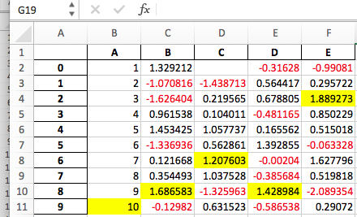

.. _whatsnew_0200:

v0.20.1 (May 5, 2017)
---------------------

{{ header }}

This is a major release from 0.19.2 and includes a number of API changes, deprecations, new features,
enhancements, and performance improvements along with a large number of bug fixes. We recommend that all
users upgrade to this version.

Highlights include:

- New ``.agg()`` API for Series/DataFrame similar to the groupby-rolling-resample API's, see :ref:`here <whatsnew_0200.enhancements.agg>`
- Integration with the ``feather-format``, including a new top-level ``pd.read_feather()`` and ``DataFrame.to_feather()`` method, see :ref:`here <io.feather>`.
- The ``.ix`` indexer has been deprecated, see :ref:`here <whatsnew_0200.api_breaking.deprecate_ix>`
- ``Panel`` has been deprecated, see :ref:`here <whatsnew_0200.api_breaking.deprecate_panel>`
- Addition of an ``IntervalIndex`` and ``Interval`` scalar type, see :ref:`here <whatsnew_0200.enhancements.intervalindex>`
- Improved user API when grouping by index levels in ``.groupby()``, see :ref:`here <whatsnew_0200.enhancements.groupby_access>`
- Improved support for ``UInt64`` dtypes, see :ref:`here <whatsnew_0200.enhancements.uint64_support>`
- A new orient for JSON serialization, ``orient='table'``, that uses the Table Schema spec and that gives the possibility for a more interactive repr in the Jupyter Notebook, see :ref:`here <whatsnew_0200.enhancements.table_schema>`
- Experimental support for exporting styled DataFrames (``DataFrame.style``) to Excel, see :ref:`here <whatsnew_0200.enhancements.style_excel>`
- Window binary corr/cov operations now return a MultiIndexed ``DataFrame`` rather than a ``Panel``, as ``Panel`` is now deprecated, see :ref:`here <whatsnew_0200.api_breaking.rolling_pairwise>`
- Support for S3 handling now uses ``s3fs``, see :ref:`here <whatsnew_0200.api_breaking.s3>`
- Google BigQuery support now uses the ``pandas-gbq`` library, see :ref:`here <whatsnew_0200.api_breaking.gbq>`

.. warning::

  Pandas has changed the internal structure and layout of the code base.
  This can affect imports that are not from the top-level ``pandas.*`` namespace, please see the changes :ref:`here <whatsnew_0200.privacy>`.

Check the :ref:`API Changes <whatsnew_0200.api_breaking>` and :ref:`deprecations <whatsnew_0200.deprecations>` before updating.

.. note::

   This is a combined release for 0.20.0 and 0.20.1.
   Version 0.20.1 contains one additional change for backwards-compatibility with downstream projects using pandas' ``utils`` routines. (:issue:`16250`)

.. contents:: What's new in v0.20.0
    :local:
    :backlinks: none

.. _whatsnew_0200.enhancements:

New features
~~~~~~~~~~~~

.. _whatsnew_0200.enhancements.agg:

``agg`` API for DataFrame/Series
^^^^^^^^^^^^^^^^^^^^^^^^^^^^^^^^

Series & DataFrame have been enhanced to support the aggregation API. This is a familiar API
from groupby, window operations, and resampling. This allows aggregation operations in a concise way
by using :meth:`~DataFrame.agg` and :meth:`~DataFrame.transform`. The full documentation
is :ref:`here <basics.aggregate>` (:issue:`1623`).

Here is a sample

.. ipython:: python

   df = pd.DataFrame(np.random.randn(10, 3), columns=['A', 'B', 'C'],
                     index=pd.date_range('1/1/2000', periods=10))
   df.iloc[3:7] = np.nan
   df

One can operate using string function names, callables, lists, or dictionaries of these.

Using a single function is equivalent to ``.apply``.

.. ipython:: python

   df.agg('sum')

Multiple aggregations with a list of functions.

.. ipython:: python

   df.agg(['sum', 'min'])

Using a dict provides the ability to apply specific aggregations per column.
You will get a matrix-like output of all of the aggregators. The output has one column
per unique function. Those functions applied to a particular column will be ``NaN``:

.. ipython:: python

   df.agg({'A': ['sum', 'min'], 'B': ['min', 'max']})

The API also supports a ``.transform()`` function for broadcasting results.

.. ipython:: python
   :okwarning:

   df.transform(['abs', lambda x: x - x.min()])

When presented with mixed dtypes that cannot be aggregated, ``.agg()`` will only take the valid
aggregations. This is similar to how groupby ``.agg()`` works. (:issue:`15015`)

.. ipython:: python

   df = pd.DataFrame({'A': [1, 2, 3],
                      'B': [1., 2., 3.],
                      'C': ['foo', 'bar', 'baz'],
                      'D': pd.date_range('20130101', periods=3)})
   df.dtypes

.. ipython:: python

   df.agg(['min', 'sum'])

.. _whatsnew_0200.enhancements.dataio_dtype:

``dtype`` keyword for data IO
^^^^^^^^^^^^^^^^^^^^^^^^^^^^^

The ``'python'`` engine for :func:`read_csv`, as well as the :func:`read_fwf` function for parsing
fixed-width text files and :func:`read_excel` for parsing Excel files, now accept the ``dtype`` keyword argument for specifying the types of specific columns (:issue:`14295`). See the :ref:`io docs <io.dtypes>` for more information.

.. ipython:: python
   :suppress:

   from io import StringIO

.. ipython:: python

   data = "a  b\n1  2\n3  4"
   pd.read_fwf(StringIO(data)).dtypes
   pd.read_fwf(StringIO(data), dtype={'a': 'float64', 'b': 'object'}).dtypes

.. _whatsnew_0120.enhancements.datetime_origin:

``.to_datetime()`` has gained an ``origin`` parameter
^^^^^^^^^^^^^^^^^^^^^^^^^^^^^^^^^^^^^^^^^^^^^^^^^^^^^

:func:`to_datetime` has gained a new parameter, ``origin``, to define a reference date
from where to compute the resulting timestamps when parsing numerical values with a specific ``unit`` specified. (:issue:`11276`, :issue:`11745`)

For example, with 1960-01-01 as the starting date:

.. ipython:: python

   pd.to_datetime([1, 2, 3], unit='D', origin=pd.Timestamp('1960-01-01'))

The default is set at ``origin='unix'``, which defaults to ``1970-01-01 00:00:00``, which is
commonly called 'unix epoch' or POSIX time. This was the previous default, so this is a backward compatible change.

.. ipython:: python

   pd.to_datetime([1, 2, 3], unit='D')

.. _whatsnew_0200.enhancements.groupby_access:

Groupby enhancements
^^^^^^^^^^^^^^^^^^^^

Strings passed to ``DataFrame.groupby()`` as the ``by`` parameter may now reference either column names or index level names. Previously, only column names could be referenced. This allows to easily group by a column and index level at the same time. (:issue:`5677`)

.. ipython:: python

   arrays = [['bar', 'bar', 'baz', 'baz', 'foo', 'foo', 'qux', 'qux'],
             ['one', 'two', 'one', 'two', 'one', 'two', 'one', 'two']]

   index = pd.MultiIndex.from_arrays(arrays, names=['first', 'second'])

   df = pd.DataFrame({'A': [1, 1, 1, 1, 2, 2, 3, 3],
                      'B': np.arange(8)},
                     index=index)
   df

   df.groupby(['second', 'A']).sum()

.. _whatsnew_0200.enhancements.compressed_urls:

Better support for compressed URLs in ``read_csv``
^^^^^^^^^^^^^^^^^^^^^^^^^^^^^^^^^^^^^^^^^^^^^^^^^^

The compression code was refactored (:issue:`12688`). As a result, reading
dataframes from URLs in :func:`read_csv` or :func:`read_table` now supports
additional compression methods: ``xz``, ``bz2``, and ``zip`` (:issue:`14570`).
Previously, only ``gzip`` compression was supported. By default, compression of
URLs and paths are now inferred using their file extensions. Additionally,
support for bz2 compression in the python 2 C-engine improved (:issue:`14874`).

.. ipython:: python

   url = ('https://github.com/{repo}/raw/{branch}/{path}'
          .format(repo='pandas-dev/pandas',
                  branch='master',
                  path='pandas/tests/io/parser/data/salaries.csv.bz2'))
   # default, infer compression
   df = pd.read_csv(url, sep='\t', compression='infer')
   # explicitly specify compression
   df = pd.read_csv(url, sep='\t', compression='bz2')
   df.head(2)

.. _whatsnew_0200.enhancements.pickle_compression:

Pickle file I/O now supports compression
^^^^^^^^^^^^^^^^^^^^^^^^^^^^^^^^^^^^^^^^

:func:`read_pickle`, :meth:`DataFrame.to_pickle` and :meth:`Series.to_pickle`
can now read from and write to compressed pickle files. Compression methods
can be an explicit parameter or be inferred from the file extension.
See :ref:`the docs here. <io.pickle.compression>`

.. ipython:: python

   df = pd.DataFrame({'A': np.random.randn(1000),
                      'B': 'foo',
                      'C': pd.date_range('20130101', periods=1000, freq='s')})

Using an explicit compression type

.. ipython:: python

   df.to_pickle("data.pkl.compress", compression="gzip")
   rt = pd.read_pickle("data.pkl.compress", compression="gzip")
   rt.head()

The default is to infer the compression type from the extension (``compression='infer'``):

.. ipython:: python

   df.to_pickle("data.pkl.gz")
   rt = pd.read_pickle("data.pkl.gz")
   rt.head()
   df["A"].to_pickle("s1.pkl.bz2")
   rt = pd.read_pickle("s1.pkl.bz2")
   rt.head()

.. ipython:: python
   :suppress:

   import os
   os.remove("data.pkl.compress")
   os.remove("data.pkl.gz")
   os.remove("s1.pkl.bz2")

.. _whatsnew_0200.enhancements.uint64_support:

UInt64 support improved
^^^^^^^^^^^^^^^^^^^^^^^

Pandas has significantly improved support for operations involving unsigned,
or purely non-negative, integers. Previously, handling these integers would
result in improper rounding or data-type casting, leading to incorrect results.
Notably, a new numerical index, ``UInt64Index``, has been created (:issue:`14937`)

.. ipython:: python

   idx = pd.UInt64Index([1, 2, 3])
   df = pd.DataFrame({'A': ['a', 'b', 'c']}, index=idx)
   df.index

- Bug in converting object elements of array-like objects to unsigned 64-bit integers (:issue:`4471`, :issue:`14982`)
- Bug in ``Series.unique()`` in which unsigned 64-bit integers were causing overflow (:issue:`14721`)
- Bug in ``DataFrame`` construction in which unsigned 64-bit integer elements were being converted to objects (:issue:`14881`)
- Bug in ``pd.read_csv()`` in which unsigned 64-bit integer elements were being improperly converted to the wrong data types (:issue:`14983`)
- Bug in ``pd.unique()`` in which unsigned 64-bit integers were causing overflow (:issue:`14915`)
- Bug in ``pd.value_counts()`` in which unsigned 64-bit integers were being erroneously truncated in the output (:issue:`14934`)

.. _whatsnew_0200.enhancements.groupy_categorical:

GroupBy on categoricals
^^^^^^^^^^^^^^^^^^^^^^^

In previous versions, ``.groupby(..., sort=False)`` would fail with a ``ValueError`` when grouping on a categorical series with some categories not appearing in the data. (:issue:`13179`)

.. ipython:: python

   chromosomes = np.r_[np.arange(1, 23).astype(str), ['X', 'Y']]
   df = pd.DataFrame({
       'A': np.random.randint(100),
       'B': np.random.randint(100),
       'C': np.random.randint(100),
       'chromosomes': pd.Categorical(np.random.choice(chromosomes, 100),
                                     categories=chromosomes,
                                     ordered=True)})
   df

**Previous behavior**:

.. code-block:: ipython

   In [3]: df[df.chromosomes != '1'].groupby('chromosomes', sort=False).sum()
   ---------------------------------------------------------------------------
   ValueError: items in new_categories are not the same as in old categories

**New behavior**:

.. ipython:: python

   df[df.chromosomes != '1'].groupby('chromosomes', sort=False).sum()

.. _whatsnew_0200.enhancements.table_schema:

Table schema output
^^^^^^^^^^^^^^^^^^^

The new orient ``'table'`` for :meth:`DataFrame.to_json`
will generate a `Table Schema`_ compatible string representation of
the data.

.. ipython:: python

   df = pd.DataFrame(
       {'A': [1, 2, 3],
        'B': ['a', 'b', 'c'],
        'C': pd.date_range('2016-01-01', freq='d', periods=3)},
       index=pd.Index(range(3), name='idx'))
   df
   df.to_json(orient='table')

See :ref:`IO: Table Schema for more information <io.table_schema>`.

Additionally, the repr for ``DataFrame`` and ``Series`` can now publish
this JSON Table schema representation of the Series or DataFrame if you are
using IPython (or another frontend like `nteract`_ using the Jupyter messaging
protocol).
This gives frontends like the Jupyter notebook and `nteract`_
more flexibility in how they display pandas objects, since they have
more information about the data.
You must enable this by setting the ``display.html.table_schema`` option to ``True``.

.. _Table Schema: http://specs.frictionlessdata.io/json-table-schema/
.. _nteract: http://nteract.io/

.. _whatsnew_0200.enhancements.scipy_sparse:

SciPy sparse matrix from/to SparseDataFrame
^^^^^^^^^^^^^^^^^^^^^^^^^^^^^^^^^^^^^^^^^^^

Pandas now supports creating sparse dataframes directly from ``scipy.sparse.spmatrix`` instances.
See the :ref:`documentation <sparse.scipysparse>` for more information. (:issue:`4343`)

All sparse formats are supported, but matrices that are not in :mod:`COOrdinate <scipy.sparse>` format will be converted, copying data as needed.

.. code-block:: python

   from scipy.sparse import csr_matrix
   arr = np.random.random(size=(1000, 5))
   arr[arr < .9] = 0
   sp_arr = csr_matrix(arr)
   sp_arr
   sdf = pd.SparseDataFrame(sp_arr)
   sdf

To convert a ``SparseDataFrame`` back to sparse SciPy matrix in COO format, you can use:

.. code-block:: python

   sdf.to_coo()

.. _whatsnew_0200.enhancements.style_excel:

Excel output for styled DataFrames
^^^^^^^^^^^^^^^^^^^^^^^^^^^^^^^^^^

Experimental support has been added to export ``DataFrame.style`` formats to Excel using the ``openpyxl`` engine. (:issue:`15530`)

For example, after running the following, ``styled.xlsx`` renders as below:

.. ipython:: python
   :okwarning:

   np.random.seed(24)
   df = pd.DataFrame({'A': np.linspace(1, 10, 10)})
   df = pd.concat([df, pd.DataFrame(np.random.RandomState(24).randn(10, 4),
                                    columns=list('BCDE'))],
                  axis=1)
   df.iloc[0, 2] = np.nan
   df
   styled = (df.style
             .applymap(lambda val: 'color: %s' % 'red' if val < 0 else 'black')
             .highlight_max())
   styled.to_excel('styled.xlsx', engine='openpyxl')

.. ipython:: python
   :suppress:

   import os
   os.remove('styled.xlsx')

See the :ref:`Style documentation </user_guide/style.ipynb#Export-to-Excel>` for more detail.

.. _whatsnew_0200.enhancements.intervalindex:

IntervalIndex
^^^^^^^^^^^^^

pandas has gained an ``IntervalIndex`` with its own dtype, ``interval`` as well as the ``Interval`` scalar type. These allow first-class support for interval
notation, specifically as a return type for the categories in :func:`cut` and :func:`qcut`. The ``IntervalIndex`` allows some unique indexing, see the
:ref:`docs <advanced.intervalindex>`. (:issue:`7640`, :issue:`8625`)

.. warning::

   These indexing behaviors of the IntervalIndex are provisional and may change in a future version of pandas. Feedback on usage is welcome.

Previous behavior:

The returned categories were strings, representing Intervals

.. code-block:: ipython

   In [1]: c = pd.cut(range(4), bins=2)

   In [2]: c
   Out[2]:
   [(-0.003, 1.5], (-0.003, 1.5], (1.5, 3], (1.5, 3]]
   Categories (2, object): [(-0.003, 1.5] < (1.5, 3]]

   In [3]: c.categories
   Out[3]: Index(['(-0.003, 1.5]', '(1.5, 3]'], dtype='object')

New behavior:

.. ipython:: python

   c = pd.cut(range(4), bins=2)
   c
   c.categories

Furthermore, this allows one to bin *other* data with these same bins, with ``NaN`` representing a missing
value similar to other dtypes.

.. ipython:: python

   pd.cut([0, 3, 5, 1], bins=c.categories)

An ``IntervalIndex`` can also be used in ``Series`` and ``DataFrame`` as the index.

.. ipython:: python

   df = pd.DataFrame({'A': range(4),
                      'B': pd.cut([0, 3, 1, 1], bins=c.categories)
                      }).set_index('B')
   df

Selecting via a specific interval:

.. ipython:: python

   df.loc[pd.Interval(1.5, 3.0)]

Selecting via a scalar value that is contained *in* the intervals.

.. ipython:: python

   df.loc[0]

.. _whatsnew_0200.enhancements.other:

Other enhancements
^^^^^^^^^^^^^^^^^^

- ``DataFrame.rolling()`` now accepts the parameter ``closed='right'|'left'|'both'|'neither'`` to choose the rolling window-endpoint closedness. See the :ref:`documentation <stats.rolling_window.endpoints>` (:issue:`13965`)
- Integration with the ``feather-format``, including a new top-level ``pd.read_feather()`` and ``DataFrame.to_feather()`` method, see :ref:`here <io.feather>`.
- ``Series.str.replace()`` now accepts a callable, as replacement, which is passed to ``re.sub`` (:issue:`15055`)
- ``Series.str.replace()`` now accepts a compiled regular expression as a pattern (:issue:`15446`)
- ``Series.sort_index`` accepts parameters ``kind`` and ``na_position`` (:issue:`13589`, :issue:`14444`)
- ``DataFrame`` and ``DataFrame.groupby()``  have gained a ``nunique()`` method to count the distinct values over an axis (:issue:`14336`, :issue:`15197`).
- ``DataFrame`` has gained a ``melt()`` method, equivalent to ``pd.melt()``, for unpivoting from a wide to long format (:issue:`12640`).
- ``pd.read_excel()`` now preserves sheet order when using ``sheetname=None`` (:issue:`9930`)
- Multiple offset aliases with decimal points are now supported (e.g. ``0.5min`` is parsed as ``30s``) (:issue:`8419`)
- ``.isnull()`` and ``.notnull()`` have been added to ``Index`` object to make them more consistent with the ``Series`` API (:issue:`15300`)
- New ``UnsortedIndexError`` (subclass of ``KeyError``) raised when indexing/slicing into an
  unsorted MultiIndex (:issue:`11897`). This allows differentiation between errors due to lack
  of sorting or an incorrect key. See :ref:`here <advanced.unsorted>`
- ``MultiIndex`` has gained a ``.to_frame()`` method to convert to a ``DataFrame`` (:issue:`12397`)
- ``pd.cut`` and ``pd.qcut`` now support datetime64 and timedelta64 dtypes (:issue:`14714`, :issue:`14798`)
- ``pd.qcut`` has gained the ``duplicates='raise'|'drop'`` option to control whether to raise on duplicated edges (:issue:`7751`)
- ``Series`` provides a ``to_excel`` method to output Excel files (:issue:`8825`)
- The ``usecols`` argument in ``pd.read_csv()`` now accepts a callable function as a value  (:issue:`14154`)
- The ``skiprows`` argument in ``pd.read_csv()`` now accepts a callable function as a value  (:issue:`10882`)
- The ``nrows`` and ``chunksize`` arguments in ``pd.read_csv()`` are supported if both are passed (:issue:`6774`, :issue:`15755`)
- ``DataFrame.plot`` now prints a title above each subplot if ``suplots=True`` and ``title`` is a list of strings (:issue:`14753`)
- ``DataFrame.plot`` can pass the matplotlib 2.0 default color cycle as a single string as color parameter, see `here <http://matplotlib.org/2.0.0/users/colors.html#cn-color-selection>`__. (:issue:`15516`)
- ``Series.interpolate()`` now supports timedelta as an index type with ``method='time'`` (:issue:`6424`)
- Addition of a ``level`` keyword to ``DataFrame/Series.rename`` to rename
  labels in the specified level of a MultiIndex (:issue:`4160`).
- ``DataFrame.reset_index()`` will now interpret a tuple ``index.name`` as a key spanning across levels of ``columns``, if this is a ``MultiIndex`` (:issue:`16164`)
- ``Timedelta.isoformat`` method added for formatting Timedeltas as an `ISO 8601 duration`_. See the :ref:`Timedelta docs <timedeltas.isoformat>` (:issue:`15136`)
- ``.select_dtypes()`` now allows the string ``datetimetz`` to generically select datetimes with tz (:issue:`14910`)
- The ``.to_latex()`` method will now accept ``multicolumn`` and ``multirow`` arguments to use the accompanying LaTeX enhancements
- ``pd.merge_asof()`` gained the option ``direction='backward'|'forward'|'nearest'`` (:issue:`14887`)
- ``Series/DataFrame.asfreq()`` have gained a ``fill_value`` parameter, to fill missing values (:issue:`3715`).
- ``Series/DataFrame.resample.asfreq`` have gained a ``fill_value`` parameter, to fill missing values during resampling (:issue:`3715`).
- :func:`pandas.util.hash_pandas_object` has gained the ability to hash a ``MultiIndex`` (:issue:`15224`)
- ``Series/DataFrame.squeeze()`` have gained the ``axis`` parameter. (:issue:`15339`)
- ``DataFrame.to_excel()`` has a new ``freeze_panes`` parameter to turn on Freeze Panes when exporting to Excel (:issue:`15160`)
- ``pd.read_html()`` will parse multiple header rows, creating a MultiIndex header. (:issue:`13434`).
- HTML table output skips ``colspan`` or ``rowspan`` attribute if equal to 1. (:issue:`15403`)
- :class:`pandas.io.formats.style.Styler` template now has blocks for easier extension, see the :ref:`example notebook </user_guide/style.ipynb#Subclassing>` (:issue:`15649`)
- :meth:`Styler.render() <pandas.io.formats.style.Styler.render>` now accepts ``**kwargs`` to allow user-defined variables in the template (:issue:`15649`)
- Compatibility with Jupyter notebook 5.0; MultiIndex column labels are left-aligned and MultiIndex row-labels are top-aligned (:issue:`15379`)
- ``TimedeltaIndex`` now has a custom date-tick formatter specifically designed for nanosecond level precision (:issue:`8711`)
- ``pd.api.types.union_categoricals`` gained the ``ignore_ordered`` argument to allow ignoring the ordered attribute of unioned categoricals (:issue:`13410`). See the :ref:`categorical union docs <categorical.union>` for more information.
- ``DataFrame.to_latex()`` and ``DataFrame.to_string()`` now allow optional header aliases. (:issue:`15536`)
- Re-enable the ``parse_dates`` keyword of ``pd.read_excel()`` to parse string columns as dates (:issue:`14326`)
- Added ``.empty`` property to subclasses of ``Index``. (:issue:`15270`)
- Enabled floor division for ``Timedelta`` and ``TimedeltaIndex`` (:issue:`15828`)
- ``pandas.io.json.json_normalize()`` gained the option ``errors='ignore'|'raise'``; the default is ``errors='raise'`` which is backward compatible. (:issue:`14583`)
- ``pandas.io.json.json_normalize()`` with an empty ``list`` will return an empty ``DataFrame`` (:issue:`15534`)
- ``pandas.io.json.json_normalize()`` has gained a ``sep`` option that accepts ``str`` to separate joined fields; the default is ".", which is backward compatible. (:issue:`14883`)
- :meth:`MultiIndex.remove_unused_levels` has been added to facilitate :ref:`removing unused levels <advanced.shown_levels>`. (:issue:`15694`)
- ``pd.read_csv()`` will now raise a ``ParserError`` error whenever any parsing error occurs (:issue:`15913`, :issue:`15925`)
- ``pd.read_csv()`` now supports the ``error_bad_lines`` and ``warn_bad_lines`` arguments for the Python parser (:issue:`15925`)
- The ``display.show_dimensions`` option can now also be used to specify
  whether the length of a ``Series`` should be shown in its repr (:issue:`7117`).
- ``parallel_coordinates()`` has gained a ``sort_labels`` keyword argument that sorts class labels and the colors assigned to them (:issue:`15908`)
- Options added to allow one to turn on/off using ``bottleneck`` and ``numexpr``, see :ref:`here <basics.accelerate>` (:issue:`16157`)
- ``DataFrame.style.bar()`` now accepts two more options to further customize the bar chart. Bar alignment is set with ``align='left'|'mid'|'zero'``, the default is "left", which is backward compatible; You can now pass a list of ``color=[color_negative, color_positive]``. (:issue:`14757`)

.. _ISO 8601 duration: https://en.wikipedia.org/wiki/ISO_8601#Durations

.. _whatsnew_0200.api_breaking:

Backwards incompatible API changes
~~~~~~~~~~~~~~~~~~~~~~~~~~~~~~~~~~

.. _whatsnew.api_breaking.io_compat:

Possible incompatibility for HDF5 formats created with pandas < 0.13.0
^^^^^^^^^^^^^^^^^^^^^^^^^^^^^^^^^^^^^^^^^^^^^^^^^^^^^^^^^^^^^^^^^^^^^^

``pd.TimeSeries`` was deprecated officially in 0.17.0, though has already been an alias since 0.13.0. It has
been dropped in favor of ``pd.Series``. (:issue:`15098`).

This *may* cause HDF5 files that were created in prior versions to become unreadable if ``pd.TimeSeries``
was used. This is most likely to be for pandas < 0.13.0. If you find yourself in this situation.
You can use a recent prior version of pandas to read in your HDF5 files,
then write them out again after applying the procedure below.

.. code-block:: ipython

   In [2]: s = pd.TimeSeries([1, 2, 3], index=pd.date_range('20130101', periods=3))

   In [3]: s
   Out[3]:
   2013-01-01    1
   2013-01-02    2
   2013-01-03    3
   Freq: D, dtype: int64

   In [4]: type(s)
   Out[4]: pandas.core.series.TimeSeries

   In [5]: s = pd.Series(s)

   In [6]: s
   Out[6]:
   2013-01-01    1
   2013-01-02    2
   2013-01-03    3
   Freq: D, dtype: int64

   In [7]: type(s)
   Out[7]: pandas.core.series.Series

.. _whatsnew_0200.api_breaking.index_map:

Map on Index types now return other Index types
^^^^^^^^^^^^^^^^^^^^^^^^^^^^^^^^^^^^^^^^^^^^^^^

``map`` on an ``Index`` now returns an ``Index``, not a numpy array (:issue:`12766`)

.. ipython:: python

   idx = pd.Index([1, 2])
   idx
   mi = pd.MultiIndex.from_tuples([(1, 2), (2, 4)])
   mi

Previous behavior:

.. code-block:: ipython

   In [5]: idx.map(lambda x: x * 2)
   Out[5]: array([2, 4])

   In [6]: idx.map(lambda x: (x, x * 2))
   Out[6]: array([(1, 2), (2, 4)], dtype=object)

   In [7]: mi.map(lambda x: x)
   Out[7]: array([(1, 2), (2, 4)], dtype=object)

   In [8]: mi.map(lambda x: x[0])
   Out[8]: array([1, 2])

New behavior:

.. ipython:: python

   idx.map(lambda x: x * 2)
   idx.map(lambda x: (x, x * 2))

   mi.map(lambda x: x)

   mi.map(lambda x: x[0])

``map`` on a ``Series`` with ``datetime64`` values may return ``int64`` dtypes rather than ``int32``

.. ipython:: python

   s = pd.Series(pd.date_range('2011-01-02T00:00', '2011-01-02T02:00', freq='H')
                 .tz_localize('Asia/Tokyo'))
   s

Previous behavior:

.. code-block:: ipython

   In [9]: s.map(lambda x: x.hour)
   Out[9]:
   0    0
   1    1
   2    2
   dtype: int32

New behavior:

.. ipython:: python

   s.map(lambda x: x.hour)

.. _whatsnew_0200.api_breaking.index_dt_field:

Accessing datetime fields of Index now return Index
^^^^^^^^^^^^^^^^^^^^^^^^^^^^^^^^^^^^^^^^^^^^^^^^^^^

The datetime-related attributes (see :ref:`here <timeseries.components>`
for an overview) of ``DatetimeIndex``, ``PeriodIndex`` and ``TimedeltaIndex`` previously
returned numpy arrays. They will now return a new ``Index`` object, except
in the case of a boolean field, where the result will still be a boolean ndarray. (:issue:`15022`)

Previous behaviour:

.. code-block:: ipython

   In [1]: idx = pd.date_range("2015-01-01", periods=5, freq='10H')

   In [2]: idx.hour
   Out[2]: array([ 0, 10, 20,  6, 16], dtype=int32)

New behavior:

.. ipython:: python

   idx = pd.date_range("2015-01-01", periods=5, freq='10H')
   idx.hour

This has the advantage that specific ``Index`` methods are still available on the
result. On the other hand, this might have backward incompatibilities: e.g.
compared to numpy arrays, ``Index`` objects are not mutable. To get the original
ndarray, you can always convert explicitly using ``np.asarray(idx.hour)``.

.. _whatsnew_0200.api_breaking.unique:

pd.unique will now be consistent with extension types
^^^^^^^^^^^^^^^^^^^^^^^^^^^^^^^^^^^^^^^^^^^^^^^^^^^^^

In prior versions, using :meth:`Series.unique` and :func:`pandas.unique` on ``Categorical`` and tz-aware
data-types would yield different return types. These are now made consistent. (:issue:`15903`)

- Datetime tz-aware

  Previous behaviour:

  .. code-block:: ipython

     # Series
     In [5]: pd.Series([pd.Timestamp('20160101', tz='US/Eastern'),
        ...:            pd.Timestamp('20160101', tz='US/Eastern')]).unique()
     Out[5]: array([Timestamp('2016-01-01 00:00:00-0500', tz='US/Eastern')], dtype=object)

     In [6]: pd.unique(pd.Series([pd.Timestamp('20160101', tz='US/Eastern'),
        ...:                      pd.Timestamp('20160101', tz='US/Eastern')]))
     Out[6]: array(['2016-01-01T05:00:00.000000000'], dtype='datetime64[ns]')

     # Index
     In [7]: pd.Index([pd.Timestamp('20160101', tz='US/Eastern'),
        ...:           pd.Timestamp('20160101', tz='US/Eastern')]).unique()
     Out[7]: DatetimeIndex(['2016-01-01 00:00:00-05:00'], dtype='datetime64[ns, US/Eastern]', freq=None)

     In [8]: pd.unique([pd.Timestamp('20160101', tz='US/Eastern'),
        ...:            pd.Timestamp('20160101', tz='US/Eastern')])
     Out[8]: array(['2016-01-01T05:00:00.000000000'], dtype='datetime64[ns]')

  New behavior:

  .. ipython:: python

     # Series, returns an array of Timestamp tz-aware
     pd.Series([pd.Timestamp(r'20160101', tz=r'US/Eastern'),
                pd.Timestamp(r'20160101', tz=r'US/Eastern')]).unique()
     pd.unique(pd.Series([pd.Timestamp('20160101', tz='US/Eastern'),
               pd.Timestamp('20160101', tz='US/Eastern')]))

     # Index, returns a DatetimeIndex
     pd.Index([pd.Timestamp('20160101', tz='US/Eastern'),
               pd.Timestamp('20160101', tz='US/Eastern')]).unique()
     pd.unique(pd.Index([pd.Timestamp('20160101', tz='US/Eastern'),
                         pd.Timestamp('20160101', tz='US/Eastern')]))

- Categoricals

  Previous behaviour:

  .. code-block:: ipython

     In [1]: pd.Series(list('baabc'), dtype='category').unique()
     Out[1]:
     [b, a, c]
     Categories (3, object): [b, a, c]

     In [2]: pd.unique(pd.Series(list('baabc'), dtype='category'))
     Out[2]: array(['b', 'a', 'c'], dtype=object)

  New behavior:

  .. ipython:: python

     # returns a Categorical
     pd.Series(list('baabc'), dtype='category').unique()
     pd.unique(pd.Series(list('baabc'), dtype='category'))

.. _whatsnew_0200.api_breaking.s3:

S3 file handling
^^^^^^^^^^^^^^^^

pandas now uses `s3fs <http://s3fs.readthedocs.io/>`_ for handling S3 connections. This shouldn't break
any code. However, since ``s3fs`` is not a required dependency, you will need to install it separately, like ``boto``
in prior versions of pandas. (:issue:`11915`).

.. _whatsnew_0200.api_breaking.partial_string_indexing:

Partial string indexing changes
^^^^^^^^^^^^^^^^^^^^^^^^^^^^^^^

:ref:`DatetimeIndex Partial String Indexing <timeseries.partialindexing>` now works as an exact match, provided that string resolution coincides with index resolution, including a case when both are seconds (:issue:`14826`). See :ref:`Slice vs. Exact Match <timeseries.slice_vs_exact_match>` for details.

.. ipython:: python

   df = pd.DataFrame({'a': [1, 2, 3]}, pd.DatetimeIndex(['2011-12-31 23:59:59',
                                                         '2012-01-01 00:00:00',
                                                         '2012-01-01 00:00:01']))
Previous behavior:

.. code-block:: ipython

   In [4]: df['2011-12-31 23:59:59']
   Out[4]:
                          a
   2011-12-31 23:59:59  1

   In [5]: df['a']['2011-12-31 23:59:59']
   Out[5]:
   2011-12-31 23:59:59    1
   Name: a, dtype: int64

New behavior:

.. code-block:: ipython

   In [4]: df['2011-12-31 23:59:59']
   KeyError: '2011-12-31 23:59:59'

   In [5]: df['a']['2011-12-31 23:59:59']
   Out[5]: 1

.. _whatsnew_0200.api_breaking.concat_dtypes:

Concat of different float dtypes will not automatically upcast
^^^^^^^^^^^^^^^^^^^^^^^^^^^^^^^^^^^^^^^^^^^^^^^^^^^^^^^^^^^^^^

Previously, ``concat`` of multiple objects with different ``float`` dtypes would automatically upcast results to a dtype of ``float64``.
Now the smallest acceptable dtype will be used (:issue:`13247`)

.. ipython:: python

   df1 = pd.DataFrame(np.array([1.0], dtype=np.float32, ndmin=2))
   df1.dtypes

   df2 = pd.DataFrame(np.array([np.nan], dtype=np.float32, ndmin=2))
   df2.dtypes

Previous behavior:

.. code-block:: ipython

   In [7]: pd.concat([df1, df2]).dtypes
   Out[7]:
   0    float64
   dtype: object

New behavior:

.. ipython:: python

   pd.concat([df1, df2]).dtypes

.. _whatsnew_0200.api_breaking.gbq:

Pandas Google BigQuery support has moved
^^^^^^^^^^^^^^^^^^^^^^^^^^^^^^^^^^^^^^^^

pandas has split off Google BigQuery support into a separate package ``pandas-gbq``. You can ``conda install pandas-gbq -c conda-forge`` or
``pip install pandas-gbq`` to get it. The functionality of :func:`read_gbq` and :meth:`DataFrame.to_gbq` remain the same with the
currently released version of ``pandas-gbq=0.1.4``. Documentation is now hosted `here <https://pandas-gbq.readthedocs.io/>`__  (:issue:`15347`)

.. _whatsnew_0200.api_breaking.memory_usage:

Memory usage for Index is more accurate
^^^^^^^^^^^^^^^^^^^^^^^^^^^^^^^^^^^^^^^

In previous versions, showing ``.memory_usage()`` on a pandas structure that has an index, would only include actual index values and not include structures that facilitated fast indexing. This will generally be different for ``Index`` and ``MultiIndex`` and less-so for other index types. (:issue:`15237`)

Previous behavior:

.. code-block:: ipython

   In [8]: index = pd.Index(['foo', 'bar', 'baz'])

   In [9]: index.memory_usage(deep=True)
   Out[9]: 180

   In [10]: index.get_loc('foo')
   Out[10]: 0

   In [11]: index.memory_usage(deep=True)
   Out[11]: 180

New behavior:

.. code-block:: ipython

   In [8]: index = pd.Index(['foo', 'bar', 'baz'])

   In [9]: index.memory_usage(deep=True)
   Out[9]: 180

   In [10]: index.get_loc('foo')
   Out[10]: 0

   In [11]: index.memory_usage(deep=True)
   Out[11]: 260

.. _whatsnew_0200.api_breaking.sort_index:

DataFrame.sort_index changes
^^^^^^^^^^^^^^^^^^^^^^^^^^^^

In certain cases, calling ``.sort_index()`` on a MultiIndexed DataFrame would return the *same* DataFrame without seeming to sort.
This would happen with a ``lexsorted``, but non-monotonic levels. (:issue:`15622`, :issue:`15687`, :issue:`14015`, :issue:`13431`, :issue:`15797`)

This is *unchanged* from prior versions, but shown for illustration purposes:

.. ipython:: python

   df = pd.DataFrame(np.arange(6), columns=['value'],
                     index=pd.MultiIndex.from_product([list('BA'), range(3)]))
   df

.. ipython:: python

   df.index.is_lexsorted()
   df.index.is_monotonic

Sorting works as expected

.. ipython:: python

   df.sort_index()

.. ipython:: python

   df.sort_index().index.is_lexsorted()
   df.sort_index().index.is_monotonic

However, this example, which has a non-monotonic 2nd level,
doesn't behave as desired.

.. ipython:: python

   df = pd.DataFrame({'value': [1, 2, 3, 4]},
                     index=pd.MultiIndex([['a', 'b'], ['bb', 'aa']],
                                         [[0, 0, 1, 1], [0, 1, 0, 1]]))
   df

Previous behavior:

.. code-block:: python

   In [11]: df.sort_index()
   Out[11]:
         value
   a bb      1
     aa      2
   b bb      3
     aa      4

   In [14]: df.sort_index().index.is_lexsorted()
   Out[14]: True

   In [15]: df.sort_index().index.is_monotonic
   Out[15]: False

New behavior:

.. ipython:: python

   df.sort_index()
   df.sort_index().index.is_lexsorted()
   df.sort_index().index.is_monotonic

.. _whatsnew_0200.api_breaking.groupby_describe:

Groupby describe formatting
^^^^^^^^^^^^^^^^^^^^^^^^^^^

The output formatting of ``groupby.describe()`` now labels the ``describe()`` metrics in the columns instead of the index.
This format is consistent with ``groupby.agg()`` when applying multiple functions at once. (:issue:`4792`)

Previous behavior:

.. code-block:: ipython

   In [1]: df = pd.DataFrame({'A': [1, 1, 2, 2], 'B': [1, 2, 3, 4]})

   In [2]: df.groupby('A').describe()
   Out[2]:
                   B
   A
   1 count  2.000000
     mean   1.500000
     std    0.707107
     min    1.000000
     25%    1.250000
     50%    1.500000
     75%    1.750000
     max    2.000000
   2 count  2.000000
     mean   3.500000
     std    0.707107
     min    3.000000
     25%    3.250000
     50%    3.500000
     75%    3.750000
     max    4.000000

   In [3]: df.groupby('A').agg([np.mean, np.std, np.min, np.max])
   Out[3]:
        B
     mean       std amin amax
   A
   1  1.5  0.707107    1    2
   2  3.5  0.707107    3    4

New behavior:

.. ipython:: python

   df = pd.DataFrame({'A': [1, 1, 2, 2], 'B': [1, 2, 3, 4]})

   df.groupby('A').describe()

   df.groupby('A').agg([np.mean, np.std, np.min, np.max])

.. _whatsnew_0200.api_breaking.rolling_pairwise:

Window binary corr/cov operations return a MultiIndex DataFrame
^^^^^^^^^^^^^^^^^^^^^^^^^^^^^^^^^^^^^^^^^^^^^^^^^^^^^^^^^^^^^^^

A binary window operation, like ``.corr()`` or ``.cov()``, when operating on a ``.rolling(..)``, ``.expanding(..)``, or ``.ewm(..)`` object,
will now return a 2-level ``MultiIndexed DataFrame`` rather than a ``Panel``, as ``Panel`` is now deprecated,
see :ref:`here <whatsnew_0200.api_breaking.deprecate_panel>`. These are equivalent in function,
but a MultiIndexed ``DataFrame`` enjoys more support in pandas.
See the section on :ref:`Windowed Binary Operations <stats.moments.binary>` for more information. (:issue:`15677`)

.. ipython:: python

   np.random.seed(1234)
   df = pd.DataFrame(np.random.rand(100, 2),
                     columns=pd.Index(['A', 'B'], name='bar'),
                     index=pd.date_range('20160101',
                                         periods=100, freq='D', name='foo'))
   df.tail()

Previous behavior:

.. code-block:: ipython

   In [2]: df.rolling(12).corr()
   Out[2]:
   <class 'pandas.core.panel.Panel'>
   Dimensions: 100 (items) x 2 (major_axis) x 2 (minor_axis)
   Items axis: 2016-01-01 00:00:00 to 2016-04-09 00:00:00
   Major_axis axis: A to B
   Minor_axis axis: A to B

New behavior:

.. ipython:: python

   res = df.rolling(12).corr()
   res.tail()

Retrieving a correlation matrix for a cross-section

.. ipython:: python

   df.rolling(12).corr().loc['2016-04-07']

.. _whatsnew_0200.api_breaking.hdfstore_where:

HDFStore where string comparison
^^^^^^^^^^^^^^^^^^^^^^^^^^^^^^^^

In previous versions most types could be compared to string column in a ``HDFStore``
usually resulting in an invalid comparison, returning an empty result frame. These comparisons will now raise a
``TypeError`` (:issue:`15492`)

.. ipython:: python

   df = pd.DataFrame({'unparsed_date': ['2014-01-01', '2014-01-01']})
   df.to_hdf('store.h5', 'key', format='table', data_columns=True)
   df.dtypes

Previous behavior:

.. code-block:: ipython

   In [4]: pd.read_hdf('store.h5', 'key', where='unparsed_date > ts')
   File "<string>", line 1
     (unparsed_date > 1970-01-01 00:00:01.388552400)
                           ^
   SyntaxError: invalid token

New behavior:

.. code-block:: ipython

   In [18]: ts = pd.Timestamp('2014-01-01')

   In [19]: pd.read_hdf('store.h5', 'key', where='unparsed_date > ts')
   TypeError: Cannot compare 2014-01-01 00:00:00 of
   type <class 'pandas.tslib.Timestamp'> to string column

.. ipython:: python
   :suppress:

   import os
   os.remove('store.h5')

.. _whatsnew_0200.api_breaking.index_order:

Index.intersection and inner join now preserve the order of the left Index
^^^^^^^^^^^^^^^^^^^^^^^^^^^^^^^^^^^^^^^^^^^^^^^^^^^^^^^^^^^^^^^^^^^^^^^^^^

:meth:`Index.intersection` now preserves the order of the calling ``Index`` (left)
instead of the other ``Index`` (right) (:issue:`15582`). This affects inner
joins, :meth:`DataFrame.join` and :func:`merge`, and the ``.align`` method.

- ``Index.intersection``

  .. ipython:: python

     left = pd.Index([2, 1, 0])
     left
     right = pd.Index([1, 2, 3])
     right

  Previous behavior:

  .. code-block:: ipython

     In [4]: left.intersection(right)
     Out[4]: Int64Index([1, 2], dtype='int64')

  New behavior:

  .. ipython:: python

     left.intersection(right)

- ``DataFrame.join`` and ``pd.merge``

  .. ipython:: python

     left = pd.DataFrame({'a': [20, 10, 0]}, index=[2, 1, 0])
     left
     right = pd.DataFrame({'b': [100, 200, 300]}, index=[1, 2, 3])
     right

  Previous behavior:

  .. code-block:: ipython

     In [4]: left.join(right, how='inner')
     Out[4]:
        a    b
     1  10  100
     2  20  200

  New behavior:

  .. ipython:: python

     left.join(right, how='inner')

.. _whatsnew_0200.api_breaking.pivot_table:

Pivot table always returns a DataFrame
^^^^^^^^^^^^^^^^^^^^^^^^^^^^^^^^^^^^^^

The documentation for :meth:`pivot_table` states that a ``DataFrame`` is *always* returned. Here a bug
is fixed that allowed this to return a ``Series`` under certain circumstance. (:issue:`4386`)

.. ipython:: python

   df = pd.DataFrame({'col1': [3, 4, 5],
                      'col2': ['C', 'D', 'E'],
                      'col3': [1, 3, 9]})
   df

Previous behavior:

.. code-block:: ipython

   In [2]: df.pivot_table('col1', index=['col3', 'col2'], aggfunc=np.sum)
   Out[2]:
   col3  col2
   1     C       3
   3     D       4
   9     E       5
   Name: col1, dtype: int64

New behavior:

.. ipython:: python

   df.pivot_table('col1', index=['col3', 'col2'], aggfunc=np.sum)

.. _whatsnew_0200.api:

Other API changes
^^^^^^^^^^^^^^^^^

- ``numexpr`` version is now required to be >= 2.4.6 and it will not be used at all if this requisite is not fulfilled (:issue:`15213`).
- ``CParserError`` has been renamed to ``ParserError`` in ``pd.read_csv()`` and will be removed in the future (:issue:`12665`)
- ``SparseArray.cumsum()`` and ``SparseSeries.cumsum()`` will now always return ``SparseArray`` and ``SparseSeries`` respectively (:issue:`12855`)
- ``DataFrame.applymap()`` with an empty ``DataFrame`` will return a copy of the empty ``DataFrame`` instead of a ``Series`` (:issue:`8222`)
- ``Series.map()`` now respects default values of dictionary subclasses with a ``__missing__`` method, such as ``collections.Counter`` (:issue:`15999`)
- ``.loc`` has compat with ``.ix`` for accepting iterators, and NamedTuples (:issue:`15120`)
- ``interpolate()`` and ``fillna()`` will raise a ``ValueError`` if the ``limit`` keyword argument is not greater than 0. (:issue:`9217`)
- ``pd.read_csv()`` will now issue a ``ParserWarning`` whenever there are conflicting values provided by the ``dialect`` parameter and the user (:issue:`14898`)
- ``pd.read_csv()`` will now raise a ``ValueError`` for the C engine if the quote character is larger than than one byte (:issue:`11592`)
- ``inplace`` arguments now require a boolean value, else a ``ValueError`` is thrown (:issue:`14189`)
- ``pandas.api.types.is_datetime64_ns_dtype`` will now report ``True`` on a tz-aware dtype, similar to ``pandas.api.types.is_datetime64_any_dtype``
- ``DataFrame.asof()`` will return a null filled ``Series`` instead the scalar ``NaN`` if a match is not found (:issue:`15118`)
- Specific support for ``copy.copy()`` and ``copy.deepcopy()`` functions on NDFrame objects (:issue:`15444`)
- ``Series.sort_values()`` accepts a one element list of bool for consistency with the behavior of ``DataFrame.sort_values()`` (:issue:`15604`)
- ``.merge()`` and ``.join()`` on ``category`` dtype columns will now preserve the category dtype when possible (:issue:`10409`)
- ``SparseDataFrame.default_fill_value`` will be 0, previously was ``nan`` in the return from ``pd.get_dummies(..., sparse=True)`` (:issue:`15594`)
- The default behaviour of ``Series.str.match`` has changed from extracting
  groups to matching the pattern. The extracting behaviour was deprecated
  since pandas version 0.13.0 and can be done with the ``Series.str.extract``
  method (:issue:`5224`). As a consequence, the ``as_indexer`` keyword is
  ignored (no longer needed to specify the new behaviour) and is deprecated.
- ``NaT`` will now correctly report ``False`` for datetimelike boolean operations such as ``is_month_start`` (:issue:`15781`)
- ``NaT`` will now correctly return ``np.nan`` for ``Timedelta`` and ``Period`` accessors such as ``days`` and ``quarter`` (:issue:`15782`)
- ``NaT`` will now returns ``NaT`` for ``tz_localize`` and ``tz_convert``
  methods (:issue:`15830`)
- ``DataFrame`` and ``Panel`` constructors with invalid input will now raise ``ValueError`` rather than ``PandasError``, if called with scalar inputs and not axes (:issue:`15541`)
- ``DataFrame`` and ``Panel`` constructors with invalid input will now raise ``ValueError`` rather than ``pandas.core.common.PandasError``, if called with scalar inputs and not axes; The exception ``PandasError`` is removed as well. (:issue:`15541`)
- The exception ``pandas.core.common.AmbiguousIndexError`` is removed as it is not referenced (:issue:`15541`)

.. _whatsnew_0200.privacy:

Reorganization of the library: privacy changes
~~~~~~~~~~~~~~~~~~~~~~~~~~~~~~~~~~~~~~~~~~~~~~

.. _whatsnew_0200.privacy.extensions:

Modules privacy has changed
^^^^^^^^^^^^^^^^^^^^^^^^^^^

Some formerly public python/c/c++/cython extension modules have been moved and/or renamed. These are all removed from the public API.
Furthermore, the ``pandas.core``, ``pandas.compat``, and ``pandas.util`` top-level modules are now considered to be PRIVATE.
If indicated, a deprecation warning will be issued if you reference theses modules. (:issue:`12588`)

.. csv-table::
    :header: "Previous Location", "New Location", "Deprecated"
    :widths: 30, 30, 4

    "pandas.lib", "pandas._libs.lib", "X"
    "pandas.tslib", "pandas._libs.tslib", "X"
    "pandas.computation", "pandas.core.computation", "X"
    "pandas.msgpack", "pandas.io.msgpack", ""
    "pandas.index", "pandas._libs.index", ""
    "pandas.algos", "pandas._libs.algos", ""
    "pandas.hashtable", "pandas._libs.hashtable", ""
    "pandas.indexes", "pandas.core.indexes", ""
    "pandas.json", "pandas._libs.json / pandas.io.json", "X"
    "pandas.parser", "pandas._libs.parsers", "X"
    "pandas.formats", "pandas.io.formats", ""
    "pandas.sparse", "pandas.core.sparse", ""
    "pandas.tools", "pandas.core.reshape", "X"
    "pandas.types", "pandas.core.dtypes", "X"
    "pandas.io.sas.saslib", "pandas.io.sas._sas", ""
    "pandas._join", "pandas._libs.join", ""
    "pandas._hash", "pandas._libs.hashing", ""
    "pandas._period", "pandas._libs.period", ""
    "pandas._sparse", "pandas._libs.sparse", ""
    "pandas._testing", "pandas._libs.testing", ""
    "pandas._window", "pandas._libs.window", ""

Some new subpackages are created with public functionality that is not directly
exposed in the top-level namespace: ``pandas.errors``, ``pandas.plotting`` and
``pandas.testing`` (more details below). Together with ``pandas.api.types`` and
certain functions in the ``pandas.io`` and ``pandas.tseries`` submodules,
these are now the public subpackages.

Further changes:

- The function :func:`~pandas.api.types.union_categoricals` is now importable from ``pandas.api.types``, formerly from ``pandas.types.concat`` (:issue:`15998`)
- The type import ``pandas.tslib.NaTType`` is deprecated and can be replaced by using ``type(pandas.NaT)`` (:issue:`16146`)
- The public functions in ``pandas.tools.hashing`` deprecated from that locations, but are now importable from ``pandas.util`` (:issue:`16223`)
- The modules in ``pandas.util``: ``decorators``, ``print_versions``, ``doctools``, ``validators``, ``depr_module`` are now private. Only the functions exposed in ``pandas.util`` itself are public (:issue:`16223`)

.. _whatsnew_0200.privacy.errors:

``pandas.errors``
^^^^^^^^^^^^^^^^^

We are adding a standard public module for all pandas exceptions & warnings ``pandas.errors``. (:issue:`14800`). Previously
these exceptions & warnings could be imported from ``pandas.core.common`` or ``pandas.io.common``. These exceptions and warnings
will be removed from the ``*.common`` locations in a future release. (:issue:`15541`)

The following are now part of this API:

.. code-block:: python

   ['DtypeWarning',
    'EmptyDataError',
    'OutOfBoundsDatetime',
    'ParserError',
    'ParserWarning',
    'PerformanceWarning',
    'UnsortedIndexError',
    'UnsupportedFunctionCall']

.. _whatsnew_0200.privacy.testing:

``pandas.testing``
^^^^^^^^^^^^^^^^^^

We are adding a standard module that exposes the public testing functions in ``pandas.testing`` (:issue:`9895`). Those functions can be used when writing tests for functionality using pandas objects.

The following testing functions are now part of this API:

- :func:`testing.assert_frame_equal`
- :func:`testing.assert_series_equal`
- :func:`testing.assert_index_equal`

.. _whatsnew_0200.privacy.plotting:

``pandas.plotting``
^^^^^^^^^^^^^^^^^^^

A new public ``pandas.plotting`` module has been added that holds plotting functionality that was previously in either ``pandas.tools.plotting`` or in the top-level namespace. See the :ref:`deprecations sections <whatsnew_0200.privacy.deprecate_plotting>` for more details.

.. _whatsnew_0200.privacy.development:

Other Development Changes
^^^^^^^^^^^^^^^^^^^^^^^^^

- Building pandas for development now requires ``cython >= 0.23`` (:issue:`14831`)
- Require at least 0.23 version of cython to avoid problems with character encodings (:issue:`14699`)
- Switched the test framework to use `pytest <http://doc.pytest.org/en/latest>`__ (:issue:`13097`)
- Reorganization of tests directory layout (:issue:`14854`, :issue:`15707`).

.. _whatsnew_0200.deprecations:

Deprecations
~~~~~~~~~~~~

.. _whatsnew_0200.api_breaking.deprecate_ix:

Deprecate ``.ix``
^^^^^^^^^^^^^^^^^

The ``.ix`` indexer is deprecated, in favor of the more strict ``.iloc`` and ``.loc`` indexers. ``.ix`` offers a lot of magic on the inference of what the user wants to do. To wit, ``.ix`` can decide to index *positionally* OR via *labels*, depending on the data type of the index. This has caused quite a bit of user confusion over the years. The full indexing documentation is :ref:`here <indexing>`. (:issue:`14218`)

The recommended methods of indexing are:

- ``.loc`` if you want to *label* index
- ``.iloc`` if you want to *positionally* index.

Using ``.ix`` will now show a ``DeprecationWarning`` with a link to some examples of how to convert code :ref:`here <indexing.deprecate_ix>`.

.. ipython:: python

   df = pd.DataFrame({'A': [1, 2, 3],
                      'B': [4, 5, 6]},
                     index=list('abc'))

   df

Previous behavior, where you wish to get the 0th and the 2nd elements from the index in the 'A' column.

.. code-block:: ipython

   In [3]: df.ix[[0, 2], 'A']
   Out[3]:
   a    1
   c    3
   Name: A, dtype: int64

Using ``.loc``. Here we will select the appropriate indexes from the index, then use *label* indexing.

.. ipython:: python

   df.loc[df.index[[0, 2]], 'A']

Using ``.iloc``. Here we will get the location of the 'A' column, then use *positional* indexing to select things.

.. ipython:: python

   df.iloc[[0, 2], df.columns.get_loc('A')]

.. _whatsnew_0200.api_breaking.deprecate_panel:

Deprecate Panel
^^^^^^^^^^^^^^^

``Panel`` is deprecated and will be removed in a future version. The recommended way to represent 3-D data are
with a ``MultiIndex`` on a ``DataFrame`` via the :meth:`~Panel.to_frame` or with the `xarray package <http://xarray.pydata.org/en/stable/>`__. Pandas
provides a :meth:`~Panel.to_xarray` method to automate this conversion (:issue:`13563`).

.. code-block:: ipython

    In [133]: import pandas._testing as tm

    In [134]: p = tm.makePanel()

    In [135]: p
    Out[135]:
    <class 'pandas.core.panel.Panel'>
    Dimensions: 3 (items) x 3 (major_axis) x 4 (minor_axis)
    Items axis: ItemA to ItemC
    Major_axis axis: 2000-01-03 00:00:00 to 2000-01-05 00:00:00
    Minor_axis axis: A to D

Convert to a MultiIndex DataFrame

.. code-block:: ipython

    In [136]: p.to_frame()
    Out[136]:
                         ItemA     ItemB     ItemC
    major      minor
    2000-01-03 A      0.628776 -1.409432  0.209395
               B      0.988138 -1.347533 -0.896581
               C     -0.938153  1.272395 -0.161137
               D     -0.223019 -0.591863 -1.051539
    2000-01-04 A      0.186494  1.422986 -0.592886
               B     -0.072608  0.363565  1.104352
               C     -1.239072 -1.449567  0.889157
               D      2.123692 -0.414505 -0.319561
    2000-01-05 A      0.952478 -2.147855 -1.473116
               B     -0.550603 -0.014752 -0.431550
               C      0.139683 -1.195524  0.288377
               D      0.122273 -1.425795 -0.619993

    [12 rows x 3 columns]

Convert to an xarray DataArray

.. code-block:: ipython

    In [137]: p.to_xarray()
    Out[137]:
    <xarray.DataArray (items: 3, major_axis: 3, minor_axis: 4)>
    array([[[ 0.628776,  0.988138, -0.938153, -0.223019],
            [ 0.186494, -0.072608, -1.239072,  2.123692],
            [ 0.952478, -0.550603,  0.139683,  0.122273]],

           [[-1.409432, -1.347533,  1.272395, -0.591863],
            [ 1.422986,  0.363565, -1.449567, -0.414505],
            [-2.147855, -0.014752, -1.195524, -1.425795]],

           [[ 0.209395, -0.896581, -0.161137, -1.051539],
            [-0.592886,  1.104352,  0.889157, -0.319561],
            [-1.473116, -0.43155 ,  0.288377, -0.619993]]])
    Coordinates:
      * items       (items) object 'ItemA' 'ItemB' 'ItemC'
      * major_axis  (major_axis) datetime64[ns] 2000-01-03 2000-01-04 2000-01-05
      * minor_axis  (minor_axis) object 'A' 'B' 'C' 'D'

.. _whatsnew_0200.api_breaking.deprecate_group_agg_dict:

Deprecate groupby.agg() with a dictionary when renaming
^^^^^^^^^^^^^^^^^^^^^^^^^^^^^^^^^^^^^^^^^^^^^^^^^^^^^^^

The ``.groupby(..).agg(..)``, ``.rolling(..).agg(..)``, and ``.resample(..).agg(..)``  syntax can accept a variable of inputs, including scalars,
list, and a dict of column names to scalars or lists. This provides a useful syntax for constructing multiple
(potentially different) aggregations.

However, ``.agg(..)`` can *also* accept a dict that allows 'renaming' of the result columns. This is a complicated and confusing syntax, as well as not consistent
between ``Series`` and ``DataFrame``. We are deprecating this 'renaming' functionality.

- We are deprecating passing a dict to a grouped/rolled/resampled ``Series``. This allowed
  one to ``rename`` the resulting aggregation, but this had a completely different
  meaning than passing a dictionary to a grouped ``DataFrame``, which accepts column-to-aggregations.
- We are deprecating passing a dict-of-dicts to a grouped/rolled/resampled ``DataFrame`` in a similar manner.

This is an illustrative example:

.. ipython:: python

   df = pd.DataFrame({'A': [1, 1, 1, 2, 2],
                      'B': range(5),
                      'C': range(5)})
   df

Here is a typical useful syntax for computing different aggregations for different columns. This
is a natural, and useful syntax. We aggregate from the dict-to-list by taking the specified
columns and applying the list of functions. This returns a ``MultiIndex`` for the columns (this is *not* deprecated).

.. ipython:: python

   df.groupby('A').agg({'B': 'sum', 'C': 'min'})

Here's an example of the first deprecation, passing a dict to a grouped ``Series``. This
is a combination aggregation & renaming:

.. code-block:: ipython

   In [6]: df.groupby('A').B.agg({'foo': 'count'})
   FutureWarning: using a dict on a Series for aggregation
   is deprecated and will be removed in a future version

   Out[6]:
      foo
   A
   1    3
   2    2

You can accomplish the same operation, more idiomatically by:

.. ipython:: python

   df.groupby('A').B.agg(['count']).rename(columns={'count': 'foo'})

Here's an example of the second deprecation, passing a dict-of-dict to a grouped ``DataFrame``:

.. code-block:: python

   In [23]: (df.groupby('A')
       ...:    .agg({'B': {'foo': 'sum'}, 'C': {'bar': 'min'}})
       ...:  )
   FutureWarning: using a dict with renaming is deprecated and
   will be removed in a future version

   Out[23]:
        B   C
      foo bar
   A
   1   3   0
   2   7   3

You can accomplish nearly the same by:

.. ipython:: python

   (df.groupby('A')
      .agg({'B': 'sum', 'C': 'min'})
      .rename(columns={'B': 'foo', 'C': 'bar'})
    )

.. _whatsnew_0200.privacy.deprecate_plotting:

Deprecate .plotting
^^^^^^^^^^^^^^^^^^^

The ``pandas.tools.plotting`` module has been deprecated,  in favor of the top level ``pandas.plotting`` module. All the public plotting functions are now available
from ``pandas.plotting`` (:issue:`12548`).

Furthermore, the top-level ``pandas.scatter_matrix`` and ``pandas.plot_params`` are deprecated.
Users can import these from ``pandas.plotting`` as well.

Previous script:

.. code-block:: python

   pd.tools.plotting.scatter_matrix(df)
   pd.scatter_matrix(df)

Should be changed to:

.. code-block:: python

   pd.plotting.scatter_matrix(df)

.. _whatsnew_0200.deprecations.other:

Other deprecations
^^^^^^^^^^^^^^^^^^

- ``SparseArray.to_dense()`` has deprecated the ``fill`` parameter, as that parameter was not being respected (:issue:`14647`)
- ``SparseSeries.to_dense()`` has deprecated the ``sparse_only`` parameter (:issue:`14647`)
- ``Series.repeat()`` has deprecated the ``reps`` parameter in favor of ``repeats`` (:issue:`12662`)
- The ``Series`` constructor and ``.astype`` method have deprecated accepting timestamp dtypes without a frequency (e.g. ``np.datetime64``) for the ``dtype`` parameter (:issue:`15524`)
- ``Index.repeat()`` and ``MultiIndex.repeat()`` have deprecated the ``n`` parameter in favor of ``repeats`` (:issue:`12662`)
- ``Categorical.searchsorted()`` and ``Series.searchsorted()`` have deprecated the ``v`` parameter in favor of ``value`` (:issue:`12662`)
- ``TimedeltaIndex.searchsorted()``, ``DatetimeIndex.searchsorted()``, and ``PeriodIndex.searchsorted()`` have deprecated the ``key`` parameter in favor of ``value`` (:issue:`12662`)
- ``DataFrame.astype()`` has deprecated the ``raise_on_error`` parameter in favor of ``errors`` (:issue:`14878`)
- ``Series.sortlevel`` and ``DataFrame.sortlevel`` have been deprecated in favor of ``Series.sort_index`` and ``DataFrame.sort_index`` (:issue:`15099`)
- importing ``concat`` from ``pandas.tools.merge`` has been deprecated in favor of imports from the ``pandas`` namespace. This should only affect explicit imports (:issue:`15358`)
- ``Series/DataFrame/Panel.consolidate()`` been deprecated as a public method. (:issue:`15483`)
- The ``as_indexer`` keyword of ``Series.str.match()`` has been deprecated (ignored keyword) (:issue:`15257`).
- The following top-level pandas functions have been deprecated and will be removed in a future version (:issue:`13790`, :issue:`15940`)

  * ``pd.pnow()``, replaced by ``Period.now()``
  * ``pd.Term``, is removed, as it is not applicable to user code. Instead use in-line string expressions in the where clause when searching in HDFStore
  * ``pd.Expr``, is removed, as it is not applicable to user code.
  * ``pd.match()``, is removed.
  * ``pd.groupby()``, replaced by using the ``.groupby()`` method directly on a ``Series/DataFrame``
  * ``pd.get_store()``, replaced by a direct call to ``pd.HDFStore(...)``
- ``is_any_int_dtype``, ``is_floating_dtype``, and ``is_sequence`` are deprecated from ``pandas.api.types`` (:issue:`16042`)

.. _whatsnew_0200.prior_deprecations:

Removal of prior version deprecations/changes
~~~~~~~~~~~~~~~~~~~~~~~~~~~~~~~~~~~~~~~~~~~~~

- The ``pandas.rpy`` module is removed. Similar functionality can be accessed
  through the `rpy2 <https://rpy2.readthedocs.io/>`__ project.
  See the `R interfacing docs <https://pandas.pydata.org/pandas-docs/version/0.20/r_interface.html>`__ for more details.
- The ``pandas.io.ga`` module with a ``google-analytics`` interface is removed (:issue:`11308`).
  Similar functionality can be found in the `Google2Pandas <https://github.com/panalysis/Google2Pandas>`__ package.
- ``pd.to_datetime`` and ``pd.to_timedelta`` have dropped the ``coerce`` parameter in favor of ``errors`` (:issue:`13602`)
- ``pandas.stats.fama_macbeth``, ``pandas.stats.ols``, ``pandas.stats.plm`` and ``pandas.stats.var``, as well as the top-level ``pandas.fama_macbeth`` and ``pandas.ols`` routines are removed. Similar functionality can be found in the `statsmodels <https://www.statsmodels.org/dev/>`__ package. (:issue:`11898`)
- The ``TimeSeries`` and ``SparseTimeSeries`` classes, aliases of ``Series``
  and ``SparseSeries``, are removed (:issue:`10890`, :issue:`15098`).
- ``Series.is_time_series`` is dropped in favor of ``Series.index.is_all_dates`` (:issue:`15098`)
- The deprecated ``irow``, ``icol``, ``iget`` and ``iget_value`` methods are removed
  in favor of ``iloc`` and ``iat`` as explained :ref:`here <whatsnew_0170.deprecations>` (:issue:`10711`).
- The deprecated ``DataFrame.iterkv()`` has been removed in favor of ``DataFrame.iteritems()`` (:issue:`10711`)
- The ``Categorical`` constructor has dropped the ``name`` parameter (:issue:`10632`)
- ``Categorical`` has dropped support for ``NaN`` categories (:issue:`10748`)
- The ``take_last`` parameter has been dropped from ``duplicated()``, ``drop_duplicates()``, ``nlargest()``, and ``nsmallest()`` methods (:issue:`10236`, :issue:`10792`, :issue:`10920`)
- ``Series``, ``Index``, and ``DataFrame`` have dropped the ``sort`` and ``order`` methods (:issue:`10726`)
- Where clauses in ``pytables`` are only accepted as strings and expressions types and not other data-types (:issue:`12027`)
- ``DataFrame`` has dropped the ``combineAdd`` and ``combineMult`` methods in favor of ``add`` and ``mul`` respectively (:issue:`10735`)

.. _whatsnew_0200.performance:

Performance improvements
~~~~~~~~~~~~~~~~~~~~~~~~

- Improved performance of ``pd.wide_to_long()`` (:issue:`14779`)
- Improved performance of ``pd.factorize()`` by releasing the GIL with ``object`` dtype when inferred as strings (:issue:`14859`, :issue:`16057`)
- Improved performance of timeseries plotting with an irregular DatetimeIndex
  (or with ``compat_x=True``) (:issue:`15073`).
- Improved performance of ``groupby().cummin()`` and ``groupby().cummax()`` (:issue:`15048`, :issue:`15109`, :issue:`15561`, :issue:`15635`)
- Improved performance and reduced memory when indexing with a ``MultiIndex`` (:issue:`15245`)
- When reading buffer object in ``read_sas()`` method without specified format, filepath string is inferred rather than buffer object. (:issue:`14947`)
- Improved performance of ``.rank()`` for categorical data (:issue:`15498`)
- Improved performance when using ``.unstack()`` (:issue:`15503`)
- Improved performance of merge/join on ``category`` columns (:issue:`10409`)
- Improved performance of ``drop_duplicates()`` on ``bool`` columns (:issue:`12963`)
- Improve performance of ``pd.core.groupby.GroupBy.apply`` when the applied
  function used the ``.name`` attribute of the group DataFrame (:issue:`15062`).
- Improved performance of ``iloc`` indexing with a list or array (:issue:`15504`).
- Improved performance of ``Series.sort_index()`` with a monotonic index (:issue:`15694`)
- Improved performance in ``pd.read_csv()`` on some platforms with buffered reads (:issue:`16039`)

.. _whatsnew_0200.bug_fixes:

Bug fixes
~~~~~~~~~

Conversion
^^^^^^^^^^

- Bug in ``Timestamp.replace`` now raises ``TypeError`` when incorrect argument names are given; previously this raised ``ValueError`` (:issue:`15240`)
- Bug in ``Timestamp.replace`` with compat for passing long integers (:issue:`15030`)
- Bug in ``Timestamp`` returning UTC based time/date attributes when a timezone was provided (:issue:`13303`, :issue:`6538`)
- Bug in ``Timestamp`` incorrectly localizing timezones during construction (:issue:`11481`, :issue:`15777`)
- Bug in ``TimedeltaIndex`` addition where overflow was being allowed without error (:issue:`14816`)
- Bug in ``TimedeltaIndex`` raising a ``ValueError`` when boolean indexing with ``loc`` (:issue:`14946`)
- Bug in catching an overflow in ``Timestamp`` + ``Timedelta/Offset`` operations (:issue:`15126`)
- Bug in ``DatetimeIndex.round()`` and ``Timestamp.round()`` floating point accuracy when rounding by milliseconds or less (:issue:`14440`, :issue:`15578`)
- Bug in ``astype()`` where ``inf`` values were incorrectly converted to integers. Now raises error now with ``astype()`` for Series and DataFrames (:issue:`14265`)
- Bug in ``DataFrame(..).apply(to_numeric)`` when values are of type decimal.Decimal. (:issue:`14827`)
- Bug in ``describe()`` when passing a numpy array which does not contain the median to the ``percentiles`` keyword argument (:issue:`14908`)
- Cleaned up ``PeriodIndex`` constructor, including raising on floats more consistently (:issue:`13277`)
- Bug in using ``__deepcopy__`` on empty NDFrame objects (:issue:`15370`)
- Bug in ``.replace()`` may result in incorrect dtypes. (:issue:`12747`, :issue:`15765`)
- Bug in ``Series.replace`` and ``DataFrame.replace`` which failed on empty replacement dicts (:issue:`15289`)
- Bug in ``Series.replace`` which replaced a numeric by string (:issue:`15743`)
- Bug in ``Index`` construction with ``NaN`` elements and integer dtype specified (:issue:`15187`)
- Bug in ``Series`` construction with a datetimetz (:issue:`14928`)
- Bug in ``Series.dt.round()`` inconsistent behaviour on ``NaT`` 's with different arguments (:issue:`14940`)
- Bug in ``Series`` constructor when both ``copy=True`` and ``dtype`` arguments are provided (:issue:`15125`)
- Incorrect dtyped ``Series`` was returned by comparison methods (e.g., ``lt``, ``gt``, ...) against a constant for an empty ``DataFrame`` (:issue:`15077`)
- Bug in ``Series.ffill()`` with mixed dtypes containing tz-aware datetimes. (:issue:`14956`)
- Bug in ``DataFrame.fillna()`` where the argument ``downcast`` was ignored when fillna value was of type ``dict`` (:issue:`15277`)
- Bug in ``.asfreq()``, where frequency was not set for empty ``Series`` (:issue:`14320`)
- Bug in ``DataFrame`` construction with nulls and datetimes in a list-like (:issue:`15869`)
- Bug in ``DataFrame.fillna()`` with tz-aware datetimes (:issue:`15855`)
- Bug in ``is_string_dtype``, ``is_timedelta64_ns_dtype``, and ``is_string_like_dtype`` in which an error was raised when ``None`` was passed in (:issue:`15941`)
- Bug in the return type of ``pd.unique`` on a ``Categorical``, which was returning an ndarray and not a ``Categorical`` (:issue:`15903`)
- Bug in ``Index.to_series()`` where the index was not copied (and so mutating later would change the original), (:issue:`15949`)
- Bug in indexing with partial string indexing with a len-1 DataFrame (:issue:`16071`)
- Bug in ``Series`` construction where passing invalid dtype didn't raise an error. (:issue:`15520`)

Indexing
^^^^^^^^

- Bug in ``Index`` power operations with reversed operands (:issue:`14973`)
- Bug in ``DataFrame.sort_values()`` when sorting by multiple columns where one column is of type ``int64`` and contains ``NaT`` (:issue:`14922`)
- Bug in ``DataFrame.reindex()`` in which ``method`` was ignored when passing ``columns`` (:issue:`14992`)
- Bug in ``DataFrame.loc`` with indexing a ``MultiIndex`` with a ``Series`` indexer (:issue:`14730`, :issue:`15424`)
- Bug in ``DataFrame.loc`` with indexing a ``MultiIndex`` with a numpy array (:issue:`15434`)
- Bug in ``Series.asof`` which raised if the series contained all ``np.nan`` (:issue:`15713`)
- Bug in ``.at`` when selecting from a tz-aware column (:issue:`15822`)
- Bug in ``Series.where()`` and ``DataFrame.where()`` where array-like conditionals were being rejected (:issue:`15414`)
- Bug in ``Series.where()`` where TZ-aware data was converted to float representation (:issue:`15701`)
- Bug in ``.loc`` that would not return the correct dtype for scalar access for a DataFrame (:issue:`11617`)
- Bug in output formatting of a ``MultiIndex`` when names are integers (:issue:`12223`, :issue:`15262`)
- Bug in ``Categorical.searchsorted()`` where alphabetical instead of the provided categorical order was used (:issue:`14522`)
- Bug in ``Series.iloc`` where a ``Categorical`` object for list-like indexes input was returned, where a ``Series`` was expected. (:issue:`14580`)
- Bug in ``DataFrame.isin`` comparing datetimelike to empty frame (:issue:`15473`)
- Bug in ``.reset_index()`` when an all ``NaN`` level of a ``MultiIndex`` would fail (:issue:`6322`)
- Bug in ``.reset_index()`` when raising error for index name already present in ``MultiIndex`` columns (:issue:`16120`)
- Bug in creating a ``MultiIndex`` with tuples and not passing a list of names; this will now raise ``ValueError`` (:issue:`15110`)
- Bug in the HTML display with with a ``MultiIndex`` and truncation (:issue:`14882`)
- Bug in the display of ``.info()`` where a qualifier (+) would always be displayed with a ``MultiIndex`` that contains only non-strings (:issue:`15245`)
- Bug in ``pd.concat()`` where the names of ``MultiIndex`` of resulting ``DataFrame`` are not handled correctly when ``None`` is presented in the names of ``MultiIndex`` of input ``DataFrame`` (:issue:`15787`)
- Bug in ``DataFrame.sort_index()`` and ``Series.sort_index()`` where ``na_position`` doesn't work with a ``MultiIndex`` (:issue:`14784`, :issue:`16604`)
- Bug in in ``pd.concat()`` when combining objects with a ``CategoricalIndex`` (:issue:`16111`)
- Bug in indexing with a scalar and a ``CategoricalIndex`` (:issue:`16123`)

I/O
^^^

- Bug in ``pd.to_numeric()`` in which float and unsigned integer elements were being improperly casted (:issue:`14941`, :issue:`15005`)
- Bug in ``pd.read_fwf()`` where the skiprows parameter was not being respected during column width inference (:issue:`11256`)
- Bug in ``pd.read_csv()`` in which the ``dialect`` parameter was not being verified before processing (:issue:`14898`)
- Bug in ``pd.read_csv()`` in which missing data was being improperly handled with ``usecols`` (:issue:`6710`)
- Bug in ``pd.read_csv()`` in which a file containing a row with many columns followed by rows with fewer columns would cause a crash (:issue:`14125`)
- Bug in ``pd.read_csv()`` for the C engine where ``usecols`` were being indexed incorrectly with ``parse_dates`` (:issue:`14792`)
- Bug in ``pd.read_csv()`` with ``parse_dates`` when multi-line headers are specified (:issue:`15376`)
- Bug in ``pd.read_csv()`` with ``float_precision='round_trip'`` which caused a segfault when a text entry is parsed (:issue:`15140`)
- Bug in ``pd.read_csv()`` when an index was specified and no values were specified as null values (:issue:`15835`)
- Bug in ``pd.read_csv()`` in which certain invalid file objects caused the Python interpreter to crash (:issue:`15337`)
- Bug in ``pd.read_csv()`` in which invalid values for ``nrows`` and ``chunksize`` were allowed (:issue:`15767`)
- Bug in ``pd.read_csv()`` for the Python engine in which unhelpful error messages were being raised when parsing errors occurred (:issue:`15910`)
- Bug in ``pd.read_csv()`` in which the ``skipfooter`` parameter was not being properly validated (:issue:`15925`)
- Bug in ``pd.to_csv()`` in which there was numeric overflow when a timestamp index was being written (:issue:`15982`)
- Bug in ``pd.util.hashing.hash_pandas_object()`` in which hashing of categoricals depended on the ordering of categories, instead of just their values. (:issue:`15143`)
- Bug in ``.to_json()`` where ``lines=True`` and contents (keys or values) contain escaped characters (:issue:`15096`)
- Bug in ``.to_json()`` causing single byte ascii characters to be expanded to four byte unicode (:issue:`15344`)
- Bug in ``.to_json()`` for the C engine where rollover was not correctly handled for case where frac is odd and diff is exactly 0.5 (:issue:`15716`, :issue:`15864`)
- Bug in ``pd.read_json()`` for Python 2 where ``lines=True`` and contents contain non-ascii unicode characters (:issue:`15132`)
- Bug in ``pd.read_msgpack()`` in which ``Series`` categoricals were being improperly processed (:issue:`14901`)
- Bug in ``pd.read_msgpack()`` which did not allow loading of a dataframe with an index of type ``CategoricalIndex`` (:issue:`15487`)
- Bug in ``pd.read_msgpack()`` when deserializing a ``CategoricalIndex`` (:issue:`15487`)
- Bug in ``DataFrame.to_records()`` with converting a ``DatetimeIndex`` with a timezone (:issue:`13937`)
- Bug in ``DataFrame.to_records()`` which failed with unicode characters in column names (:issue:`11879`)
- Bug in ``.to_sql()`` when writing a DataFrame with numeric index names (:issue:`15404`).
- Bug in ``DataFrame.to_html()`` with ``index=False`` and ``max_rows`` raising in ``IndexError`` (:issue:`14998`)
- Bug in ``pd.read_hdf()`` passing a ``Timestamp`` to the ``where`` parameter with a non date column (:issue:`15492`)
- Bug in ``DataFrame.to_stata()`` and ``StataWriter`` which produces incorrectly formatted files to be produced for some locales (:issue:`13856`)
- Bug in ``StataReader`` and ``StataWriter`` which allows invalid encodings (:issue:`15723`)
- Bug in the ``Series`` repr not showing the length when the output was truncated (:issue:`15962`).

Plotting
^^^^^^^^

- Bug in ``DataFrame.hist`` where ``plt.tight_layout`` caused an ``AttributeError``  (use ``matplotlib >= 2.0.1``) (:issue:`9351`)
- Bug in ``DataFrame.boxplot`` where ``fontsize`` was not applied to the tick labels on both axes (:issue:`15108`)
- Bug in the date and time converters pandas registers with matplotlib not handling multiple dimensions (:issue:`16026`)
- Bug in ``pd.scatter_matrix()`` could accept either ``color`` or ``c``, but not both (:issue:`14855`)

Groupby/resample/rolling
^^^^^^^^^^^^^^^^^^^^^^^^

- Bug in ``.groupby(..).resample()`` when passed the ``on=`` kwarg. (:issue:`15021`)
- Properly set ``__name__`` and ``__qualname__`` for ``Groupby.*`` functions (:issue:`14620`)
- Bug in ``GroupBy.get_group()`` failing with a categorical grouper (:issue:`15155`)
- Bug in ``.groupby(...).rolling(...)`` when ``on`` is specified and using a ``DatetimeIndex`` (:issue:`15130`, :issue:`13966`)
- Bug in groupby operations with ``timedelta64`` when passing ``numeric_only=False`` (:issue:`5724`)
- Bug in ``groupby.apply()`` coercing ``object`` dtypes to numeric types, when not all values were numeric (:issue:`14423`, :issue:`15421`, :issue:`15670`)
- Bug in ``resample``, where a non-string ``loffset`` argument would not be applied when resampling a timeseries (:issue:`13218`)
- Bug in ``DataFrame.groupby().describe()`` when grouping on ``Index`` containing tuples (:issue:`14848`)
- Bug in ``groupby().nunique()`` with a datetimelike-grouper where bins counts were incorrect (:issue:`13453`)
- Bug in ``groupby.transform()`` that would coerce the resultant dtypes back to the original (:issue:`10972`, :issue:`11444`)
- Bug in ``groupby.agg()`` incorrectly localizing timezone on ``datetime`` (:issue:`15426`, :issue:`10668`, :issue:`13046`)
- Bug in ``.rolling/expanding()`` functions where ``count()`` was not counting ``np.Inf``, nor handling ``object`` dtypes (:issue:`12541`)
- Bug in ``.rolling()`` where ``pd.Timedelta`` or ``datetime.timedelta`` was not accepted as a ``window`` argument (:issue:`15440`)
- Bug in ``Rolling.quantile`` function that caused a segmentation fault when called with a quantile value outside of the range [0, 1] (:issue:`15463`)
- Bug in ``DataFrame.resample().median()`` if duplicate column names are present (:issue:`14233`)

Sparse
^^^^^^

- Bug in ``SparseSeries.reindex`` on single level with list of length 1 (:issue:`15447`)
- Bug in repr-formatting a ``SparseDataFrame`` after a value was set on (a copy of) one of its series (:issue:`15488`)
- Bug in ``SparseDataFrame`` construction with lists not coercing to dtype (:issue:`15682`)
- Bug in sparse array indexing in which indices were not being validated (:issue:`15863`)

Reshaping
^^^^^^^^^

- Bug in ``pd.merge_asof()`` where ``left_index`` or ``right_index`` caused a failure when multiple ``by`` was specified (:issue:`15676`)
- Bug in ``pd.merge_asof()`` where ``left_index``/``right_index`` together caused a failure when ``tolerance`` was specified (:issue:`15135`)
- Bug in ``DataFrame.pivot_table()`` where ``dropna=True`` would not drop all-NaN columns when the columns was a ``category`` dtype (:issue:`15193`)
- Bug in ``pd.melt()`` where passing a tuple value for ``value_vars`` caused a ``TypeError`` (:issue:`15348`)
- Bug in ``pd.pivot_table()`` where no error was raised when values argument was not in the columns (:issue:`14938`)
- Bug in ``pd.concat()`` in which concatenating with an empty dataframe with ``join='inner'`` was being improperly handled (:issue:`15328`)
- Bug with ``sort=True`` in ``DataFrame.join`` and ``pd.merge`` when joining on indexes (:issue:`15582`)
- Bug in ``DataFrame.nsmallest`` and ``DataFrame.nlargest`` where identical values resulted in duplicated rows (:issue:`15297`)
- Bug in :func:`pandas.pivot_table` incorrectly raising ``UnicodeError`` when passing unicode input for ``margins`` keyword (:issue:`13292`)

Numeric
^^^^^^^

- Bug in ``.rank()`` which incorrectly ranks ordered categories (:issue:`15420`)
- Bug in ``.corr()`` and ``.cov()`` where the column and index were the same object (:issue:`14617`)
- Bug in ``.mode()`` where ``mode`` was not returned if was only a single value (:issue:`15714`)
- Bug in ``pd.cut()`` with a single bin on an all 0s array (:issue:`15428`)
- Bug in ``pd.qcut()`` with a single quantile and an array with identical values (:issue:`15431`)
- Bug in ``pandas.tools.utils.cartesian_product()`` with large input can cause overflow on windows (:issue:`15265`)
- Bug in ``.eval()`` which caused multi-line evals to fail with local variables not on the first line (:issue:`15342`)

Other
^^^^^

- Compat with SciPy 0.19.0 for testing on ``.interpolate()`` (:issue:`15662`)
- Compat for 32-bit platforms for ``.qcut/cut``; bins will now be ``int64`` dtype (:issue:`14866`)
- Bug in interactions with ``Qt`` when a ``QtApplication`` already exists (:issue:`14372`)
- Avoid use of ``np.finfo()`` during ``import pandas`` removed to mitigate deadlock on Python GIL misuse (:issue:`14641`)

.. _whatsnew_0.20.0.contributors:

Contributors
~~~~~~~~~~~~

.. contributors:: v0.19.2..v0.20.0
