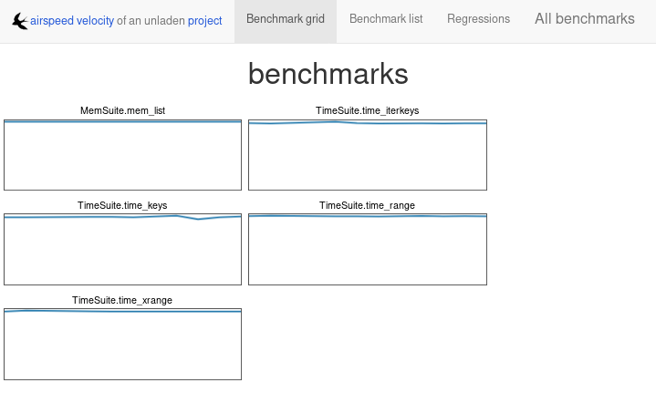
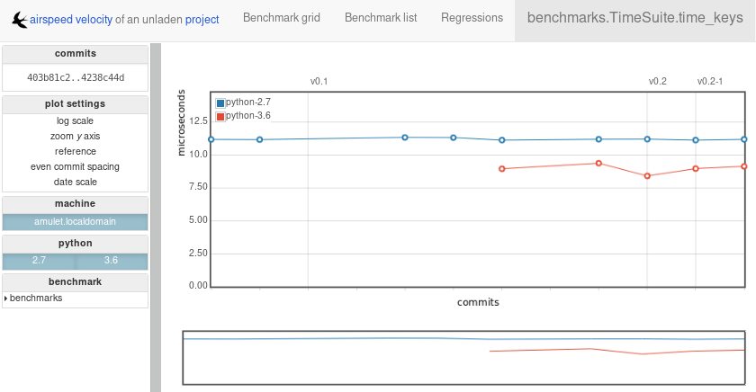
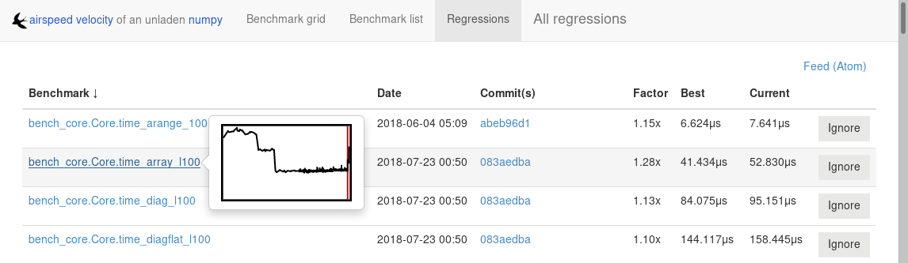

Using airspeed velocity
=======================

**airspeed velocity** is designed to benchmark a single project over
its lifetime using a given set of benchmarks.  Below, we use the
phrase "project" to refer to the project being benchmarked, and
"benchmark suite" to refer to the set of benchmarks -- i.e., little
snippets of code that are timed -- being run against the project.

The benchmark suite may live inside the project's repository, or it
may reside in a separate repository -- the choice is up to you and is
primarily a matter of style or policy.  Note also that the result data
is stored in JSON files alongside the benchmark suite and may grow
quite large, and you may want to plan where to store it.

You can interact with **airspeed velocity** through the ``asv``
command.  Like ``git``, the ``asv`` command has a number of
"subcommands" for performing various actions on your benchmarking
project.

Setting up a new benchmarking project
-------------------------------------

The first thing to do is to set up an **airspeed velocity** benchmark
suite for your project.  It must contain, at a minimum, a single
configuration file, ``asv.conf.json``, and a directory tree of Python
files containing benchmarks.

The ``asv quickstart`` command can be used to create a new
benchmarking suite.  Change to the directory where you would like your
new benchmarking suite to be created and run::

    $ asv quickstart
    · Setting up new Airspeed Velocity benchmark suite.

    Which of the following template layouts to use:
    (1) benchmark suite at the top level of the project repository
    (2) benchmark suite in a separate repository

    Layout to use? [1/2] 1

    · Edit asv.conf.json to get started.

Answer '1' if you want a default configuration suitable for putting
the benchmark suite on the top level of the same repository where your
project is, or '2' to get default configuration for putting it in a
separate repository.

Now that you have the bare bones of a benchmarking suite, let's edit
the configuration file, ``asv.conf.json``.  Like most files that
**airspeed velocity** uses and generates, it is a JSON file.

There are comments in the file describing what each of the elements
do, and there is also a :ref:`conf-reference` with more details.  The
values that will most likely need to be changed for any benchmarking
suite are:

- ``project``: The Python package name of the project being benchmarked.

- ``project_url``: The project's homepage.

- ``repo``: The URL or path to the DVCS repository for the project.  This
  should be a read-only URL so that anyone, even those without commit
  rights to the repository, can run the benchmarks.  For a project on
  github, for example, the URL would look like:
  ``https://github.com/airspeed-velocity/asv.git``

  The value can also be a path, relative to the location of the
  configuration file. For example, if the benchmarks are stored
  in the same repository as the project itself, and the configuration
  file is located at ``benchmarks/asv.conf.json`` inside the repository,
  you can set ``"repo": ".."`` to use the local repository.

- ``show_commit_url``: The base of URLs used to display commits for
  the project.  This allows users to click on a commit in the web
  interface and have it display the contents of that commit.  For a
  github project, the URL is of the form
  ``http://github.com/$OWNER/$REPO/commit/``.

- ``environment_type``: The tool used to create environments.  May be
  ``conda`` or ``virtualenv`` or ``mamba``.  If Conda supports the
  dependencies you need, that is the recommended method. Mamba is faster
  but needs a newer Python version (3.8 or greater).
  See :ref:`environments` for more information.

- ``matrix``: Dependencies you want to preinstall into the environment
  where benchmarks are run.

- ``default_benchmark_timeout``: The maximum time in seconds that a
  benchmark is allowed to run before it is terminated.  This is
  useful to prevent benchmarks from running indefinitely if they get
  stuck. The default is 60 seconds.

The rest of the values can usually be left to their defaults, unless
you want to benchmark against multiple versions of Python or multiple
versions of third-party dependencies, or if your package needs
nonstandard installation commands.

Once you've set up the project's configuration, you'll need to write
some benchmarks.  The benchmarks live in Python files in the
``benchmarks`` directory.  The ``quickstart`` command has created a
single example benchmark file already in
``benchmarks/benchmarks.py``:

.. include:: ../../asv/template/benchmarks/benchmarks.py
   :code: python

You'll want to replace these benchmarks with your own.  See
:ref:`writing-benchmarks` for more information.

Running benchmarks
------------------

Benchmarks are run using the ``asv run`` subcommand.

Let's start by just benchmarking the latest commit on the current
``main`` branch of the project::

    $ asv run

Machine information
```````````````````

If this is the first time using ``asv run`` on a given machine, (which
it probably is, if you're following along), you will be prompted for
information about the machine, such as its platform, cpu and memory.
**airspeed velocity** will try to make reasonable guesses, so it's
usually ok to just press ``Enter`` to accept each default value.  This
information is stored in the ``~/.asv-machine.json`` file in your home
directory::

    I will now ask you some questions about this machine to identify
    it in the benchmarks.

    1. machine: A unique name to identify this machine in the results.
       May be anything, as long as it is unique across all the
       machines used to benchmark this project.  NOTE: If changed from
       the default, it will no longer match the hostname of this
       machine, and you may need to explicitly use the --machine
       argument to asv.
    machine [cheetah]:
    2. os: The OS type and version of this machine.  For example,
       'Macintosh OS-X 10.8'.
    os [Linux 3.17.6-300.fc21.x86_64]:
    3. arch: The generic CPU architecture of this machine.  For
       example, 'i386' or 'x86_64'.
    arch [x86_64]:
    4. cpu: A specific description of the CPU of this machine,
       including its speed and class.  For example, 'Intel(R) Core(TM)
       i5-2520M CPU @ 2.50GHz (4 cores)'.
    cpu [Intel(R) Core(TM) i5-2520M CPU @ 2.50GHz]:
    5. ram: The amount of physical RAM on this machine.  For example,
       '4GB'.
    ram [8055476]:

.. note::

    If you ever need to update the machine information later, you can
    run ``asv machine``.

.. note::

    By default, the name of the machine is determined from your
    hostname.  If you have a hostname that frequently changes, and
    your ``~/.asv-machine.json`` file contains more than one entry,
    you will need to use the ``--machine`` argument to ``asv run`` and
    similar commands.

.. _environments:

Environments
````````````

Next, the Python environments to run the benchmarks are set up.
``asv`` always runs its benchmarks in an environment that it creates,
in order to not change any of your existing Python environments.  One
environment will be set up for each of the combinations of Python
versions and the matrix of project dependencies, if any.  The first
time this is run, this may take some time, as many files are copied
over and dependencies are installed into the environment.  The
environments are stored in the ``env`` directory so that the next time
the benchmarks are run, things will start much faster.

Environments can be created using different tools.  By default,
``asv`` ships with support for `anaconda
<https://store.continuum.io/cshop/anaconda/>`__,
`mamba <https://mamba.readthedocs.io/en/latest/index.html/>`__, and
`virtualenv <https://pypi.python.org/pypi/virtualenv>`__, though plugins may be
installed to support other environment tools.  The
``environment_type`` key in ``asv.conf.json`` is used to select the
tool used to create environments.

When using ``virtualenv``, ``asv`` does not build Python interpreters
for you, but it expects to find the Python versions specified
in the ``asv.conf.json`` file available on the ``PATH``.  For example,
if the ``asv.conf.json`` file has::

  "pythons": ["3.7", "3.12"]

then it will use the executables named ``python3.7`` and
``python3.12`` on the path.  There are many ways to get multiple
versions of Python installed -- your package manager, ``apt-get``,
``yum``, ``MacPorts`` or ``homebrew`` probably has them, or you
can also use `pyenv <https://github.com/yyuu/pyenv>`__.

The ``virtualenv`` environment also supports PyPy_. You can specify
``"pypy"`` or ``"pypy3"`` as a Python version number in the
``"pythons"`` list.  Note that PyPy must also be installed and
available on your ``PATH``.

.. _PyPy: http://pypy.org/

Benchmarking
````````````

Finally, the benchmarks are run::

    $ asv run
    · Cloning project.
    · Fetching recent changes
    · Creating environments......
    · Discovering benchmarks
    ·· Uninstalling from virtualenv-py3.7
    ·· Building 4238c44d <main> for virtualenv-py3.7
    ·· Installing into virtualenv-py3.7.
    · Running 10 total benchmarks (1 commits * 2 environments * 5 benchmarks)
    [  0.00%] · For project commit 4238c44d <main>:
    [  0.00%] ·· Building for virtualenv-py3.7.
    [  0.00%] ·· Benchmarking virtualenv-py3.7
    [ 10.00%] ··· Running (benchmarks.TimeSuite.time_iterkeys--)....
    [ 30.00%] ··· benchmarks.MemSuite.mem_list                                 2.42k
    [ 35.00%] ··· benchmarks.TimeSuite.time_iterkeys                     11.1±0.01μs
    [ 40.00%] ··· benchmarks.TimeSuite.time_keys                         11.2±0.01μs
    [ 45.00%] ··· benchmarks.TimeSuite.time_range                        32.9±0.01μs
    [ 50.00%] ··· benchmarks.TimeSuite.time_xrange                       30.3±0.01μs
    [ 50.00%] ·· Building for virtualenv-py3.12..
    [ 50.00%] ·· Benchmarking virtualenv-py3.12
    [ 60.00%] ··· Running (benchmarks.TimeSuite.time_iterkeys--)....
    [ 80.00%] ··· benchmarks.MemSuite.mem_list                                 2.11k
    [ 85.00%] ··· benchmarks.TimeSuite.time_iterkeys                          failed
    [ 90.00%] ··· benchmarks.TimeSuite.time_keys                          9.07±0.5μs
    [ 95.00%] ··· benchmarks.TimeSuite.time_range                        35.5±0.01μs
    [100.00%] ··· benchmarks.TimeSuite.time_xrange                            failed

To improve reproducibility, each benchmark is run in its own process.

The results of each benchmark are displayed in the output and also
recorded on disk.  For timing benchmarks, the median and interquartile
range of collected measurements are displayed.  Note that the results
may vary on slow time scales due to CPU frequency scaling, heat
management, and system load, and this variability is not necessarily
captured by a single run.  How to deal with this is discussed in :doc:`tuning`.

The killer feature of **airspeed velocity** is that it can track the
benchmark performance of your project over time.  The ``range``
argument to ``asv run`` specifies a range of commits that should be
benchmarked.  The value of this argument is passed directly to either ``git
log`` or to the Mercurial log command to get the set of commits, so it actually
has a very powerful syntax defined in the `gitrevisions manpage
<https://www.kernel.org/pub/software/scm/git/docs/gitrevisions.html>`__, or the
`revsets help section <http://www.selenic.com/hg/help/revsets>`_ for Mercurial.

For example, in a Git repository, one can test a range of commits on a
particular branch since branching off main::

        asv run main..mybranch

Or, to benchmark all of the commits since a particular tag (``v0.1``)::

    asv run v0.1..main

To benchmark a single commit, or tag, use ``^!`` (git)::

    asv run v0.1^!

Corresponding examples for Mercurial using the revsets specification are also
possible.

In many cases, this may result in more commits than you are able to
benchmark in a reasonable amount of time.  In that case, the
``--steps`` argument is helpful.  It specifies the maximum number of
commits you want to test, and it will evenly space them over the
specified range.

You can benchmark all commits in the repository by using::

    asv run ALL

You may also want to benchmark every commit that has already been
benchmarked on all the other machines.  For that, use::

    asv run EXISTING

You can benchmark all commits since the last one that was benchmarked
on this machine.  This is useful for running in nightly cron jobs::

    asv run NEW

You can also benchmark a specific set of commits listed explicitly in a file
(one commit hash per line)::

    asv run HASHFILE:hashestobenchmark.txt

Finally, you can also benchmark all commits that have not yet been benchmarked
for this machine::

    asv run --skip-existing-commits ALL

.. note::

   You can also do a validity check for the benchmark suite without
   running benchmarks, using ``asv check``.

The results are stored as JSON files in the directory
``results/$MACHINE``, where ``$MACHINE`` is the unique machine name
that was set up in your ``~/.asv-machine.json`` file.  In order to
combine results from multiple machines, you can for example store the
results in separate repositories, for example git submodules,
alongside the results from other machines.  These results are then
collated and "published" altogether into a single interactive website
for viewing (see :ref:`viewing-results`).

You can also continue to generate benchmark results for other commits,
or for new benchmarks and continue to throw them in the ``results``
directory.  **airspeed velocity** is designed from the ground up to
handle missing data where certain benchmarks have yet to be performed
-- it's entirely up to you how often you want to generate results, and
on which commits and in which configurations.

.. _viewing-results:

Viewing the results
-------------------

You can use the :ref:`asv show <cmd-asv-show>` command to display
results from previous runs on the command line::

    $ asv show main
    Commit: 4238c44d <main>

    benchmarks.MemSuite.mem_list [mymachine/virtualenv-py3.7]
      2.42k
      started: 2018-08-19 18:46:47, duration: 1.00s

    benchmarks.TimeSuite.time_iterkeys [mymachine/virtualenv-py3.7]
      11.1±0.06μs
      started: 2018-08-19 18:46:47, duration: 1.00s

    ...

To collate a set of results into a viewable website, run::

    asv publish

This will put a tree of files in the ``html`` directory.  This website
can not be viewed directly from the local filesystem, since web
browsers do not support AJAX requests to the local filesystem.
Instead, **airspeed velocity** provides a simple static webserver that
can be used to preview the website.  Just run::

    asv preview

and open the URL that is displayed at the console.  Press Ctrl+C to
stop serving.

|screenshot| |screenshot2|





To share the website on the open internet, simply put the files in the
``html`` directory on any webserver that can serve static content.  Github Pages
works quite well, for example.  For using Github Pages, ``asv``
includes the convenience command ``asv gh-pages`` to put the results
to the ``gh-pages`` branch and push them to Github. See :ref:`asv gh-pages
--help <cmd-asv-gh-pages>` for details.

Managing the results database
-----------------------------

The ``asv rm`` command can be used to remove benchmarks from the
database.  The command takes an arbitrary number of ``key=value``
entries that are "and"ed together to determine which benchmarks to
remove.

The keys may be one of:

- ``benchmark``: A benchmark name

- ``python``: The version of python

- ``commit_hash``: The commit hash

- machine-related: ``machine``, ``arch``, ``cpu``, ``os``, ``ram``

- environment-related: a name of a dependency, e.g. ``numpy``

The values are glob patterns, as supported by the Python standard
library module `fnmatch`.  So, for example, to remove all benchmarks
in the ``time_units`` module::

    asv rm "benchmark=time_units.*"

Note the double quotes around the entry to prevent the shell from
expanding the ``*`` itself.

The ``asv rm`` command will prompt before performing any operations.
Passing the ``-y`` option will skip the prompt.

Here is a more complex example, to remove all of the benchmarks on
Python 3.7 and the machine named ``giraffe``::

    asv rm python=3.7 machine=giraffe


Finding a commit that produces a large regression
-------------------------------------------------

**airspeed velocity** detects statistically significant decreases of
performance automatically based on the available data when you run
``asv publish``. The results can be inspected via the web interface,
clicking the "Regressions" tab on the web site.  The results include
links to each benchmark graph deemed to contain a decrease in
performance, the commits where the regressions were estimated to
occur, and other potentially useful information.



However, since benchmarking can be rather time consuming, it's likely that
you're only benchmarking a subset of all commits in the repository.
When you discover from the graph that the runtime between commit A and
commit B suddenly doubles, you don't necessarily know which particular commit in
that range is the likely culprit.  ``asv find`` can be used to help
find a commit within that range that produced a large regression using
a binary search.  You can select a range of commits easily from the
web interface by dragging a box around the commits in question.  The
commit hashes associated with that range is then displayed in the
"commits" section of the sidebar.  We'll copy and paste this commit
range into the commandline arguments of the ``asv find`` command,
along with the name of a single benchmark to use.  The output below is
truncated to show how the search progresses::

    $ asv find 05d4f83d..b96fcc53 time_coordinates.time_latitude
    - Running approximately 10 benchmarks within 1156 commits
    - Testing <----------------------------O----------------------------->
    - Testing <-------------O-------------->------------------------------
    - Testing --------------<-------O------>------------------------------
    - Testing --------------<---O--->-------------------------------------
    - Testing --------------<-O->-----------------------------------------
    - Testing --------------<O>-------------------------------------------
    - Testing --------------<>--------------------------------------------
    - Greatest regression found: 2918f61e

The result, ``2918f61e`` is the commit found with the largest
regression, using the binary search.

.. note::

    The binary search used by ``asv find`` will only be effective when
    the runtimes over the range are more-or-less monotonic.  If there
    is a lot of variation within that range, it may find only a local
    maximum, rather than the global maximum.  For best results, use a
    reasonably small commit range.

.. _profiling:

Running a benchmark in the profiler
-----------------------------------

**airspeed velocity** can oftentimes tell you *if* something got
slower, but it can't really tell you *why* it got slower.  That's
where a profiler comes in.  **airspeed velocity** has features to
easily run a given benchmark in the Python standard library's
`cProfile` profiler, and then open the profiling data in the tool of
your choice.

The ``asv profile`` command profiles a given benchmark on a given
revision of the project.

.. note::

    You can also pass the ``--profile`` option to ``asv run``.  In
    addition to running the benchmarks as usual, it also runs them
    again in the `cProfile` profiler and save the results.  ``asv
    profile`` will use this data, if found, rather than needing to
    profile the benchmark each time.  However, it's important to note
    that profiler data contains absolute paths to the source code, so
    they are generally not portable between machines.

``asv profile`` takes as arguments the name of the benchmark and the
hash, tag or branch of the project to run it in.  Below is a real
world example of testing the ``astropy`` project.  By default, a
simple table summary of profiling results is displayed::

    > asv profile time_units.time_very_simple_unit_parse 10fc29cb

         8700042 function calls in 6.844 seconds

     Ordered by: cumulative time

     ncalls  tottime  percall  cumtime  percall filename:lineno(function)
          1    0.000    0.000    6.844    6.844 asv/benchmark.py:171(method_caller)
          1    0.000    0.000    6.844    6.844 asv/benchmark.py:197(run)
          1    0.000    0.000    6.844    6.844 /usr/lib64/python3.7/timeit.py:201(repeat)
          3    0.000    0.000    6.844    2.281 /usr/lib64/python3.7/timeit.py:178(timeit)
          3    0.104    0.035    6.844    2.281 /usr/lib64/python3.7/timeit.py:96(inner)
     300000    0.398    0.000    6.740    0.000 benchmarks/time_units.py:20(time_very_simple_unit_parse)
     300000    1.550    0.000    6.342    0.000 astropy/units/core.py:1673(__call__)
     300000    0.495    0.000    2.416    0.000 astropy/units/format/generic.py:361(parse)
     300000    1.023    0.000    1.841    0.000 astropy/units/format/__init__.py:31(get_format)
     300000    0.168    0.000    1.283    0.000 astropy/units/format/generic.py:374(_do_parse)
     300000    0.986    0.000    1.115    0.000 astropy/units/format/generic.py:345(_parse_unit)
    3000002    0.735    0.000    0.735    0.000 {isinstance}
     300000    0.403    0.000    0.403    0.000 {method 'decode' of 'str' objects}
     300000    0.216    0.000    0.216    0.000 astropy/units/format/generic.py:32(__init__)
     300000    0.152    0.000    0.188    0.000 /usr/lib64/python3.7/inspect.py:59(isclass)
     900000    0.170    0.000    0.170    0.000 {method 'lower' of 'unicode' objects}
     300000    0.133    0.000    0.133    0.000 {method 'count' of 'unicode' objects}
     300000    0.078    0.000    0.078    0.000 astropy/units/core.py:272(get_current_unit_registry)
     300000    0.076    0.000    0.076    0.000 {issubclass}
     300000    0.052    0.000    0.052    0.000 astropy/units/core.py:131(registry)
     300000    0.038    0.000    0.038    0.000 {method 'strip' of 'str' objects}
     300003    0.037    0.000    0.037    0.000 {globals}
     300000    0.033    0.000    0.033    0.000 {len}
          3    0.000    0.000    0.000    0.000 /usr/lib64/python3.7/timeit.py:143(setup)
          1    0.000    0.000    0.000    0.000 /usr/lib64/python3.7/timeit.py:121(__init__)
          6    0.000    0.000    0.000    0.000 {time.time}
          1    0.000    0.000    0.000    0.000 {min}
          1    0.000    0.000    0.000    0.000 {range}
          1    0.000    0.000    0.000    0.000 {hasattr}
          1    0.000    0.000    0.000    0.000 /usr/lib64/python3.7/timeit.py:94(_template_func)
          3    0.000    0.000    0.000    0.000 {gc.enable}
          3    0.000    0.000    0.000    0.000 {method 'append' of 'list' objects}
          3    0.000    0.000    0.000    0.000 {gc.disable}
          1    0.000    0.000    0.000    0.000 {method 'disable' of '_lsprof.Profiler' objects}
          3    0.000    0.000    0.000    0.000 {gc.isenabled}
          1    0.000    0.000    0.000    0.000 <string>:1(<module>)

Navigating these sorts of results can be tricky, and generally you
want to open the results in a GUI tool, such as `RunSnakeRun
<http://www.vrplumber.com/programming/runsnakerun/>`__ or `snakeviz
<http://jiffyclub.github.io/snakeviz/>`__.  For example, by passing
the ``--gui=runsnake`` to ``asv profile``, the profile is collected
(or extracted) and opened in the RunSnakeRun tool.

.. note::

    To make sure the line numbers in the profiling data correctly
    match the source files being viewed, the correct revision of the
    project is checked out before opening it in the external GUI tool.

You can also get the raw profiling data by using the ``--output``
argument to ``asv profile``.

.. note::

   Since the method name is passed as a regex, parenthesis need to be escaped, e.g.
   ``asv profile 'benchmarks.MyBench.time_sort\(500\)' HEAD --gui snakeviz``

See :ref:`cmd-asv-profile` for more options.

To extract information from ``--profile`` runs of ``asv``::

    $ python
    import asv
    results_asv = asv.results.iter_results(".asv")
    res_objects = list(results_asv)
    prof_data = res_objects[0].get_profile_stats('benchmarks.MyBench.time_sort')
    prof_data.strip_dirs() # Remove machine specific info
    prof_data.sort_stats('cumulative').print_stats()

Where different benchmarks may be used. A specific ``json`` may also be loaded
directly with ``asv.results.Results.load(<json_path>)``, after which
``get_profile_stats`` can be used.

.. _comparing:

Comparing the benchmarking results for two revisions
----------------------------------------------------

In some cases, you may want to directly compare the results for two specific
revisions of the project. You can do so with the ``compare`` command::

    $ asv compare v0.1 v0.2
    All benchmarks:

           before           after         ratio
         [3bfda9c6]       [bf719488]
         <v0.1>           <v0.2>
                40.4m            40.4m     1.00  benchmarks.MemSuite.mem_list [amulet.localdomain/virtualenv-py3.7-numpy]
               failed            35.2m      n/a  benchmarks.MemSuite.mem_list [amulet.localdomain/virtualenv-py3.12-numpy]
          11.5±0.08μs         11.0±0μs     0.96  benchmarks.TimeSuite.time_iterkeys [amulet.localdomain/virtualenv-py3.7-numpy]
               failed           failed      n/a  benchmarks.TimeSuite.time_iterkeys [amulet.localdomain/virtualenv-py3.12-numpy]
             11.5±1μs      11.2±0.02μs     0.97  benchmarks.TimeSuite.time_keys [amulet.localdomain/virtualenv-py3.7-numpy]
               failed      8.40±0.02μs      n/a  benchmarks.TimeSuite.time_keys [amulet.localdomain/virtualenv-py3.12-numpy]
          34.6±0.09μs      32.9±0.01μs     0.95  benchmarks.TimeSuite.time_range [amulet.localdomain/virtualenv-py3.7-numpy]
               failed      35.6±0.05μs      n/a  benchmarks.TimeSuite.time_range [amulet.localdomain/virtualenv-py3.12-numpy]
           31.6±0.1μs      30.2±0.02μs     0.95  benchmarks.TimeSuite.time_xrange [amulet.localdomain/virtualenv-py3.7-numpy]
               failed           failed      n/a  benchmarks.TimeSuite.time_xrange [amulet.localdomain/virtualenv-py3.12-numpy]

This will show the times for each benchmark for the first and second
revision, and the ratio of the second to the first. In addition, the
benchmarks will be color coded green and red if the benchmark improves
or worsens more than a certain threshold factor, which defaults to 1.1
(that is, benchmarks that improve by more than 10% or worsen by 10%
are color coded). The threshold can be set with the
``--factor=value`` option. Finally, the benchmarks can be split
into ones that have improved, stayed the same, and worsened, using the
same threshold using the ``--split`` option.
See :ref:`cmd-asv-compare` for more.
